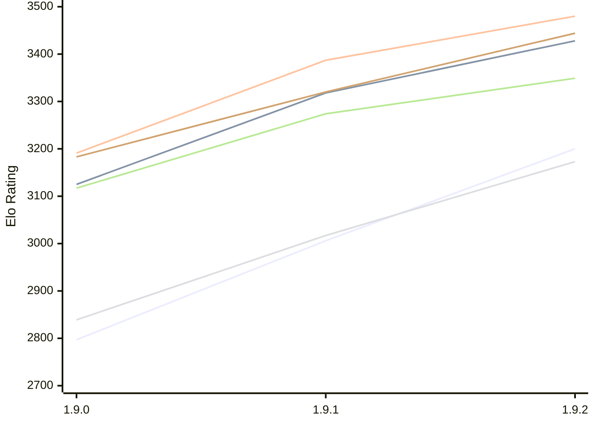

# Engine: Superpawn

Author: John Byrd

Home: https://github.com/johnwbyrd/superpawn

## Elo Ratings E1 (Ultra 7 265T (1.50 GHz) - E-Core)

| Version | Published | STC 8.0+0.08s  | LTC 60.0+0.60s | VLTC 2m24s+1.12s | Comment |
| --- | --- | --- | --- | --- | --- |
| 1.9.2 | 2026-11-08 | 3200(+194) | 3428(+110) | 3480(+93) |  |
| 1.9.1 | 2026-10-18 | 3006(+209) | 3318(+193) | 3387(+196) |  |
| 1.9.0 | 2026-10-16 | 2797 | 3125 | 3191 |  |
 | | | cElo (∆ prev) | cElo (∆ prev) | cElo (∆ prev) | 

## Elo Ratings P1 (Ultra 7 265T (1.50 GHz) - P-Core)

| Version | Published | STC 8.0+0.08s  | LTC 60.0+0.60s | VLTC 2m24s+1.12s | Comment |
| --- | --- | --- | --- | --- | --- |
| 1.9.2 | 2026-11-08 | 3173(+156) | 3349(+75) | 3444(+124) |  |
| 1.9.1 | 2026-10-18 | 3017(+178) | 3274(+157) | 3320(+137) |  |
| 1.9.0 | 2026-10-16 | 2839 | 3117 | 3183 |  |
 | | | cElo (∆ prev) | cElo (∆ prev) | cElo (∆ prev) | 

## Elo Ratings T1 (i5-7500T 2.70GHz)

| Version | Published | STC 8.0+0.08s  | LTC 60.0+0.60s | VLTC 2m24s+1.12s | Comment |
| --- | --- | --- | --- | --- | --- |
| 1.9.0 | 2026-10-16 | 2839 | 3117 | 3183 |  |
 | | | cElo (∆ prev) | cElo (∆ prev) | cElo (∆ prev) | 

<a href="https://github.com/computer-chess-index/cci/issues/new?template=submit-version.yml&title=[VERSION]+Superpawn+<version>&body=###%20Engine%20name%0ASuperpawn%0A%0A###%20Version%0A1.9.2" target="_blank">Submit new version</a>

 Test Conditions:

GUI/CLI: <a href=https://github.com/cutechess/cutechess target="_blank">Cute-Chess</a> 
Elo Calculation: <a href=https://www.remi-coulom.fr/Bayesian-Elo/ target="_blank">Bayesian-Elo</a> 
CPU for P1: Intel(R) Core(TM) Ultra 7 265T (1.50 GHz) - P-Core 
CPU for E1: Intel(R) Core(TM) Ultra 7 265T (1.50 GHz) - E-Core 
CPU for T1: Intel(R) Core(TM) i5-7500T 2.70GHz 
Opening book: 8_moves_v3 
\* STC: 8.0+0.08s, LTC: 60.0+0.60s, VLTC: 2m24s+1.12s

 Lists:
Ratings: <a href=https://github.com/computer-chess-index/cci/blob/main/lists/CCIRatings.csv target="_blank">Complete list</a>

Generated: 2026-11-20 05:43:26

## Ratings Verlauf E1 / P1

```mermaid
%%{init: {"theme":"base","themeVariables":{"seriesColors:['#a3a3a3','#222221','#faa371']}}}%%
xychart-beta
  x-axis ["1.9.0", "1.9.1", "1.9.2"]
  y-axis "Elo Rating" 2700 --> 3500
  line "E1: STC (8.0+0.08s)" [2797, 3006, 3200]
  line "E1: LTC (60.0+0.60s)" [3125, 3318, 3428]
  line "E1: VLTC (2m24s+1.12s)" [3191, 3387, 3480]
  line "P1: STC (8.0+0.08s)" [2839, 3017, 3173]
  line "P1: LTC (60.0+0.60s)" [3117, 3274, 3349]
  line "P1: VLTC (2m24s+1.12s)" [3183, 3320, 3444]
```

## Detailed Evaluation Results

| Version | Time Control | Variant | Elo  | Range +/- | Matches | Score | Average Opponent Elo | Draws |
| --- | --- |--- | --- | --- | --- | --- | --- | --- |
| 1.9.2 | VLTC (2m24s+1.12s) | P1 | 3444 | 30 | 266 | 54% | 3414 | 76% |
|  |  | E1 | 3480 | 32 | 242 | 51% | 3472 | 73% |
|  | LTC (60.0+0.60s) | E1 | 3428 | 27 | 342 | 53% | 3409 | 69% |
|  |  | P1 | 3349 | 42 | 140 | 51% | 3345 | 76% |
|  | STC (8.0+0.08s) | E1 | 3200 | 31 | 278 | 53% | 3181 | 58% |
|  |  | P1 | 3173 | 34 | 238 | 52% | 3154 | 59% |
| --- | --- |--- | --- | --- | --- | --- | --- | --- |
| 1.9.1 | VLTC (2m24s+1.12s) | P1 | 3320 | 35 | 210 | 52% | 3309 | 62% |
|  |  | E1 | 3387 | 28 | 342 | 51% | 3376 | 64% |
|  | LTC (60.0+0.60s) | P1 | 3274 | 34 | 236 | 49% | 3281 | 58% |
|  |  | E1 | 3318 | 30 | 302 | 53% | 3295 | 56% |
|  | STC (8.0+0.08s) | P1 | 3017 | 41 | 172 | 50% | 3019 | 46% |
|  |  | E1 | 3006 | 28 | 388 | 53% | 2982 | 39% |
| --- | --- |--- | --- | --- | --- | --- | --- | --- |
| 1.9.0 | VLTC (2m24s+1.12s) | E1 | 3191 | 34 | 292 | 55% | 3036 | 40% |
|  |  | P1 | 3183 | 42 | 194 | 60% | 2952 | 39% |
|  | LTC (60.0+0.60s) | E1 | 3125 | 42 | 214 | 62% | 2835 | 34% |
|  |  | P1 | 3117 | 50 | 150 | 62% | 2807 | 32% |
|  | STC (8.0+0.08s) | P1 | 2839 | 47 | 176 | 58% | 2623 | 26% |
|  |  | E1 | 2797 | 42 | 220 | 61% | 2546 | 26% |