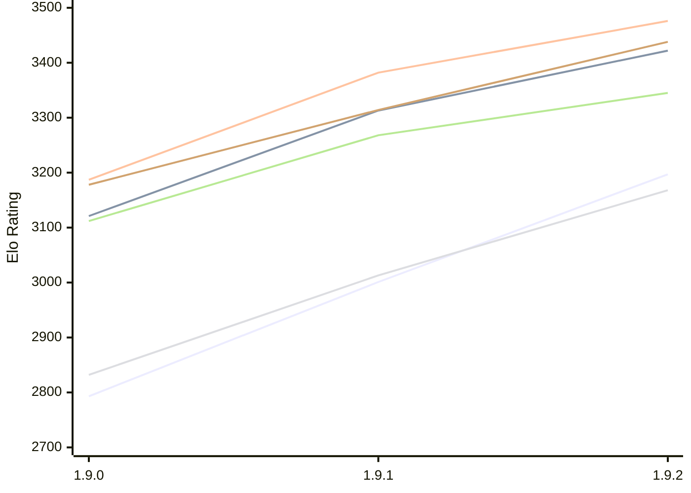

# Engine: Superpawn

Author: John Byrd

Home: https://github.com/johnwbyrd/superpawn

## Elo Ratings E1 (Ultra 7 265T (1.50 GHz) - E-Core)

| Version | Published | STC 8.0+0.08s  | LTC 60.0+0.60s | VLTC 2m24s+1.12s | Comment |
| --- | --- | --- | --- | --- | --- |
| 1.9.2 | 2026-11-08 | 3197(+196) | 3422(+109) | 3476(+94) |  |
| 1.9.1 | 2026-10-18 | 3001(+208) | 3313(+192) | 3382(+195) |  |
| 1.9.0 | 2026-10-16 | 2793 | 3121 | 3187 |  |
 | | | cElo (∆ prev) | cElo (∆ prev) | cElo (∆ prev) | 

## Elo Ratings P1 (Ultra 7 265T (1.50 GHz) - P-Core)

| Version | Published | STC 8.0+0.08s  | LTC 60.0+0.60s | VLTC 2m24s+1.12s | Comment |
| --- | --- | --- | --- | --- | --- |
| 1.9.2 | 2026-11-08 | 3168(+155) | 3345(+77) | 3438(+124) |  |
| 1.9.1 | 2026-10-18 | 3013(+181) | 3268(+156) | 3314(+136) |  |
| 1.9.0 | 2026-10-16 | 2832 | 3112 | 3178 |  |
 | | | cElo (∆ prev) | cElo (∆ prev) | cElo (∆ prev) | 

## Elo Ratings T1 (i5-7500T 2.70GHz)

| Version | Published | STC 8.0+0.08s  | LTC 60.0+0.60s | VLTC 2m24s+1.12s | Comment |
| --- | --- | --- | --- | --- | --- |
| 1.9.0 | 2026-10-16 | 2832 | 3112 | 3178 |  |
 | | | cElo (∆ prev) | cElo (∆ prev) | cElo (∆ prev) | 

<a href="https://github.com/computer-chess-index/cci/issues/new?template=submit-version.yml&title=[VERSION]+Superpawn+<version>&body=###%20Engine%20name%0ASuperpawn%0A%0A###%20Version%0A1.9.2" target="_blank">Submit new version</a>

 Test Conditions:

GUI/CLI: <a href=https://github.com/cutechess/cutechess target="_blank">Cute-Chess</a> 
Elo Calculation: <a href=https://www.remi-coulom.fr/Bayesian-Elo/ target="_blank">Bayesian-Elo</a> 
CPU for P1: Intel(R) Core(TM) Ultra 7 265T (1.50 GHz) - P-Core 
CPU for E1: Intel(R) Core(TM) Ultra 7 265T (1.50 GHz) - E-Core 
CPU for T1: Intel(R) Core(TM) i5-7500T 2.70GHz 
Opening book: 8_moves_v3 
\* STC: 8.0+0.08s, LTC: 60.0+0.60s, VLTC: 2m24s+1.12s

 Lists:
Ratings: <a href=https://github.com/computer-chess-index/cci/blob/main/lists/CCIRatings.csv target="_blank">Complete list</a>

Generated: 2026-11-19 05:43:55

## Ratings Verlauf E1 / P1

```mermaid
%%{init: {"theme":"base","themeVariables":{"seriesColors:['#a3a3a3','#222221','#faa371']}}}%%
xychart-beta
  x-axis ["1.9.0", "1.9.1", "1.9.2"]
  y-axis "Elo Rating" 2700 --> 3500
  line "E1: STC (8.0+0.08s)" [2793, 3001, 3197]
  line "E1: LTC (60.0+0.60s)" [3121, 3313, 3422]
  line "E1: VLTC (2m24s+1.12s)" [3187, 3382, 3476]
  line "P1: STC (8.0+0.08s)" [2832, 3013, 3168]
  line "P1: LTC (60.0+0.60s)" [3112, 3268, 3345]
  line "P1: VLTC (2m24s+1.12s)" [3178, 3314, 3438]
```

## Detailed Evaluation Results

| Version | Time Control | Variant | Elo  | Range +/- | Matches | Score | Average Opponent Elo | Draws |
| --- | --- |--- | --- | --- | --- | --- | --- | --- |
| 1.9.2 | VLTC (2m24s+1.12s) | P1 | 3438 | 30 | 266 | 54% | 3410 | 76% |
|  |  | E1 | 3476 | 32 | 238 | 51% | 3467 | 72% |
|  | LTC (60.0+0.60s) | P1 | 3345 | 42 | 140 | 51% | 3341 | 76% |
|  |  | E1 | 3422 | 27 | 342 | 53% | 3403 | 69% |
|  | STC (8.0+0.08s) | P1 | 3168 | 34 | 238 | 52% | 3150 | 59% |
|  |  | E1 | 3197 | 32 | 274 | 53% | 3177 | 58% |
| --- | --- |--- | --- | --- | --- | --- | --- | --- |
| 1.9.1 | VLTC (2m24s+1.12s) | E1 | 3382 | 28 | 342 | 51% | 3372 | 64% |
|  |  | P1 | 3314 | 35 | 210 | 52% | 3303 | 62% |
|  | LTC (60.0+0.60s) | E1 | 3313 | 30 | 302 | 53% | 3291 | 56% |
|  |  | P1 | 3268 | 34 | 236 | 49% | 3275 | 58% |
|  | STC (8.0+0.08s) | P1 | 3013 | 41 | 172 | 50% | 3015 | 46% |
|  |  | E1 | 3001 | 28 | 388 | 53% | 2977 | 39% |
| --- | --- |--- | --- | --- | --- | --- | --- | --- |
| 1.9.0 | VLTC (2m24s+1.12s) | P1 | 3178 | 42 | 194 | 60% | 2948 | 39% |
|  |  | E1 | 3187 | 34 | 292 | 55% | 3032 | 40% |
|  | LTC (60.0+0.60s) | P1 | 3112 | 50 | 150 | 62% | 2803 | 32% |
|  |  | E1 | 3121 | 42 | 214 | 62% | 2832 | 34% |
|  | STC (8.0+0.08s) | P1 | 2832 | 47 | 176 | 58% | 2618 | 26% |
|  |  | E1 | 2793 | 42 | 220 | 61% | 2542 | 26% |