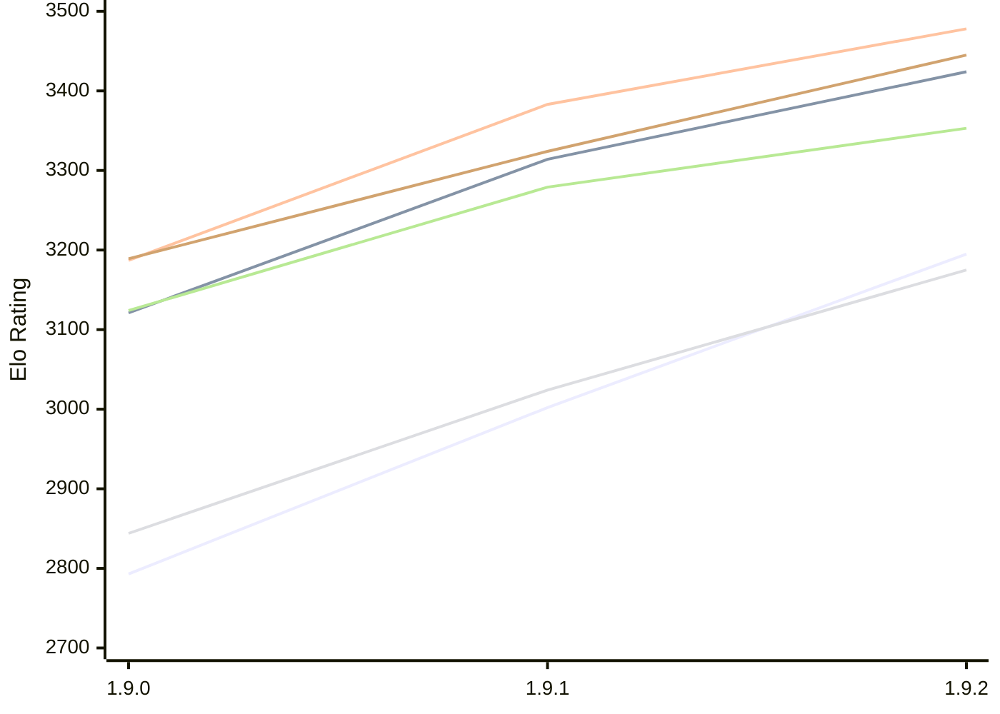

# Engine: Superpawn

Author: John Byrd

Home: https://github.com/johnwbyrd/superpawn

## Elo Ratings E1 (Ultra 7 265T (1.50 GHz) - E-Core)

| Version | Published | STC 8.0+0.08s  | LTC 60.0+0.60s | VLTC 2m24s+1.12s | Comment |
| --- | --- | --- | --- | --- | --- |
| 1.9.2 | 2026-11-08 | 3195(+193) | 3424(+110) | 3478(+95) |  |
| 1.9.1 | 2026-10-18 | 3002(+209) | 3314(+193) | 3383(+196) |  |
| 1.9.0 | 2026-10-16 | 2793 | 3121 | 3187 |  |
 | | | cElo (∆ prev) | cElo (∆ prev) | cElo (∆ prev) | 

## Elo Ratings P1 (Ultra 7 265T (1.50 GHz) - P-Core)

| Version | Published | STC 8.0+0.08s  | LTC 60.0+0.60s | VLTC 2m24s+1.12s | Comment |
| --- | --- | --- | --- | --- | --- |
| 1.9.2 | 2026-11-08 | 3175(+151) | 3353(+74) | 3445(+121) |  |
| 1.9.1 | 2026-10-18 | 3024(+180) | 3279(+155) | 3324(+135) |  |
| 1.9.0 | 2026-10-16 | 2844 | 3124 | 3189 |  |
 | | | cElo (∆ prev) | cElo (∆ prev) | cElo (∆ prev) | 

## Elo Ratings T1 (i5-7500T 2.70GHz)

| Version | Published | STC 8.0+0.08s  | LTC 60.0+0.60s | VLTC 2m24s+1.12s | Comment |
| --- | --- | --- | --- | --- | --- |
| 1.9.0 | 2026-10-16 | 2844 | 3124 | 3189 |  |
 | | | cElo (∆ prev) | cElo (∆ prev) | cElo (∆ prev) | 

<a href="https://github.com/computer-chess-index/cci/issues/new?template=submit-version.yml&title=[VERSION]+Superpawn+<version>&body=###%20Engine%20name%0ASuperpawn%0A%0A###%20Version%0A1.9.2" target="_blank">Submit new version</a>

 Test Conditions:

GUI/CLI: <a href=https://github.com/cutechess/cutechess target="_blank">Cute-Chess</a> 
Elo Calculation: <a href=https://www.remi-coulom.fr/Bayesian-Elo/ target="_blank">Bayesian-Elo</a> 
CPU for P1: Intel(R) Core(TM) Ultra 7 265T (1.50 GHz) - P-Core 
CPU for E1: Intel(R) Core(TM) Ultra 7 265T (1.50 GHz) - E-Core 
CPU for T1: Intel(R) Core(TM) i5-7500T 2.70GHz 
Opening book: 8_moves_v3 
\* STC: 8.0+0.08s, LTC: 60.0+0.60s, VLTC: 2m24s+1.12s

 Lists:
Ratings: <a href=https://github.com/computer-chess-index/cci/blob/main/lists/CCIRatings.csv target="_blank">Complete list</a>

Generated: 2026-11-21 05:43:20

## Ratings Verlauf E1 / P1

```mermaid
%%{init: {"theme":"base","themeVariables":{"seriesColors:['#a3a3a3','#222221','#faa371']}}}%%
xychart-beta
  x-axis ["1.9.0", "1.9.1", "1.9.2"]
  y-axis "Elo Rating" 2700 --> 3500
  line "E1: STC (8.0+0.08s)" [2793, 3002, 3195]
  line "E1: LTC (60.0+0.60s)" [3121, 3314, 3424]
  line "E1: VLTC (2m24s+1.12s)" [3187, 3383, 3478]
  line "P1: STC (8.0+0.08s)" [2844, 3024, 3175]
  line "P1: LTC (60.0+0.60s)" [3124, 3279, 3353]
  line "P1: VLTC (2m24s+1.12s)" [3189, 3324, 3445]
```

## Detailed Evaluation Results

| Version | Time Control | Variant | Elo  | Range +/- | Matches | Score | Average Opponent Elo | Draws |
| --- | --- |--- | --- | --- | --- | --- | --- | --- |
| 1.9.2 | VLTC (2m24s+1.12s) | E1 | 3478 | 32 | 242 | 51% | 3468 | 73% |
|  |  | P1 | 3445 | 30 | 266 | 54% | 3417 | 76% |
|  | LTC (60.0+0.60s) | E1 | 3424 | 27 | 346 | 53% | 3405 | 69% |
|  |  | P1 | 3353 | 42 | 140 | 51% | 3349 | 76% |
|  | STC (8.0+0.08s) | E1 | 3195 | 31 | 278 | 53% | 3178 | 58% |
|  |  | P1 | 3175 | 32 | 254 | 52% | 3163 | 60% |
| --- | --- |--- | --- | --- | --- | --- | --- | --- |
| 1.9.1 | VLTC (2m24s+1.12s) | P1 | 3324 | 35 | 210 | 52% | 3312 | 62% |
|  |  | E1 | 3383 | 28 | 342 | 51% | 3374 | 64% |
|  | LTC (60.0+0.60s) | P1 | 3279 | 33 | 244 | 49% | 3286 | 59% |
|  |  | E1 | 3314 | 30 | 302 | 53% | 3291 | 56% |
|  | STC (8.0+0.08s) | P1 | 3024 | 41 | 172 | 50% | 3027 | 46% |
|  |  | E1 | 3002 | 28 | 388 | 53% | 2978 | 39% |
| --- | --- |--- | --- | --- | --- | --- | --- | --- |
| 1.9.0 | VLTC (2m24s+1.12s) | E1 | 3187 | 34 | 292 | 55% | 3033 | 40% |
|  |  | P1 | 3189 | 42 | 194 | 60% | 2958 | 39% |
|  | LTC (60.0+0.60s) | P1 | 3124 | 50 | 150 | 62% | 2812 | 32% |
|  |  | E1 | 3121 | 42 | 214 | 62% | 2831 | 34% |
|  | STC (8.0+0.08s) | P1 | 2844 | 47 | 176 | 58% | 2628 | 26% |
|  |  | E1 | 2793 | 42 | 220 | 61% | 2542 | 26% |