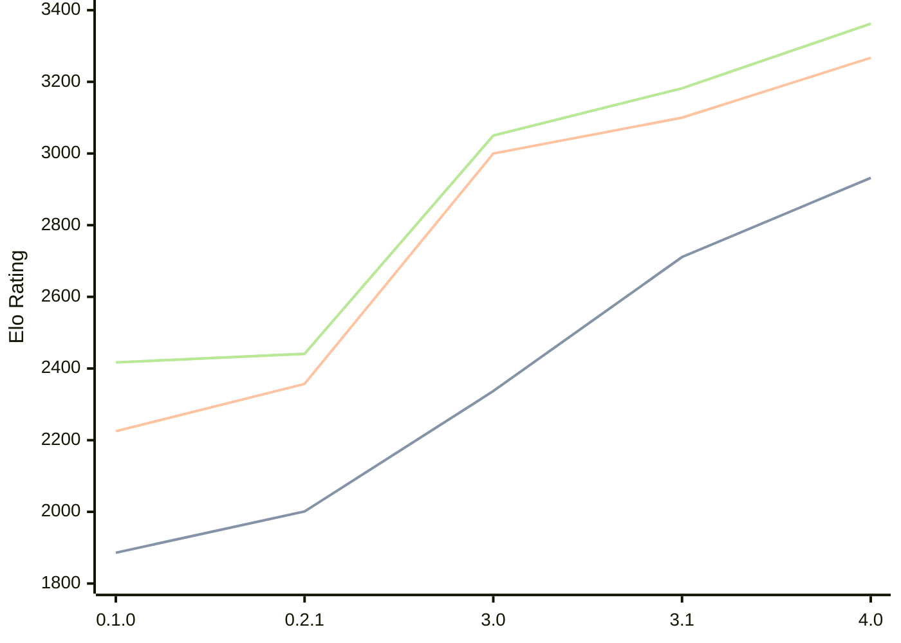

# Engine: Sykora

Author: Sullivan Bognar

Home: https://github.com/sb2bg/sykora

## Elo Ratings

| Version | Published | STC 8.0+0.08s  | LTC 60.0+0.60s | VLTC 2m24s+1.12s | Comment |
| --- | --- | --- | --- | --- | --- |
| 4.0 | 2026-08-02 | 2932(+221) | 3267(+167) | 3362(+180) |  |
| 3.1 | 2026-07-15 | 2711(+374) | 3100(+100) | 3182(+132) |  |
| 3.0 | 2026-07-12 | 2337(+new) | 3000(+new) | 3050(+new) |  |
| 0.2.2 | 2026-03-23 |  |  |  |  |
| 0.2.1 | 2026-03-02 | 2001(+115) | 2357(+132) | 2441(+24) |  |
| 0.1.0 | 2026-02-17 | 1886 | 2225 | 2417 |  |
 | | | cElo (∆ prev) | cElo (∆ prev) | cElo (∆ prev) | 

<a href="https://github.com/computer-chess-index/cci/issues/new?template=submit-version.yml&title=[VERSION]+Sykora+<version>&body=###%20Engine%20name%0ASykora%0A%0A###%20Version%0A4.0" target="_blank">Submit new version</a>

 Test Conditions:

GUI/CLI: <a href=https://github.com/cutechess/cutechess target="_blank">Cute-Chess</a> 
Elo Calculation: <a href=https://www.remi-coulom.fr/Bayesian-Elo/ target="_blank">Bayesian-Elo</a> 
CPU: Intel(R) Core(TM) i5-7500T 2.70GHz 
Opening book: 8_moves_v3 
\* STC: 8.0+0.08s, LTC: 60.0+0.60s, VLTC: 2m24s+1.12s

 Lists:
Ratings: <a href=https://github.com/computer-chess-index/cci/blob/main/lists/CCIRatings.csv target="_blank">Complete list</a>

Generated: 2026-08-25 06:37:34

## Ratings Verlauf

⬛ STC (8.0+0.08s) &nbsp;&nbsp; 🟧 LTC (60.0+0.60s) &nbsp;&nbsp; 🟩 VLTC (2m24s+1.12s)

dark mode: 🟩STC (8.0+0.08s) 🟧LTC (60.0+0.60s) ⬜VLTC (2m24s+1.12s)

## Detailed Evaluation Results

| Version | Time Control | Elo  | Range +/- | Matches | Score | Average Opponent Elo | Draws |
| --- | --- | --- | --- | --- | --- | --- | --- |
| 4.0 | VLTC (2m24s+1.12s) | 3362 | 32 | 238 | 48% | 3374 | 77% |
| 4.0 | LTC (60.0+0.60s) | 3267 | 37 | 184 | 54% | 3241 | 74% |
| 4.0 | STC (8.0+0.08s) | 2932 | 37 | 184 | 55% | 2893 | 71% |
| --- | --- | --- | --- | --- | --- | --- | --- |
| 3.1 | VLTC (2m24s+1.12s) | 3182 | 44 | 132 | 50% | 3179 | 70% |
| 3.1 | LTC (60.0+0.60s) | 3100 | 44 | 132 | 52% | 3090 | 64% |
| 3.1 | STC (8.0+0.08s) | 2711 | 46 | 126 | 51% | 2697 | 63% |
| --- | --- | --- | --- | --- | --- | --- | --- |
| 3.0 | VLTC (2m24s+1.12s) | 3050 | 48 | 124 | 56% | 2985 | 57% |
| 3.0 | LTC (60.0+0.60s) | 3000 | 56 | 96 | 54% | 2952 | 46% |
| 3.0 | STC (8.0+0.08s) | 2337 | 34 | 240 | 65% | 2226 | 62% |
| --- | --- | --- | --- | --- | --- | --- | --- |
| 0.2.1 | VLTC (2m24s+1.12s) | 2441 | 36 | 254 | 53% | 2415 | 34% |
| 0.2.1 | LTC (60.0+0.60s) | 2357 | 33 | 304 | 50% | 2353 | 28% |
| 0.2.1 | STC (8.0+0.08s) | 2001 | 34 | 306 | 51% | 1990 | 22% |
| --- | --- | --- | --- | --- | --- | --- | --- |
| 0.1.0 | VLTC (2m24s+1.12s) | 2417 | 126 | 28 | 21% | 2719 | 21% |
| 0.1.0 | LTC (60.0+0.60s) | 2225 | 70 | 70 | 46% | 2257 | 27% |
| 0.1.0 | STC (8.0+0.08s) | 1886 | 97 | 40 | 41% | 2007 | 23% |
| --- | --- | --- | --- | --- | --- | --- | --- |