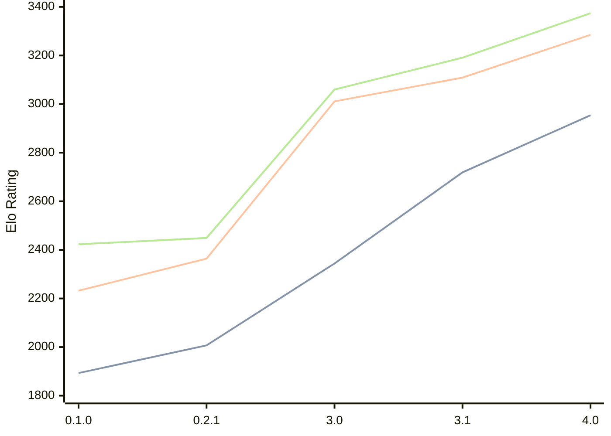

# Engine: Sykora

Author: Sullivan Bognar

Home: https://github.com/sb2bg/sykora

## Elo Ratings

| Version | Published | STC 8.0+0.08s  | LTC 60.0+0.60s | VLTC 2m24s+1.12s | Comment |
| --- | --- | --- | --- | --- | --- |
| 4.0 | 2026-08-02 | 2954(+235) | 3285(+176) | 3374(+183) |  |
| 3.1 | 2026-07-15 | 2719(+375) | 3109(+98) | 3191(+131) |  |
| 3.0 | 2026-07-12 | 2344(+new) | 3011(+new) | 3060(+new) |  |
| 0.2.2 | 2026-03-23 |  |  |  |  |
| 0.2.1 | 2026-03-02 | 2007(+114) | 2364(+132) | 2449(+26) |  |
| 0.1.0 | 2026-02-17 | 1893 | 2232 | 2423 |  |
 | | | cElo (∆ prev) | cElo (∆ prev) | cElo (∆ prev) | 

<a href="https://github.com/computer-chess-index/cci/issues/new?template=submit-version.yml&title=[VERSION]+Sykora+<version>&body=###%20Engine%20name%0ASykora%0A%0A###%20Version%0A4.0" target="_blank">Submit new version</a>

 Test Conditions:

GUI/CLI: <a href=https://github.com/cutechess/cutechess target="_blank">Cute-Chess</a> 
Elo Calculation: <a href=https://www.remi-coulom.fr/Bayesian-Elo/ target="_blank">Bayesian-Elo</a> 
CPU: Intel(R) Core(TM) i5-7500T 2.70GHz 
Opening book: 8_moves_v3 
\* STC: 8.0+0.08s, LTC: 60.0+0.60s, VLTC: 2m24s+1.12s

 Lists:
Ratings: <a href=https://github.com/computer-chess-index/cci/blob/main/lists/CCIRatings.csv target="_blank">Complete list</a>

Generated: 2026-09-24 04:42:59

## Ratings Verlauf

## Detailed Evaluation Results

| Version | Time Control | Elo  | Range +/- | Matches | Score | Average Opponent Elo | Draws |
| --- | --- | --- | --- | --- | --- | --- | --- |
| 4.0 | VLTC (2m24s+1.12s) | 3374 | 30 | 262 | 48% | 3383 | 78% |
| 4.0 | LTC (60.0+0.60s) | 3285 | 33 | 224 | 54% | 3258 | 76% |
| 4.0 | STC (8.0+0.08s) | 2954 | 33 | 228 | 55% | 2913 | 71% |
| --- | --- | --- | --- | --- | --- | --- | --- |
| 3.1 | VLTC (2m24s+1.12s) | 3191 | 44 | 132 | 50% | 3189 | 70% |
| 3.1 | LTC (60.0+0.60s) | 3109 | 44 | 132 | 52% | 3098 | 64% |
| 3.1 | STC (8.0+0.08s) | 2719 | 46 | 126 | 51% | 2705 | 63% |
| --- | --- | --- | --- | --- | --- | --- | --- |
| 3.0 | VLTC (2m24s+1.12s) | 3060 | 48 | 124 | 56% | 2997 | 57% |
| 3.0 | LTC (60.0+0.60s) | 3011 | 56 | 96 | 54% | 2963 | 46% |
| 3.0 | STC (8.0+0.08s) | 2344 | 34 | 240 | 65% | 2233 | 62% |
| --- | --- | --- | --- | --- | --- | --- | --- |
| 0.2.1 | VLTC (2m24s+1.12s) | 2449 | 36 | 254 | 53% | 2423 | 34% |
| 0.2.1 | LTC (60.0+0.60s) | 2364 | 33 | 304 | 50% | 2360 | 28% |
| 0.2.1 | STC (8.0+0.08s) | 2007 | 34 | 306 | 51% | 1997 | 22% |
| --- | --- | --- | --- | --- | --- | --- | --- |
| 0.1.0 | VLTC (2m24s+1.12s) | 2423 | 126 | 28 | 21% | 2727 | 21% |
| 0.1.0 | LTC (60.0+0.60s) | 2232 | 70 | 70 | 46% | 2264 | 27% |
| 0.1.0 | STC (8.0+0.08s) | 1893 | 97 | 40 | 41% | 2014 | 23% |
| --- | --- | --- | --- | --- | --- | --- | --- |