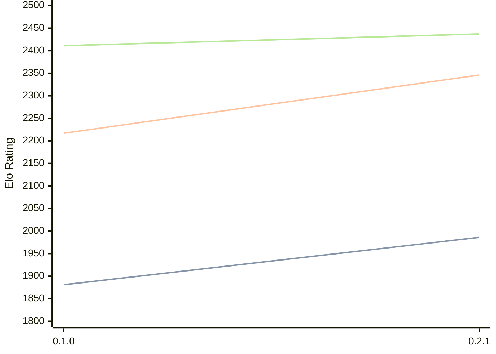

# Engine: Sykora

Author: Sullivan Bognar

Home: https://github.com/sb2bg/sykora

## Elo Ratings

| Version | Published | STC 8.0+0.08s  | LTC 60.0+0.60s | VLTC 2m24s+1.12s | Comment |
| --- | --- | --- | --- | --- | --- |
| 0.2.2 | 2026-03-23 |  |  |  |  |
| 0.2.1 | 2026-03-02 | 1986(+105) | 2346(+129) | 2437(+26) |  |
| 0.1.0 | 2026-02-17 | 1881 | 2217 | 2411 |  |
 | | | cElo (∆ prev) | cElo (∆ prev) | cElo (∆ prev) | 

<a href="https://github.com/computer-chess-index/cci/issues/new?template=submit-version.yml&title=[VERSION]+Sykora+<version>&body=###%20Engine%20name%0ASykora%0A%0A###%20Version%0A0.2.2" target="_blank">Submit new version</a>

 Test Conditions:

GUI/CLI: <a href=https://github.com/cutechess/cutechess target="_blank">Cute-Chess</a> 
Elo Calculation: <a href=https://www.remi-coulom.fr/Bayesian-Elo/ target="_blank">Bayesian-Elo</a> 
CPU: Intel(R) Core(TM) i5-7500T 2.70GHz 
Opening book: 8_moves_v3 
\* STC: 8.0+0.08s, LTC: 60.0+0.60s, VLTC: 2m24s+1.12s

 Lists:
Ratings: <a href=https://github.com/computer-chess-index/cci/blob/main/lists/CCIRatings.csv target="_blank">Complete list</a>

Generated: 2026-07-09 06:35:26

## Ratings Verlauf

## Ratings Verlauf

⬛ STC (8.0+0.08s) &nbsp;&nbsp; 🟧 LTC (60.0+0.60s) &nbsp;&nbsp; 🟩 VLTC (2m24s+1.12s)

dark mode: 🟩STC (8.0+0.08s) 🟧LTC (60.0+0.60s) ⬜VLTC (2m24s+1.12s)

## Detailed Evaluation Results

| Version | Time Control | Elo  | Range +/- | Matches | Score | Average Opponent Elo | Draws |
| --- | --- | --- | --- | --- | --- | --- | --- |
| 0.2.1 | VLTC (2m24s+1.12s) | 2437 | 36 | 254 | 53% | 2411 | 34% |
| 0.2.1 | LTC (60.0+0.60s) | 2346 | 34 | 292 | 49% | 2349 | 28% |
| 0.2.1 | STC (8.0+0.08s) | 1986 | 35 | 298 | 50% | 1982 | 21% |
| --- | --- | --- | --- | --- | --- | --- | --- |
| 0.1.0 | VLTC (2m24s+1.12s) | 2411 | 126 | 28 | 21% | 2714 | 21% |
| 0.1.0 | LTC (60.0+0.60s) | 2217 | 70 | 70 | 46% | 2249 | 27% |
| 0.1.0 | STC (8.0+0.08s) | 1881 | 97 | 40 | 41% | 2002 | 23% |
| --- | --- | --- | --- | --- | --- | --- | --- |