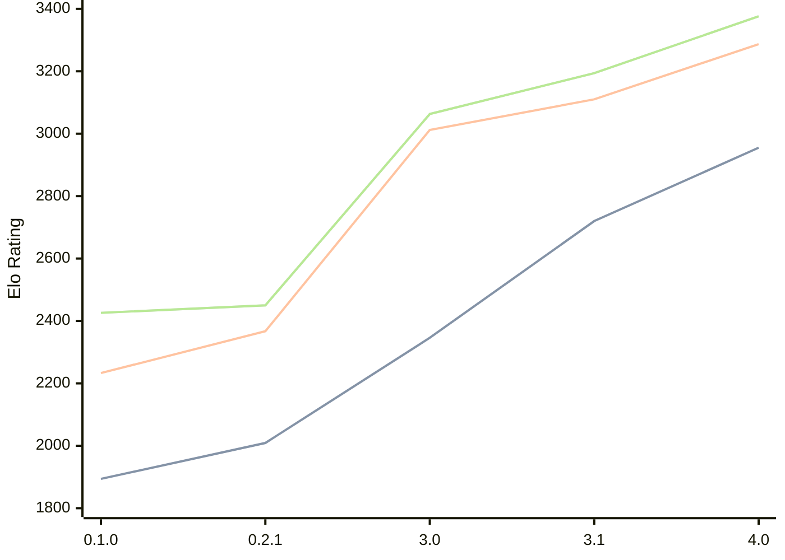

# Engine: Sykora

Author: Sullivan Bognar

Home: https://github.com/sb2bg/sykora

## Elo Ratings E1

| Version | Published | STC 8.0+0.08s  | LTC 60.0+0.60s | VLTC 2m24s+1.12s | Comment |
| --- | --- | --- | --- | --- | --- |
|  |  |  |  |  |  |
 | | | cElo (∆ prev) | cElo (∆ prev) | cElo (∆ prev) | 

## Elo Ratings P1

| Version | Published | STC 8.0+0.08s  | LTC 60.0+0.60s | VLTC 2m24s+1.12s | Comment |
| --- | --- | --- | --- | --- | --- |
|  |  |  |  |  |  |
 | | | cElo (∆ prev) | cElo (∆ prev) | cElo (∆ prev) | 

## Elo Ratings T1

| Version | Published | STC 8.0+0.08s  | LTC 60.0+0.60s | VLTC 2m24s+1.12s | Comment |
| --- | --- | --- | --- | --- | --- |
| 4.0 | 2026-08-02 | 2955(+235) | 3287(+177) | 3376(+182) |  |
| 3.1 | 2026-07-15 | 2720(+374) | 3110(+98) | 3194(+131) |  |
| 3.0 | 2026-07-12 | 2346(+337) | 3012(+645) | 3063(+613) |  |
| 0.2.1 | 2026-03-02 | 2009(+115) | 2367(+134) | 2450(+24) |  |
| 0.1.0 | 2026-02-17 | 1894 | 2233 | 2426 |  |
 | | | cElo (∆ prev) | cElo (∆ prev) | cElo (∆ prev) | 

<a href="https://github.com/computer-chess-index/cci/issues/new?template=submit-version.yml&title=[VERSION]+Sykora+<version>&body=###%20Engine%20name%0ASykora%0A%0A###%20Version%0A4.0" target="_blank">Submit new version</a>

 Test Conditions:

GUI/CLI: <a href=https://github.com/cutechess/cutechess target="_blank">Cute-Chess</a> 
Elo Calculation: <a href=https://www.remi-coulom.fr/Bayesian-Elo/ target="_blank">Bayesian-Elo</a> 
CPU for P1: Intel(R) Core(TM) Ultra 7 265T (1.50 GHz) - P-Core 
CPU for E1: Intel(R) Core(TM) Ultra 7 265T (1.50 GHz) - E-Core 
CPU for T1: Intel(R) Core(TM) i5-7500T 2.70GHz 
Opening book: 8_moves_v3 
\* STC: 8.0+0.08s, LTC: 60.0+0.60s, VLTC: 2m24s+1.12s

 Lists:
Ratings: <a href=https://github.com/computer-chess-index/cci/blob/main/lists/CCIRatings.csv target="_blank">Complete list</a>

Generated: 2026-10-09 14:17:13

## Ratings Verlauf

```mermaid
%%{init: {"theme":"base","themeVariables":{"seriesColors:['#a3a3a3','#222221','#faa371']}}}%%
xychart-beta
  x-axis ["0.1.0", "0.2.1", "3.0", "3.1", "4.0"]
  y-axis "Elo Rating" 1800 --> 3400
  line "" [1894, 2009, 2346, 2720, 2955]
  line "STC (8.0+0.08s)" [1894, 2009, 2346, 2720, 2955]
  line "LTC (60.0+0.60s)" [2233, 2367, 3012, 3110, 3287]
  line "" [2426, 2450, 3063, 3194, 3376]
  line "VLTC (2m24s+1.12s)" [2426, 2450, 3063, 3194, 3376]
```

## Detailed Evaluation Results

| Version | Time Control | Elo  | Range +/- | Matches | Score | Average Opponent Elo | Draws |
| --- | --- | --- | --- | --- | --- | --- | --- |
| 4.0 | VLTC (2m24s+1.12s) | 3376 | 30 | 262 | 48% | 3386 | 78% |
| 4.0 | LTC (60.0+0.60s) | 3287 | 33 | 224 | 54% | 3260 | 76% |
| 4.0 | STC (8.0+0.08s) | 2955 | 33 | 236 | 55% | 2916 | 72% |
| --- | --- | --- | --- | --- | --- | --- | --- |
| 3.1 | VLTC (2m24s+1.12s) | 3194 | 44 | 132 | 50% | 3191 | 70% |
| 3.1 | LTC (60.0+0.60s) | 3110 | 44 | 132 | 52% | 3101 | 64% |
| 3.1 | STC (8.0+0.08s) | 2720 | 46 | 126 | 51% | 2707 | 63% |
| --- | --- | --- | --- | --- | --- | --- | --- |
| 3.0 | VLTC (2m24s+1.12s) | 3063 | 48 | 124 | 56% | 2998 | 57% |
| 3.0 | LTC (60.0+0.60s) | 3012 | 56 | 96 | 54% | 2965 | 46% |
| 3.0 | STC (8.0+0.08s) | 2346 | 34 | 240 | 65% | 2236 | 62% |
| --- | --- | --- | --- | --- | --- | --- | --- |
| 0.2.1 | VLTC (2m24s+1.12s) | 2450 | 36 | 254 | 53% | 2426 | 34% |
| 0.2.1 | LTC (60.0+0.60s) | 2367 | 33 | 304 | 50% | 2363 | 28% |
| 0.2.1 | STC (8.0+0.08s) | 2009 | 34 | 306 | 51% | 1998 | 22% |
| --- | --- | --- | --- | --- | --- | --- | --- |
| 0.1.0 | VLTC (2m24s+1.12s) | 2426 | 126 | 28 | 21% | 2730 | 21% |
| 0.1.0 | LTC (60.0+0.60s) | 2233 | 70 | 70 | 46% | 2265 | 27% |
| 0.1.0 | STC (8.0+0.08s) | 1894 | 97 | 40 | 41% | 2016 | 23% |
| --- | --- | --- | --- | --- | --- | --- | --- |