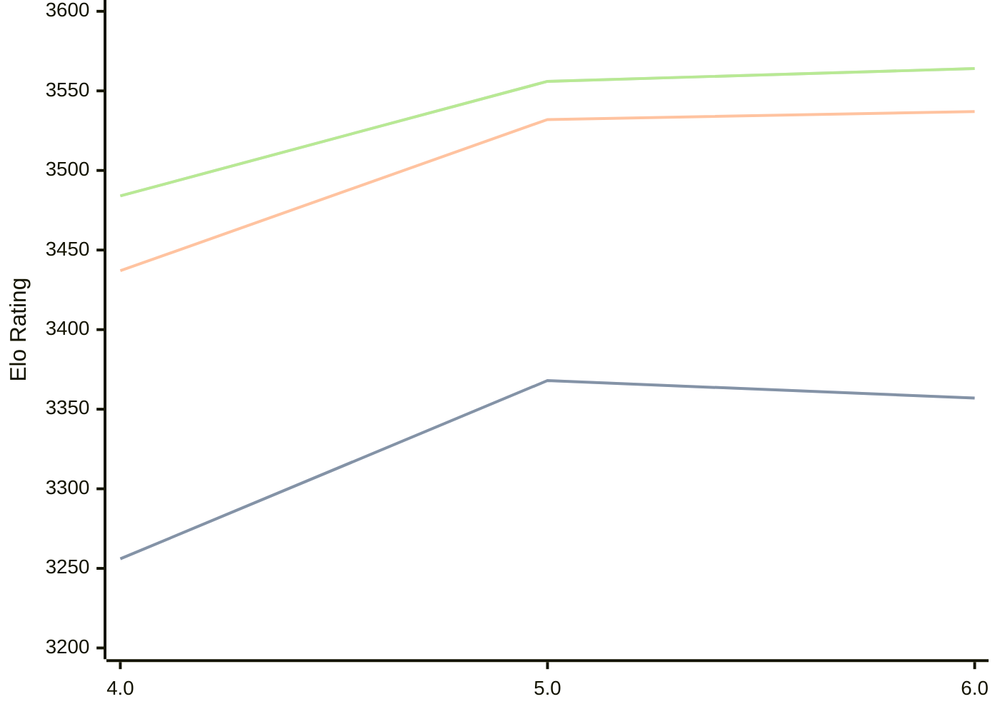

# Engine: Tarnished

Author: Anik Patel

Home: https://github.com/Bobingstern/Tarnished

## Elo Ratings

| Version | Published | STC 8.0+0.08s  | LTC 60.0+0.60s | VLTC 2m24s+1.12s | Comment |
| --- | --- | --- | --- | --- | --- |
| 6.0 | 2026-06-10 | 3357(-11) | 3537(+5) | 3564(+8) |  |
| 5.0 | 2026-02-07 | 3368(+112) | 3532(+95) | 3556(+72) |  |
| 4.0 | 2025-08-23 | 3256 | 3437 | 3484 |  |
 | | | cElo (∆ prev) | cElo (∆ prev) | cElo (∆ prev) | 

<a href="https://github.com/computer-chess-index/cci/issues/new?template=submit-version.yml&title=[VERSION]+Tarnished+<version>&body=###%20Engine%20name%0ATarnished%0A%0A###%20Version%0A6.0" target="_blank">Submit new version</a>

 Test Conditions:

GUI/CLI: <a href=https://github.com/cutechess/cutechess target="_blank">Cute-Chess</a> 
Elo Calculation: <a href=https://www.remi-coulom.fr/Bayesian-Elo/ target="_blank">Bayesian-Elo</a> 
CPU: Intel(R) Core(TM) i5-7500T 2.70GHz 
Opening book: 8_moves_v3 
\* STC: 8.0+0.08s, LTC: 60.0+0.60s, VLTC: 2m24s+1.12s

 Lists:
Ratings: <a href=https://github.com/computer-chess-index/cci/blob/main/lists/CCIRatings.csv target="_blank">Complete list</a>

Generated: 2026-09-10 04:43:04

## Ratings Verlauf

## Detailed Evaluation Results

| Version | Time Control | Elo  | Range +/- | Matches | Score | Average Opponent Elo | Draws |
| --- | --- | --- | --- | --- | --- | --- | --- |
| 6.0 | VLTC (2m24s+1.12s) | 3564 | 25 | 368 | 51% | 3557 | 87% |
| 6.0 | LTC (60.0+0.60s) | 3537 | 25 | 378 | 49% | 3544 | 86% |
| 6.0 | STC (8.0+0.08s) | 3357 | 24 | 436 | 49% | 3364 | 72% |
| --- | --- | --- | --- | --- | --- | --- | --- |
| 5.0 | VLTC (2m24s+1.12s) | 3556 | 23 | 442 | 50% | 3555 | 86% |
| 5.0 | LTC (60.0+0.60s) | 3532 | 23 | 442 | 51% | 3525 | 85% |
| 5.0 | STC (8.0+0.08s) | 3368 | 23 | 474 | 50% | 3366 | 72% |
| --- | --- | --- | --- | --- | --- | --- | --- |
| 4.0 | VLTC (2m24s+1.12s) | 3484 | 29 | 282 | 51% | 3476 | 78% |
| 4.0 | LTC (60.0+0.60s) | 3437 | 34 | 220 | 51% | 3420 | 75% |
| 4.0 | STC (8.0+0.08s) | 3256 | 29 | 316 | 54% | 3220 | 68% |
| --- | --- | --- | --- | --- | --- | --- | --- |