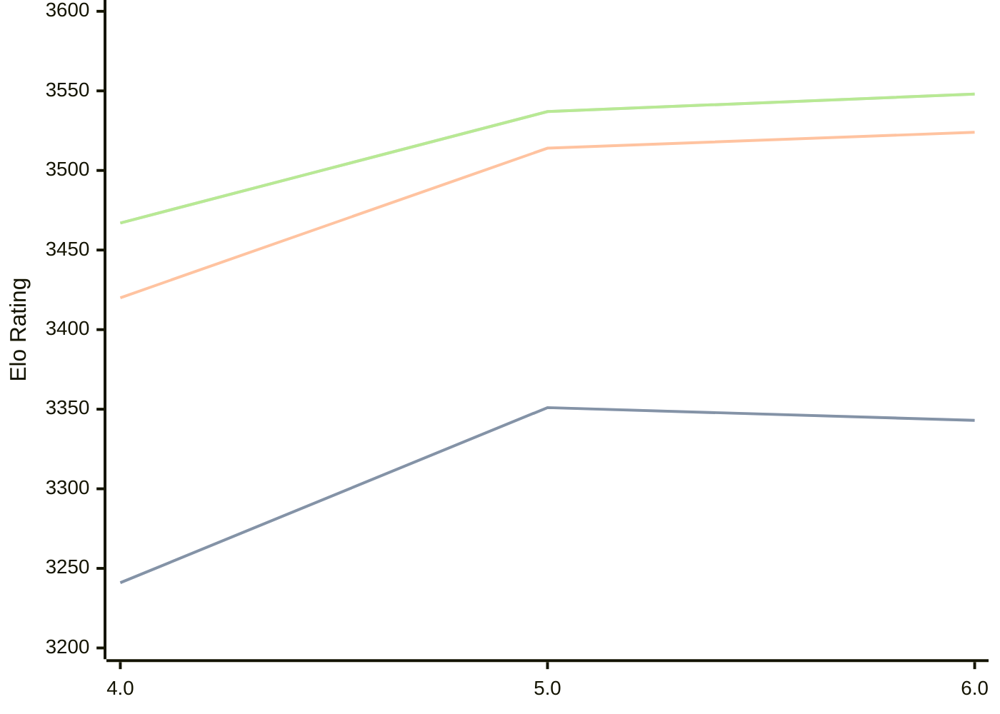

# Engine: Tarnished

Author: Anik Patel

Home: https://github.com/Bobingstern/Tarnished

## Elo Ratings

| Version | Published | STC 8.0+0.08s  | LTC 60.0+0.60s | VLTC 2m24s+1.12s | Comment |
| --- | --- | --- | --- | --- | --- |
| 6.0 | 2026-06-10 | 3343(-8) | 3524(+10) | 3548(+11) |  |
| 5.0 | 2026-02-07 | 3351(+110) | 3514(+94) | 3537(+70) |  |
| 4.0 | 2025-08-23 | 3241(+new) | 3420(+new) | 3467(+new) |  |
| 3.0 | 2025-06-30 |  |  |  |  |
| 2.1 | 2025-05-25 |  |  |  |  |
| 2.0 | 2025-05-14 |  |  |  |  |
| 1.0 | 2025-05-07 |  |  |  |  |
 | | | cElo (∆ prev) | cElo (∆ prev) | cElo (∆ prev) | 

<a href="https://github.com/computer-chess-index/cci/issues/new?template=submit-version.yml&title=[VERSION]+Tarnished+<version>&body=###%20Engine%20name%0ATarnished%0A%0A###%20Version%0A6.0" target="_blank">Submit new version</a>

 Test Conditions:

GUI/CLI: <a href=https://github.com/cutechess/cutechess target="_blank">Cute-Chess</a> 
Elo Calculation: <a href=https://www.remi-coulom.fr/Bayesian-Elo/ target="_blank">Bayesian-Elo</a> 
CPU: Intel(R) Core(TM) i5-7500T 2.70GHz 
Opening book: 8_moves_v3 
\* STC: 8.0+0.08s, LTC: 60.0+0.60s, VLTC: 2m24s+1.12s

 Lists:
Ratings: <a href=https://github.com/computer-chess-index/cci/blob/main/lists/CCIRatings.csv target="_blank">Complete list</a>

Generated: 2026-06-30 06:29:41

## Ratings Verlauf

## Ratings Verlauf

⬛ STC (8.0+0.08s) &nbsp;&nbsp; 🟧 LTC (60.0+0.60s) &nbsp;&nbsp; 🟩 VLTC (2m24s+1.12s)

dark mode: 🟩STC (8.0+0.08s) 🟧LTC (60.0+0.60s) ⬜VLTC (2m24s+1.12s)

## Detailed Evaluation Results

| Version | Time Control | Elo  | Range +/- | Matches | Score | Average Opponent Elo | Draws |
| --- | --- | --- | --- | --- | --- | --- | --- |
| 6.0 | VLTC (2m24s+1.12s) | 3548 | 32 | 222 | 51% | 3538 | 87% |
| 6.0 | LTC (60.0+0.60s) | 3524 | 32 | 232 | 49% | 3530 | 85% |
| 6.0 | STC (8.0+0.08s) | 3343 | 30 | 276 | 49% | 3348 | 72% |
| --- | --- | --- | --- | --- | --- | --- | --- |
| 5.0 | VLTC (2m24s+1.12s) | 3537 | 23 | 442 | 50% | 3537 | 86% |
| 5.0 | LTC (60.0+0.60s) | 3514 | 23 | 442 | 51% | 3507 | 85% |
| 5.0 | STC (8.0+0.08s) | 3351 | 23 | 474 | 50% | 3348 | 72% |
| --- | --- | --- | --- | --- | --- | --- | --- |
| 4.0 | VLTC (2m24s+1.12s) | 3467 | 29 | 282 | 51% | 3459 | 78% |
| 4.0 | LTC (60.0+0.60s) | 3420 | 34 | 220 | 51% | 3401 | 75% |
| 4.0 | STC (8.0+0.08s) | 3241 | 29 | 316 | 54% | 3204 | 68% |
| --- | --- | --- | --- | --- | --- | --- | --- |