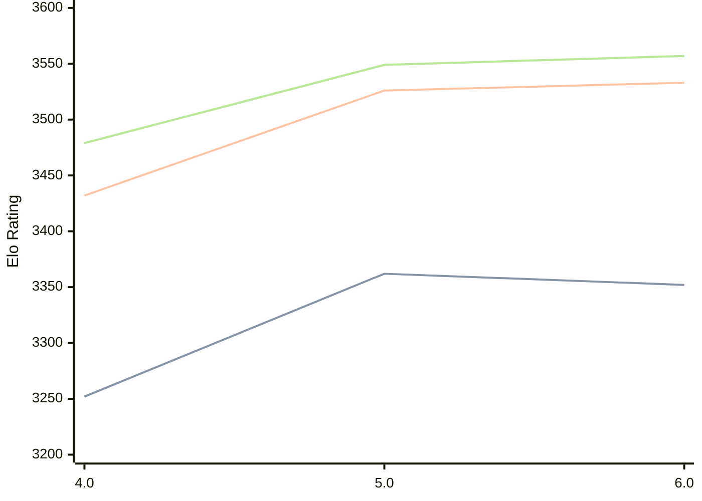

# Engine: Tarnished

Author: Anik Patel

Home: https://github.com/Bobingstern/Tarnished

## Elo Ratings

| Version | Published | STC 8.0+0.08s  | LTC 60.0+0.60s | VLTC 2m24s+1.12s | Comment |
| --- | --- | --- | --- | --- | --- |
| 6.0 | 2026-06-10 | 3352(-10) | 3533(+7) | 3557(+8) |  |
| 5.0 | 2026-02-07 | 3362(+110) | 3526(+94) | 3549(+70) |  |
| 4.0 | 2025-08-23 | 3252 | 3432 | 3479 |  |
 | | | cElo (∆ prev) | cElo (∆ prev) | cElo (∆ prev) | 

<a href="https://github.com/computer-chess-index/cci/issues/new?template=submit-version.yml&title=[VERSION]+Tarnished+<version>&body=###%20Engine%20name%0ATarnished%0A%0A###%20Version%0A6.0" target="_blank">Submit new version</a>

 Test Conditions:

GUI/CLI: <a href=https://github.com/cutechess/cutechess target="_blank">Cute-Chess</a> 
Elo Calculation: <a href=https://www.remi-coulom.fr/Bayesian-Elo/ target="_blank">Bayesian-Elo</a> 
CPU: Intel(R) Core(TM) i5-7500T 2.70GHz 
Opening book: 8_moves_v3 
\* STC: 8.0+0.08s, LTC: 60.0+0.60s, VLTC: 2m24s+1.12s

 Lists:
Ratings: <a href=https://github.com/computer-chess-index/cci/blob/main/lists/CCIRatings.csv target="_blank">Complete list</a>

Generated: 2026-08-25 06:37:53

## Ratings Verlauf

⬛ STC (8.0+0.08s) &nbsp;&nbsp; 🟧 LTC (60.0+0.60s) &nbsp;&nbsp; 🟩 VLTC (2m24s+1.12s)

dark mode: 🟩STC (8.0+0.08s) 🟧LTC (60.0+0.60s) ⬜VLTC (2m24s+1.12s)

## Detailed Evaluation Results

| Version | Time Control | Elo  | Range +/- | Matches | Score | Average Opponent Elo | Draws |
| --- | --- | --- | --- | --- | --- | --- | --- |
| 6.0 | VLTC (2m24s+1.12s) | 3557 | 25 | 356 | 51% | 3551 | 87% |
| 6.0 | LTC (60.0+0.60s) | 3533 | 25 | 362 | 49% | 3538 | 85% |
| 6.0 | STC (8.0+0.08s) | 3352 | 25 | 404 | 49% | 3359 | 73% |
| --- | --- | --- | --- | --- | --- | --- | --- |
| 5.0 | VLTC (2m24s+1.12s) | 3549 | 23 | 442 | 50% | 3549 | 86% |
| 5.0 | LTC (60.0+0.60s) | 3526 | 23 | 442 | 51% | 3519 | 85% |
| 5.0 | STC (8.0+0.08s) | 3362 | 23 | 474 | 50% | 3360 | 72% |
| --- | --- | --- | --- | --- | --- | --- | --- |
| 4.0 | VLTC (2m24s+1.12s) | 3479 | 29 | 282 | 51% | 3471 | 78% |
| 4.0 | LTC (60.0+0.60s) | 3432 | 34 | 220 | 51% | 3413 | 75% |
| 4.0 | STC (8.0+0.08s) | 3252 | 29 | 316 | 54% | 3214 | 68% |
| --- | --- | --- | --- | --- | --- | --- | --- |