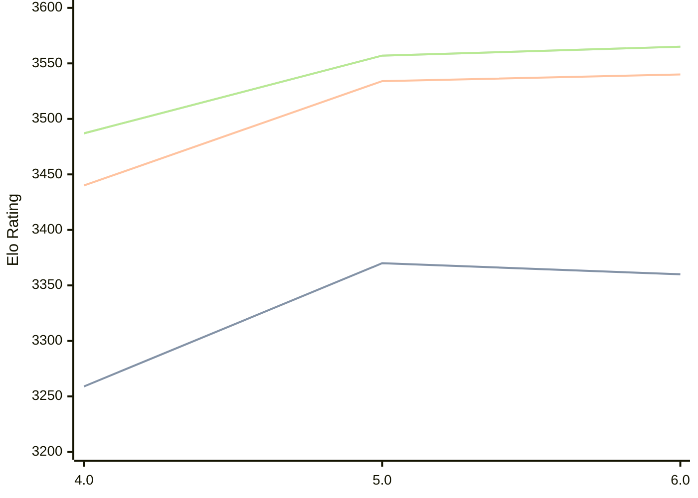

# Engine: Tarnished

Author: Anik Patel

Home: https://github.com/Bobingstern/Tarnished

## Elo Ratings

| Version | Published | STC 8.0+0.08s  | LTC 60.0+0.60s | VLTC 2m24s+1.12s | Comment |
| --- | --- | --- | --- | --- | --- |
| 6.0 | 2026-06-10 | 3360(-10) | 3540(+6) | 3565(+8) |  |
| 5.0 | 2026-02-07 | 3370(+111) | 3534(+94) | 3557(+70) |  |
| 4.0 | 2025-08-23 | 3259 | 3440 | 3487 |  |
 | | | cElo (∆ prev) | cElo (∆ prev) | cElo (∆ prev) | 

<a href="https://github.com/computer-chess-index/cci/issues/new?template=submit-version.yml&title=[VERSION]+Tarnished+<version>&body=###%20Engine%20name%0ATarnished%0A%0A###%20Version%0A6.0" target="_blank">Submit new version</a>

 Test Conditions:

GUI/CLI: <a href=https://github.com/cutechess/cutechess target="_blank">Cute-Chess</a> 
Elo Calculation: <a href=https://www.remi-coulom.fr/Bayesian-Elo/ target="_blank">Bayesian-Elo</a> 
CPU: Intel(R) Core(TM) i5-7500T 2.70GHz 
Opening book: 8_moves_v3 
\* STC: 8.0+0.08s, LTC: 60.0+0.60s, VLTC: 2m24s+1.12s

 Lists:
Ratings: <a href=https://github.com/computer-chess-index/cci/blob/main/lists/CCIRatings.csv target="_blank">Complete list</a>

Generated: 2026-09-16 04:42:52

## Ratings Verlauf

## Detailed Evaluation Results

| Version | Time Control | Elo  | Range +/- | Matches | Score | Average Opponent Elo | Draws |
| --- | --- | --- | --- | --- | --- | --- | --- |
| 6.0 | VLTC (2m24s+1.12s) | 3565 | 25 | 372 | 51% | 3560 | 87% |
| 6.0 | LTC (60.0+0.60s) | 3540 | 25 | 382 | 49% | 3546 | 86% |
| 6.0 | STC (8.0+0.08s) | 3360 | 24 | 444 | 49% | 3366 | 72% |
| --- | --- | --- | --- | --- | --- | --- | --- |
| 5.0 | VLTC (2m24s+1.12s) | 3557 | 23 | 442 | 50% | 3557 | 86% |
| 5.0 | LTC (60.0+0.60s) | 3534 | 23 | 442 | 51% | 3528 | 85% |
| 5.0 | STC (8.0+0.08s) | 3370 | 23 | 474 | 50% | 3368 | 72% |
| --- | --- | --- | --- | --- | --- | --- | --- |
| 4.0 | VLTC (2m24s+1.12s) | 3487 | 29 | 282 | 51% | 3479 | 78% |
| 4.0 | LTC (60.0+0.60s) | 3440 | 34 | 220 | 51% | 3421 | 75% |
| 4.0 | STC (8.0+0.08s) | 3259 | 29 | 316 | 54% | 3221 | 68% |
| --- | --- | --- | --- | --- | --- | --- | --- |