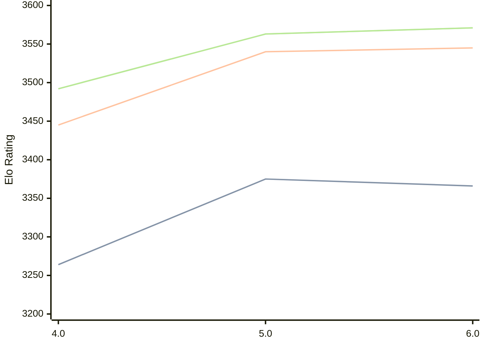

# Engine: Tarnished

Author: Anik Patel

Home: https://github.com/Bobingstern/Tarnished

## Elo Ratings

| Version | Published | STC 8.0+0.08s  | LTC 60.0+0.60s | VLTC 2m24s+1.12s | Comment |
| --- | --- | --- | --- | --- | --- |
| 6.0 | 2026-06-10 | 3366(-9) | 3545(+5) | 3571(+8) |  |
| 5.0 | 2026-02-07 | 3375(+111) | 3540(+95) | 3563(+71) |  |
| 4.0 | 2025-08-23 | 3264 | 3445 | 3492 |  |
 | | | cElo (∆ prev) | cElo (∆ prev) | cElo (∆ prev) | 

<a href="https://github.com/computer-chess-index/cci/issues/new?template=submit-version.yml&title=[VERSION]+Tarnished+<version>&body=###%20Engine%20name%0ATarnished%0A%0A###%20Version%0A6.0" target="_blank">Submit new version</a>

 Test Conditions:

GUI/CLI: <a href=https://github.com/cutechess/cutechess target="_blank">Cute-Chess</a> 
Elo Calculation: <a href=https://www.remi-coulom.fr/Bayesian-Elo/ target="_blank">Bayesian-Elo</a> 
CPU: Intel(R) Core(TM) i5-7500T 2.70GHz 
Opening book: 8_moves_v3 
\* STC: 8.0+0.08s, LTC: 60.0+0.60s, VLTC: 2m24s+1.12s

 Lists:
Ratings: <a href=https://github.com/computer-chess-index/cci/blob/main/lists/CCIRatings.csv target="_blank">Complete list</a>

Generated: 2026-10-09 04:43:44

## Ratings Verlauf

```mermaid
%%{init: {"theme":"base","themeVariables":{"seriesColors:['#a3a3a3','#222221','#faa371']}}}%%
xychart-beta
  x-axis ["4.0", "5.0", "6.0"]
  y-axis "Elo Rating" 3200 --> 3600
  line "" [3264, 3375, 3366]
  line "STC (8.0+0.08s)" [3264, 3375, 3366]
  line "LTC (60.0+0.60s)" [3445, 3540, 3545]
  line "" [3492, 3563, 3571]
  line "VLTC (2m24s+1.12s)" [3492, 3563, 3571]
```

## Detailed Evaluation Results

| Version | Time Control | Elo  | Range +/- | Matches | Score | Average Opponent Elo | Draws |
| --- | --- | --- | --- | --- | --- | --- | --- |
| 6.0 | VLTC (2m24s+1.12s) | 3571 | 25 | 372 | 51% | 3565 | 87% |
| 6.0 | LTC (60.0+0.60s) | 3545 | 24 | 390 | 49% | 3552 | 86% |
| 6.0 | STC (8.0+0.08s) | 3366 | 24 | 444 | 49% | 3372 | 72% |
| --- | --- | --- | --- | --- | --- | --- | --- |
| 5.0 | VLTC (2m24s+1.12s) | 3563 | 23 | 442 | 50% | 3563 | 86% |
| 5.0 | LTC (60.0+0.60s) | 3540 | 23 | 442 | 51% | 3533 | 85% |
| 5.0 | STC (8.0+0.08s) | 3375 | 23 | 474 | 50% | 3374 | 72% |
| --- | --- | --- | --- | --- | --- | --- | --- |
| 4.0 | VLTC (2m24s+1.12s) | 3492 | 29 | 282 | 51% | 3484 | 78% |
| 4.0 | LTC (60.0+0.60s) | 3445 | 34 | 220 | 51% | 3426 | 75% |
| 4.0 | STC (8.0+0.08s) | 3264 | 29 | 316 | 54% | 3227 | 68% |
| --- | --- | --- | --- | --- | --- | --- | --- |