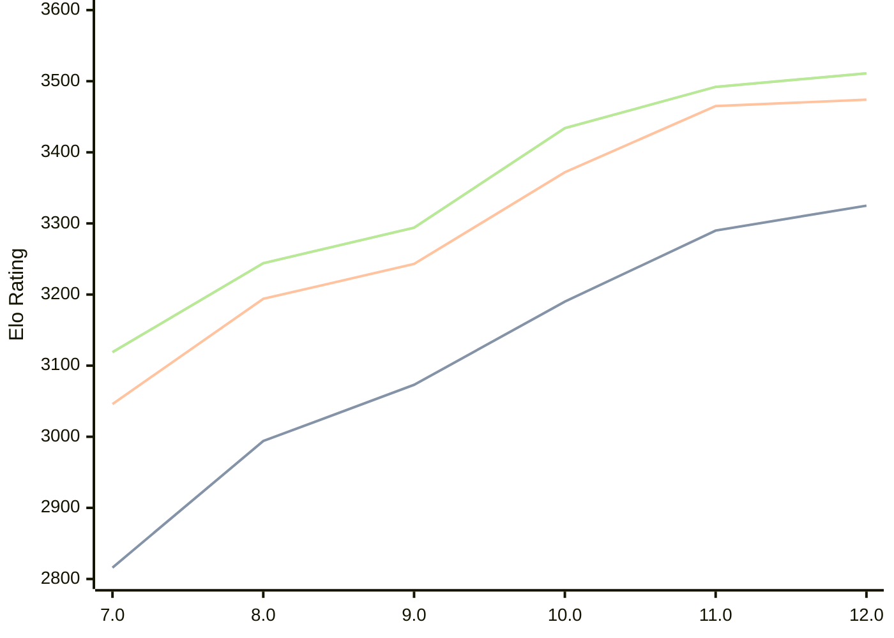

# Engine: Tcheran

Author: Jonathan Gilchrist

Home: https://github.com/tcheran-chess/tcheran

## Elo Ratings

| Version | Published | STC 8.0+0.08s  | LTC 60.0+0.60s | VLTC 2m24s+1.12s | Comment |
| --- | --- | --- | --- | --- | --- |
| 12.0 | 2026-05-08 | 3325(+35) | 3474(+9) | 3511(+19) |  |
| 11.0 | 2026-02-13 | 3290(+100) | 3465(+93) | 3492(+58) |  |
| 10.0 | 2025-12-28 | 3190(+117) | 3372(+129) | 3434(+140) |  |
| 9.0 | 2025-12-08 | 3073(+79) | 3243(+49) | 3294(+50) |  |
| 8.0 | 2025-11-27 | 2994(+178) | 3194(+148) | 3244(+125) |  |
| 7.0 | 2025-11-07 | 2816(+new) | 3046(+new) | 3119(+new) |  |
| 6.0 | 2025-10-21 |  |  |  |  |
| 5.1 | 2025-01-01 |  |  |  |  |
| 5.0 | 2024-12-05 |  |  |  |  |
| 4.1 | 2024-11-24 |  |  |  |  |
| 4.0 | 2024-10-18 |  |  |  |  |
| 3.0 | 2024-09-09 |  |  |  |  |
| 2.5 | 2024-07-25 |  |  |  |  |
| 2.4 | 2024-07-08 |  |  |  |  |
| 2.3 | 2024-05-09 |  |  |  |  |
| 2.2 | 2024-04-09 |  |  |  |  |
| 2.1 | 2024-01-25 |  |  |  |  |
| 2.0 | 2024-01-18 |  |  |  |  |
| 1.1 | 2024-01-08 |  |  |  |  |
| 1.0 | 2023-12-07 |  |  |  |  |
 | | | cElo (∆ prev) | cElo (∆ prev) | cElo (∆ prev) | 

<a href="https://github.com/computer-chess-index/cci/issues/new?template=submit-version.yml&title=[VERSION]+Tcheran+<version>&body=###%20Engine%20name%0ATcheran%0A%0A###%20Version%0A12.0" target="_blank">Submit new version</a>

 Test Conditions:

GUI/CLI: <a href=https://github.com/cutechess/cutechess target="_blank">Cute-Chess</a> 
Elo Calculation: <a href=https://www.remi-coulom.fr/Bayesian-Elo/ target="_blank">Bayesian-Elo</a> 
CPU: Intel(R) Core(TM) i5-7500T 2.70GHz 
Opening book: 8_moves_v3 
\* STC: 8.0+0.08s, LTC: 60.0+0.60s, VLTC: 2m24s+1.12s

 Lists:
Ratings: <a href=https://github.com/computer-chess-index/cci/blob/main/lists/CCIRatings.csv target="_blank">Complete list</a>

Generated: 2026-05-15 06:28:39

## Ratings Verlauf

⬛ STC (8.0+0.08s) &nbsp;&nbsp; 🟧 LTC (60.0+0.60s) &nbsp;&nbsp; 🟩 VLTC (2m24s+1.12s)

dark mode: 🟩STC (8.0+0.08s) 🟧LTC (60.0+0.60s) ⬜VLTC (2m24s+1.12s)

## Detailed Evaluation Results

| Version | Time Control | Elo  | Range +/- | Matches | Score | Average Opponent Elo | Draws |
| --- | --- | --- | --- | --- | --- | --- | --- |
| 12.0 | VLTC (2m24s+1.12s) | 3511 | 31 | 238 | 51% | 3507 | 84% |
| 12.0 | LTC (60.0+0.60s) | 3474 | 32 | 240 | 51% | 3471 | 79% |
| 12.0 | STC (8.0+0.08s) | 3325 | 29 | 312 | 52% | 3310 | 69% |
| --- | --- | --- | --- | --- | --- | --- | --- |
| 11.0 | VLTC (2m24s+1.12s) | 3492 | 23 | 434 | 51% | 3488 | 80% |
| 11.0 | LTC (60.0+0.60s) | 3465 | 24 | 424 | 51% | 3457 | 79% |
| 11.0 | STC (8.0+0.08s) | 3290 | 25 | 448 | 51% | 3286 | 56% |
| --- | --- | --- | --- | --- | --- | --- | --- |
| 10.0 | VLTC (2m24s+1.12s) | 3434 | 27 | 336 | 49% | 3443 | 75% |
| 10.0 | LTC (60.0+0.60s) | 3372 | 30 | 268 | 49% | 3383 | 75% |
| 10.0 | STC (8.0+0.08s) | 3190 | 31 | 286 | 52% | 3178 | 58% |
| --- | --- | --- | --- | --- | --- | --- | --- |
| 9.0 | VLTC (2m24s+1.12s) | 3294 | 38 | 180 | 50% | 3293 | 66% |
| 9.0 | LTC (60.0+0.60s) | 3243 | 39 | 168 | 52% | 3229 | 65% |
| 9.0 | STC (8.0+0.08s) | 3073 | 37 | 212 | 47% | 3102 | 53% |
| --- | --- | --- | --- | --- | --- | --- | --- |
| 8.0 | VLTC (2m24s+1.12s) | 3244 | 44 | 132 | 50% | 3241 | 64% |
| 8.0 | LTC (60.0+0.60s) | 3194 | 37 | 204 | 57% | 3137 | 58% |
| 8.0 | STC (8.0+0.08s) | 2994 | 42 | 164 | 47% | 3016 | 49% |
| --- | --- | --- | --- | --- | --- | --- | --- |
| 7.0 | VLTC (2m24s+1.12s) | 3119 | 51 | 116 | 47% | 3143 | 44% |
| 7.0 | LTC (60.0+0.60s) | 3046 | 49 | 130 | 50% | 3027 | 42% |
| 7.0 | STC (8.0+0.08s) | 2816 | 54 | 116 | 56% | 2739 | 36% |
| --- | --- | --- | --- | --- | --- | --- | --- |