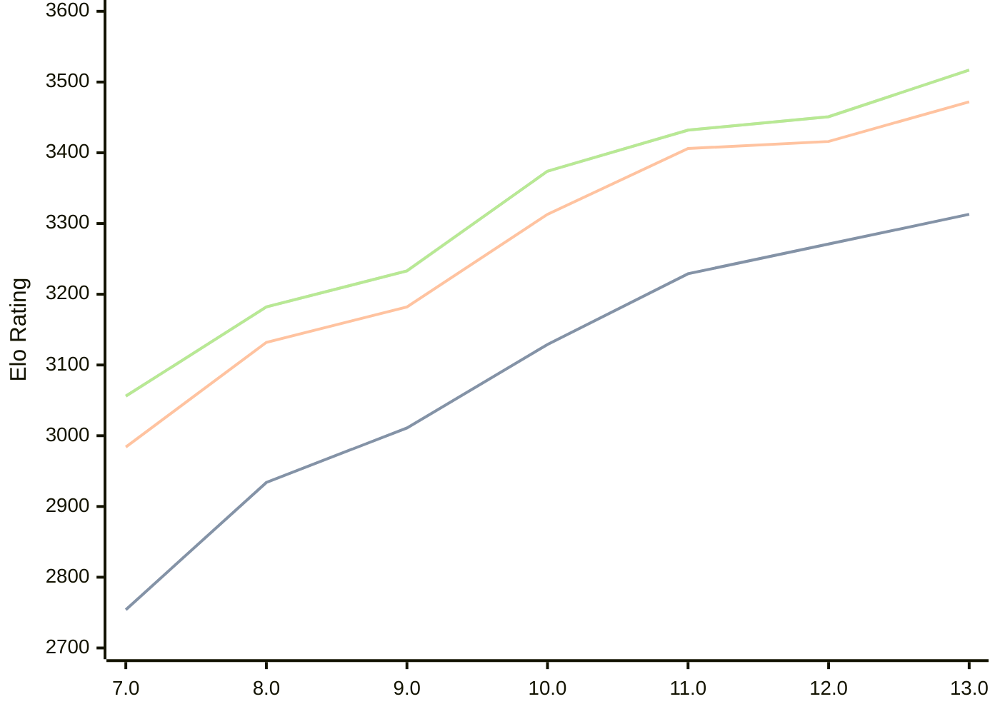

# Engine: Tcheran

Author: Jonathan Gilchrist

Home: https://github.com/tcheran-chess/tcheran

## Elo Ratings

| Version | Published | STC 8.0+0.08s  | LTC 60.0+0.60s | VLTC 2m24s+1.12s | Comment |
| --- | --- | --- | --- | --- | --- |
| 13.0 | 2026-07-17 | 3313(+42) | 3472(+56) | 3517(+66) |  |
| 12.0 | 2026-05-08 | 3271(+42) | 3416(+10) | 3451(+19) |  |
| 11.0 | 2026-02-13 | 3229(+100) | 3406(+93) | 3432(+58) |  |
| 10.0 | 2025-12-28 | 3129(+118) | 3313(+131) | 3374(+141) |  |
| 9.0 | 2025-12-08 | 3011(+77) | 3182(+50) | 3233(+51) |  |
| 8.0 | 2025-11-27 | 2934(+180) | 3132(+148) | 3182(+126) |  |
| 7.0 | 2025-11-07 | 2754(+new) | 2984(+new) | 3056(+new) |  |
| 6.0 | 2025-10-21 |  |  |  |  |
| 5.1 | 2025-01-01 |  |  |  |  |
| 5.0 | 2024-12-05 |  |  |  |  |
| 4.1 | 2024-11-24 |  |  |  |  |
| 4.0 | 2024-10-18 |  |  |  |  |
| 3.0 | 2024-09-09 |  |  |  |  |
| 2.5 | 2024-07-25 |  |  |  |  |
| 2.4 | 2024-07-08 |  |  |  |  |
| 2.3 | 2024-05-09 |  |  |  |  |
| 2.2 | 2024-04-09 |  |  |  |  |
| 2.1 | 2024-01-25 |  |  |  |  |
| 2.0 | 2024-01-18 |  |  |  |  |
| 1.1 | 2024-01-08 |  |  |  |  |
| 1.0 | 2023-12-07 |  |  |  |  |
 | | | cElo (∆ prev) | cElo (∆ prev) | cElo (∆ prev) | 

<a href="https://github.com/computer-chess-index/cci/issues/new?template=submit-version.yml&title=[VERSION]+Tcheran+<version>&body=###%20Engine%20name%0ATcheran%0A%0A###%20Version%0A13.0" target="_blank">Submit new version</a>

 Test Conditions:

GUI/CLI: <a href=https://github.com/cutechess/cutechess target="_blank">Cute-Chess</a> 
Elo Calculation: <a href=https://www.remi-coulom.fr/Bayesian-Elo/ target="_blank">Bayesian-Elo</a> 
CPU: Intel(R) Core(TM) i5-7500T 2.70GHz 
Opening book: 8_moves_v3 
\* STC: 8.0+0.08s, LTC: 60.0+0.60s, VLTC: 2m24s+1.12s

 Lists:
Ratings: <a href=https://github.com/computer-chess-index/cci/blob/main/lists/CCIRatings.csv target="_blank">Complete list</a>

Generated: 2026-07-24 06:30:56

## Ratings Verlauf

⬛ STC (8.0+0.08s) &nbsp;&nbsp; 🟧 LTC (60.0+0.60s) &nbsp;&nbsp; 🟩 VLTC (2m24s+1.12s)

dark mode: 🟩STC (8.0+0.08s) 🟧LTC (60.0+0.60s) ⬜VLTC (2m24s+1.12s)

## Detailed Evaluation Results

| Version | Time Control | Elo  | Range +/- | Matches | Score | Average Opponent Elo | Draws |
| --- | --- | --- | --- | --- | --- | --- | --- |
| 13.0 | VLTC (2m24s+1.12s) | 3517 | 34 | 200 | 50% | 3518 | 82% |
| 13.0 | LTC (60.0+0.60s) | 3472 | 33 | 210 | 52% | 3459 | 83% |
| 13.0 | STC (8.0+0.08s) | 3313 | 36 | 188 | 51% | 3305 | 71% |
| --- | --- | --- | --- | --- | --- | --- | --- |
| 12.0 | VLTC (2m24s+1.12s) | 3451 | 24 | 404 | 50% | 3453 | 84% |
| 12.0 | LTC (60.0+0.60s) | 3416 | 25 | 380 | 51% | 3413 | 81% |
| 12.0 | STC (8.0+0.08s) | 3271 | 25 | 418 | 52% | 3256 | 68% |
| --- | --- | --- | --- | --- | --- | --- | --- |
| 11.0 | VLTC (2m24s+1.12s) | 3432 | 23 | 434 | 51% | 3428 | 80% |
| 11.0 | LTC (60.0+0.60s) | 3406 | 24 | 424 | 51% | 3397 | 79% |
| 11.0 | STC (8.0+0.08s) | 3229 | 25 | 448 | 51% | 3225 | 56% |
| --- | --- | --- | --- | --- | --- | --- | --- |
| 10.0 | VLTC (2m24s+1.12s) | 3374 | 27 | 336 | 49% | 3382 | 75% |
| 10.0 | LTC (60.0+0.60s) | 3313 | 30 | 268 | 49% | 3322 | 75% |
| 10.0 | STC (8.0+0.08s) | 3129 | 31 | 286 | 52% | 3117 | 58% |
| --- | --- | --- | --- | --- | --- | --- | --- |
| 9.0 | VLTC (2m24s+1.12s) | 3233 | 38 | 180 | 50% | 3232 | 66% |
| 9.0 | LTC (60.0+0.60s) | 3182 | 39 | 168 | 52% | 3168 | 65% |
| 9.0 | STC (8.0+0.08s) | 3011 | 37 | 212 | 47% | 3040 | 53% |
| --- | --- | --- | --- | --- | --- | --- | --- |
| 8.0 | VLTC (2m24s+1.12s) | 3182 | 44 | 132 | 50% | 3181 | 64% |
| 8.0 | LTC (60.0+0.60s) | 3132 | 37 | 204 | 57% | 3075 | 58% |
| 8.0 | STC (8.0+0.08s) | 2934 | 42 | 164 | 47% | 2955 | 49% |
| --- | --- | --- | --- | --- | --- | --- | --- |
| 7.0 | VLTC (2m24s+1.12s) | 3056 | 51 | 116 | 47% | 3081 | 44% |
| 7.0 | LTC (60.0+0.60s) | 2984 | 49 | 130 | 50% | 2965 | 42% |
| 7.0 | STC (8.0+0.08s) | 2754 | 54 | 116 | 56% | 2678 | 36% |
| --- | --- | --- | --- | --- | --- | --- | --- |