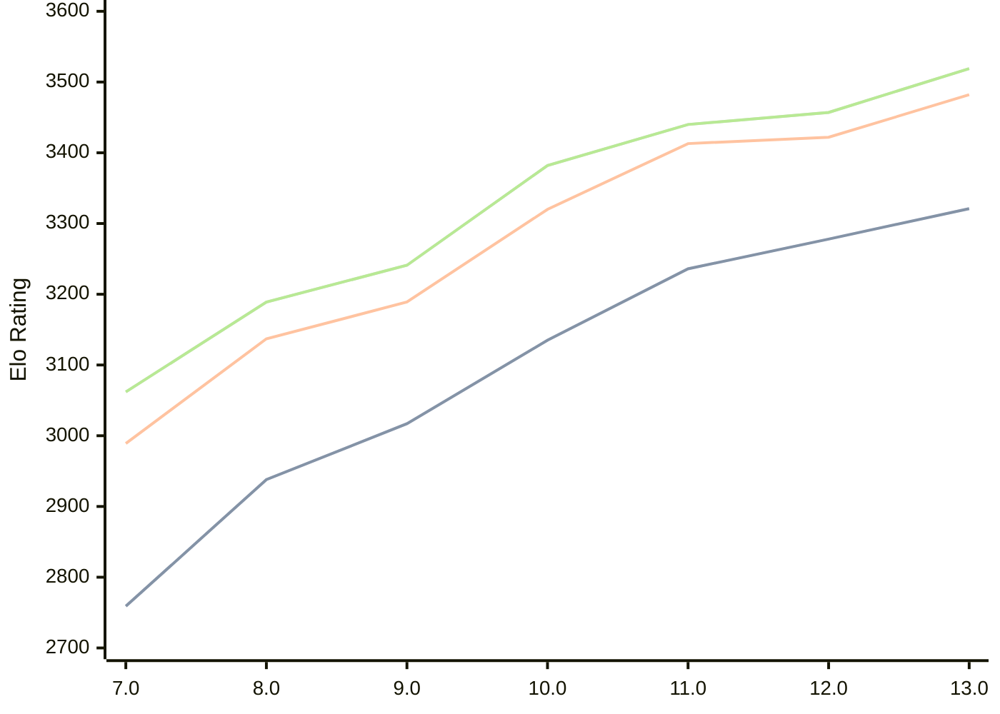

# Engine: Tcheran

Author: Jonathan Gilchrist

Home: https://github.com/tcheran-chess/tcheran

## Elo Ratings

| Version | Published | STC 8.0+0.08s  | LTC 60.0+0.60s | VLTC 2m24s+1.12s | Comment |
| --- | --- | --- | --- | --- | --- |
| 13.0 | 2026-07-17 | 3321(+43) | 3482(+60) | 3519(+62) |  |
| 12.0 | 2026-05-08 | 3278(+42) | 3422(+9) | 3457(+17) |  |
| 11.0 | 2026-02-13 | 3236(+101) | 3413(+93) | 3440(+58) |  |
| 10.0 | 2025-12-28 | 3135(+118) | 3320(+131) | 3382(+141) |  |
| 9.0 | 2025-12-08 | 3017(+79) | 3189(+52) | 3241(+52) |  |
| 8.0 | 2025-11-27 | 2938(+179) | 3137(+148) | 3189(+127) |  |
| 7.0 | 2025-11-07 | 2759 | 2989 | 3062 |  |
 | | | cElo (∆ prev) | cElo (∆ prev) | cElo (∆ prev) | 

<a href="https://github.com/computer-chess-index/cci/issues/new?template=submit-version.yml&title=[VERSION]+Tcheran+<version>&body=###%20Engine%20name%0ATcheran%0A%0A###%20Version%0A13.0" target="_blank">Submit new version</a>

 Test Conditions:

GUI/CLI: <a href=https://github.com/cutechess/cutechess target="_blank">Cute-Chess</a> 
Elo Calculation: <a href=https://www.remi-coulom.fr/Bayesian-Elo/ target="_blank">Bayesian-Elo</a> 
CPU: Intel(R) Core(TM) i5-7500T 2.70GHz 
Opening book: 8_moves_v3 
\* STC: 8.0+0.08s, LTC: 60.0+0.60s, VLTC: 2m24s+1.12s

 Lists:
Ratings: <a href=https://github.com/computer-chess-index/cci/blob/main/lists/CCIRatings.csv target="_blank">Complete list</a>

Generated: 2026-08-21 06:32:00

## Ratings Verlauf

⬛ STC (8.0+0.08s) &nbsp;&nbsp; 🟧 LTC (60.0+0.60s) &nbsp;&nbsp; 🟩 VLTC (2m24s+1.12s)

dark mode: 🟩STC (8.0+0.08s) 🟧LTC (60.0+0.60s) ⬜VLTC (2m24s+1.12s)

## Detailed Evaluation Results

| Version | Time Control | Elo  | Range +/- | Matches | Score | Average Opponent Elo | Draws |
| --- | --- | --- | --- | --- | --- | --- | --- |
| 13.0 | VLTC (2m24s+1.12s) | 3519 | 27 | 326 | 50% | 3524 | 86% |
| 13.0 | LTC (60.0+0.60s) | 3482 | 28 | 306 | 51% | 3471 | 83% |
| 13.0 | STC (8.0+0.08s) | 3321 | 31 | 268 | 51% | 3316 | 70% |
| --- | --- | --- | --- | --- | --- | --- | --- |
| 12.0 | VLTC (2m24s+1.12s) | 3457 | 24 | 404 | 50% | 3461 | 84% |
| 12.0 | LTC (60.0+0.60s) | 3422 | 25 | 380 | 51% | 3420 | 81% |
| 12.0 | STC (8.0+0.08s) | 3278 | 25 | 418 | 52% | 3263 | 68% |
| --- | --- | --- | --- | --- | --- | --- | --- |
| 11.0 | VLTC (2m24s+1.12s) | 3440 | 23 | 434 | 51% | 3436 | 80% |
| 11.0 | LTC (60.0+0.60s) | 3413 | 24 | 424 | 51% | 3405 | 79% |
| 11.0 | STC (8.0+0.08s) | 3236 | 25 | 448 | 51% | 3232 | 56% |
| --- | --- | --- | --- | --- | --- | --- | --- |
| 10.0 | VLTC (2m24s+1.12s) | 3382 | 27 | 336 | 49% | 3390 | 75% |
| 10.0 | LTC (60.0+0.60s) | 3320 | 30 | 268 | 49% | 3330 | 75% |
| 10.0 | STC (8.0+0.08s) | 3135 | 31 | 286 | 52% | 3123 | 58% |
| --- | --- | --- | --- | --- | --- | --- | --- |
| 9.0 | VLTC (2m24s+1.12s) | 3241 | 38 | 180 | 50% | 3240 | 66% |
| 9.0 | LTC (60.0+0.60s) | 3189 | 39 | 168 | 52% | 3174 | 65% |
| 9.0 | STC (8.0+0.08s) | 3017 | 37 | 212 | 47% | 3046 | 53% |
| --- | --- | --- | --- | --- | --- | --- | --- |
| 8.0 | VLTC (2m24s+1.12s) | 3189 | 44 | 132 | 50% | 3187 | 64% |
| 8.0 | LTC (60.0+0.60s) | 3137 | 37 | 204 | 57% | 3082 | 58% |
| 8.0 | STC (8.0+0.08s) | 2938 | 42 | 164 | 47% | 2961 | 49% |
| --- | --- | --- | --- | --- | --- | --- | --- |
| 7.0 | VLTC (2m24s+1.12s) | 3062 | 51 | 116 | 47% | 3086 | 44% |
| 7.0 | LTC (60.0+0.60s) | 2989 | 49 | 130 | 50% | 2970 | 42% |
| 7.0 | STC (8.0+0.08s) | 2759 | 54 | 116 | 56% | 2682 | 36% |
| --- | --- | --- | --- | --- | --- | --- | --- |