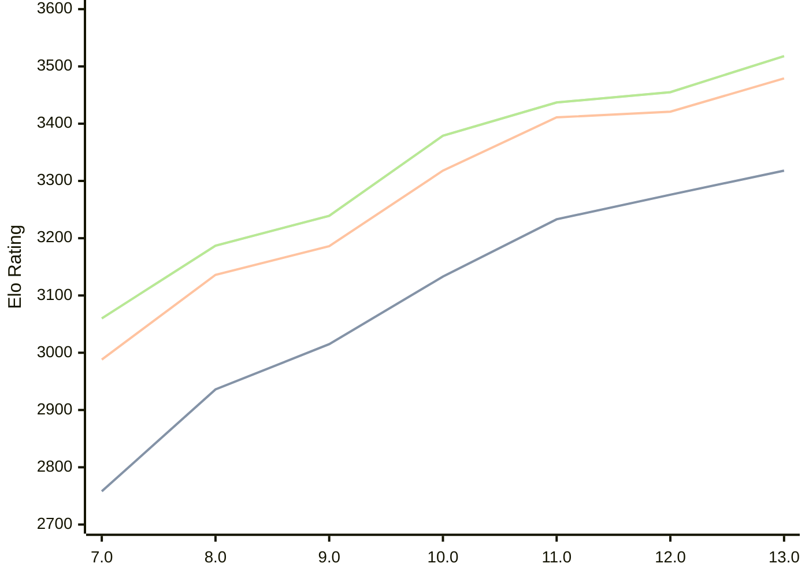

# Engine: Tcheran

Author: Jonathan Gilchrist

Home: https://github.com/tcheran-chess/tcheran

## Elo Ratings

| Version | Published | STC 8.0+0.08s  | LTC 60.0+0.60s | VLTC 2m24s+1.12s | Comment |
| --- | --- | --- | --- | --- | --- |
| 13.0 | 2026-07-17 | 3318(+42) | 3479(+58) | 3518(+63) |  |
| 12.0 | 2026-05-08 | 3276(+43) | 3421(+10) | 3455(+18) |  |
| 11.0 | 2026-02-13 | 3233(+100) | 3411(+93) | 3437(+58) |  |
| 10.0 | 2025-12-28 | 3133(+118) | 3318(+132) | 3379(+140) |  |
| 9.0 | 2025-12-08 | 3015(+79) | 3186(+50) | 3239(+52) |  |
| 8.0 | 2025-11-27 | 2936(+178) | 3136(+148) | 3187(+127) |  |
| 7.0 | 2025-11-07 | 2758 | 2988 | 3060 |  |
 | | | cElo (∆ prev) | cElo (∆ prev) | cElo (∆ prev) | 

<a href="https://github.com/computer-chess-index/cci/issues/new?template=submit-version.yml&title=[VERSION]+Tcheran+<version>&body=###%20Engine%20name%0ATcheran%0A%0A###%20Version%0A13.0" target="_blank">Submit new version</a>

 Test Conditions:

GUI/CLI: <a href=https://github.com/cutechess/cutechess target="_blank">Cute-Chess</a> 
Elo Calculation: <a href=https://www.remi-coulom.fr/Bayesian-Elo/ target="_blank">Bayesian-Elo</a> 
CPU: Intel(R) Core(TM) i5-7500T 2.70GHz 
Opening book: 8_moves_v3 
\* STC: 8.0+0.08s, LTC: 60.0+0.60s, VLTC: 2m24s+1.12s

 Lists:
Ratings: <a href=https://github.com/computer-chess-index/cci/blob/main/lists/CCIRatings.csv target="_blank">Complete list</a>

Generated: 2026-08-18 06:32:21

## Ratings Verlauf

⬛ STC (8.0+0.08s) &nbsp;&nbsp; 🟧 LTC (60.0+0.60s) &nbsp;&nbsp; 🟩 VLTC (2m24s+1.12s)

dark mode: 🟩STC (8.0+0.08s) 🟧LTC (60.0+0.60s) ⬜VLTC (2m24s+1.12s)

## Detailed Evaluation Results

| Version | Time Control | Elo  | Range +/- | Matches | Score | Average Opponent Elo | Draws |
| --- | --- | --- | --- | --- | --- | --- | --- |
| 13.0 | VLTC (2m24s+1.12s) | 3518 | 27 | 326 | 50% | 3521 | 86% |
| 13.0 | LTC (60.0+0.60s) | 3479 | 28 | 306 | 51% | 3468 | 83% |
| 13.0 | STC (8.0+0.08s) | 3318 | 31 | 268 | 51% | 3314 | 70% |
| --- | --- | --- | --- | --- | --- | --- | --- |
| 12.0 | VLTC (2m24s+1.12s) | 3455 | 24 | 404 | 50% | 3459 | 84% |
| 12.0 | LTC (60.0+0.60s) | 3421 | 25 | 380 | 51% | 3418 | 81% |
| 12.0 | STC (8.0+0.08s) | 3276 | 25 | 418 | 52% | 3260 | 68% |
| --- | --- | --- | --- | --- | --- | --- | --- |
| 11.0 | VLTC (2m24s+1.12s) | 3437 | 23 | 434 | 51% | 3434 | 80% |
| 11.0 | LTC (60.0+0.60s) | 3411 | 24 | 424 | 51% | 3402 | 79% |
| 11.0 | STC (8.0+0.08s) | 3233 | 25 | 448 | 51% | 3231 | 56% |
| --- | --- | --- | --- | --- | --- | --- | --- |
| 10.0 | VLTC (2m24s+1.12s) | 3379 | 27 | 336 | 49% | 3387 | 75% |
| 10.0 | LTC (60.0+0.60s) | 3318 | 30 | 268 | 49% | 3328 | 75% |
| 10.0 | STC (8.0+0.08s) | 3133 | 31 | 286 | 52% | 3121 | 58% |
| --- | --- | --- | --- | --- | --- | --- | --- |
| 9.0 | VLTC (2m24s+1.12s) | 3239 | 38 | 180 | 50% | 3237 | 66% |
| 9.0 | LTC (60.0+0.60s) | 3186 | 39 | 168 | 52% | 3173 | 65% |
| 9.0 | STC (8.0+0.08s) | 3015 | 37 | 212 | 47% | 3044 | 53% |
| --- | --- | --- | --- | --- | --- | --- | --- |
| 8.0 | VLTC (2m24s+1.12s) | 3187 | 44 | 132 | 50% | 3185 | 64% |
| 8.0 | LTC (60.0+0.60s) | 3136 | 37 | 204 | 57% | 3079 | 58% |
| 8.0 | STC (8.0+0.08s) | 2936 | 42 | 164 | 47% | 2959 | 49% |
| --- | --- | --- | --- | --- | --- | --- | --- |
| 7.0 | VLTC (2m24s+1.12s) | 3060 | 51 | 116 | 47% | 3085 | 44% |
| 7.0 | LTC (60.0+0.60s) | 2988 | 49 | 130 | 50% | 2967 | 42% |
| 7.0 | STC (8.0+0.08s) | 2758 | 54 | 116 | 56% | 2681 | 36% |
| --- | --- | --- | --- | --- | --- | --- | --- |