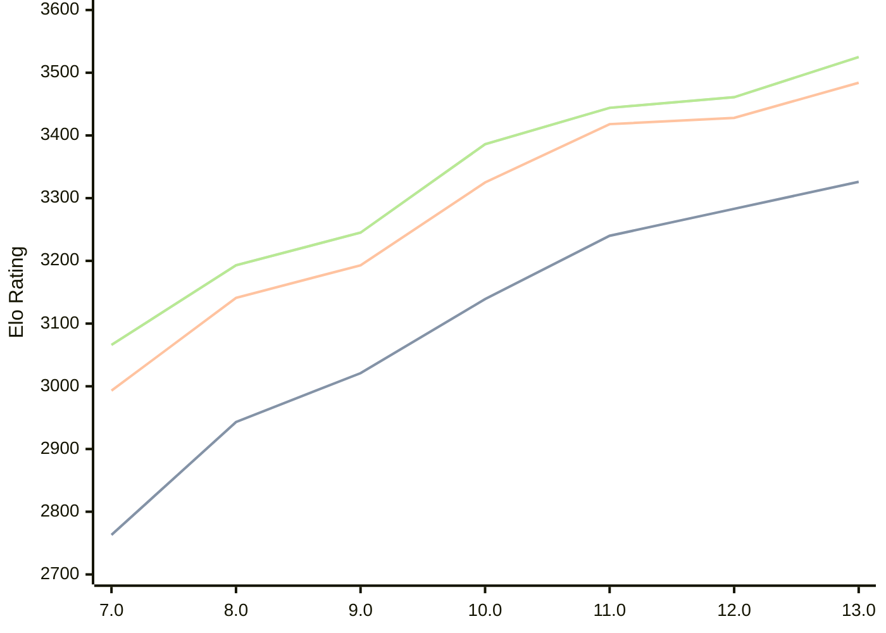

# Engine: Tcheran

Author: Jonathan Gilchrist

Home: https://github.com/tcheran-chess/tcheran

## Elo Ratings

| Version | Published | STC 8.0+0.08s  | LTC 60.0+0.60s | VLTC 2m24s+1.12s | Comment |
| --- | --- | --- | --- | --- | --- |
| 13.0 | 2026-07-17 | 3326(+43) | 3484(+56) | 3525(+64) |  |
| 12.0 | 2026-05-08 | 3283(+43) | 3428(+10) | 3461(+17) |  |
| 11.0 | 2026-02-13 | 3240(+101) | 3418(+93) | 3444(+58) |  |
| 10.0 | 2025-12-28 | 3139(+118) | 3325(+132) | 3386(+141) |  |
| 9.0 | 2025-12-08 | 3021(+78) | 3193(+52) | 3245(+52) |  |
| 8.0 | 2025-11-27 | 2943(+180) | 3141(+148) | 3193(+127) |  |
| 7.0 | 2025-11-07 | 2763 | 2993 | 3066 |  |
 | | | cElo (∆ prev) | cElo (∆ prev) | cElo (∆ prev) | 

<a href="https://github.com/computer-chess-index/cci/issues/new?template=submit-version.yml&title=[VERSION]+Tcheran+<version>&body=###%20Engine%20name%0ATcheran%0A%0A###%20Version%0A13.0" target="_blank">Submit new version</a>

 Test Conditions:

GUI/CLI: <a href=https://github.com/cutechess/cutechess target="_blank">Cute-Chess</a> 
Elo Calculation: <a href=https://www.remi-coulom.fr/Bayesian-Elo/ target="_blank">Bayesian-Elo</a> 
CPU: Intel(R) Core(TM) i5-7500T 2.70GHz 
Opening book: 8_moves_v3 
\* STC: 8.0+0.08s, LTC: 60.0+0.60s, VLTC: 2m24s+1.12s

 Lists:
Ratings: <a href=https://github.com/computer-chess-index/cci/blob/main/lists/CCIRatings.csv target="_blank">Complete list</a>

Generated: 2026-08-27 06:30:00

## Ratings Verlauf

⬛ STC (8.0+0.08s) &nbsp;&nbsp; 🟧 LTC (60.0+0.60s) &nbsp;&nbsp; 🟩 VLTC (2m24s+1.12s)

dark mode: 🟩STC (8.0+0.08s) 🟧LTC (60.0+0.60s) ⬜VLTC (2m24s+1.12s)

## Detailed Evaluation Results

| Version | Time Control | Elo  | Range +/- | Matches | Score | Average Opponent Elo | Draws |
| --- | --- | --- | --- | --- | --- | --- | --- |
| 13.0 | VLTC (2m24s+1.12s) | 3525 | 26 | 350 | 50% | 3528 | 86% |
| 13.0 | LTC (60.0+0.60s) | 3484 | 26 | 338 | 51% | 3478 | 84% |
| 13.0 | STC (8.0+0.08s) | 3326 | 30 | 276 | 51% | 3320 | 70% |
| --- | --- | --- | --- | --- | --- | --- | --- |
| 12.0 | VLTC (2m24s+1.12s) | 3461 | 24 | 404 | 50% | 3465 | 84% |
| 12.0 | LTC (60.0+0.60s) | 3428 | 25 | 380 | 51% | 3424 | 81% |
| 12.0 | STC (8.0+0.08s) | 3283 | 25 | 418 | 52% | 3267 | 68% |
| --- | --- | --- | --- | --- | --- | --- | --- |
| 11.0 | VLTC (2m24s+1.12s) | 3444 | 23 | 434 | 51% | 3440 | 80% |
| 11.0 | LTC (60.0+0.60s) | 3418 | 24 | 424 | 51% | 3409 | 79% |
| 11.0 | STC (8.0+0.08s) | 3240 | 25 | 448 | 51% | 3236 | 56% |
| --- | --- | --- | --- | --- | --- | --- | --- |
| 10.0 | VLTC (2m24s+1.12s) | 3386 | 27 | 336 | 49% | 3394 | 75% |
| 10.0 | LTC (60.0+0.60s) | 3325 | 30 | 268 | 49% | 3335 | 75% |
| 10.0 | STC (8.0+0.08s) | 3139 | 31 | 286 | 52% | 3127 | 58% |
| --- | --- | --- | --- | --- | --- | --- | --- |
| 9.0 | VLTC (2m24s+1.12s) | 3245 | 38 | 180 | 50% | 3244 | 66% |
| 9.0 | LTC (60.0+0.60s) | 3193 | 39 | 168 | 52% | 3178 | 65% |
| 9.0 | STC (8.0+0.08s) | 3021 | 37 | 212 | 47% | 3050 | 53% |
| --- | --- | --- | --- | --- | --- | --- | --- |
| 8.0 | VLTC (2m24s+1.12s) | 3193 | 44 | 132 | 50% | 3191 | 64% |
| 8.0 | LTC (60.0+0.60s) | 3141 | 37 | 204 | 57% | 3086 | 58% |
| 8.0 | STC (8.0+0.08s) | 2943 | 42 | 164 | 47% | 2965 | 49% |
| --- | --- | --- | --- | --- | --- | --- | --- |
| 7.0 | VLTC (2m24s+1.12s) | 3066 | 51 | 116 | 47% | 3090 | 44% |
| 7.0 | LTC (60.0+0.60s) | 2993 | 49 | 130 | 50% | 2974 | 42% |
| 7.0 | STC (8.0+0.08s) | 2763 | 54 | 116 | 56% | 2687 | 36% |
| --- | --- | --- | --- | --- | --- | --- | --- |