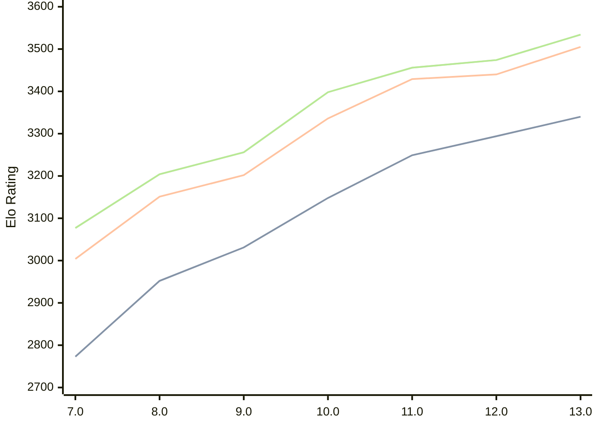

# Engine: Tcheran

Author: Jonathan Gilchrist

Home: https://github.com/tcheran-chess/tcheran

## Elo Ratings E1

| Version | Published | STC 8.0+0.08s  | LTC 60.0+0.60s | VLTC 2m24s+1.12s | Comment |
| --- | --- | --- | --- | --- | --- |
| 13.0 | 2026-07-17 | 3255 | 3455 | 3509 |  |
 | | | cElo (∆ prev) | cElo (∆ prev) | cElo (∆ prev) | 

## Elo Ratings P1

| Version | Published | STC 8.0+0.08s  | LTC 60.0+0.60s | VLTC 2m24s+1.12s | Comment |
| --- | --- | --- | --- | --- | --- |
| 13.0 | 2026-07-17 | 3514 | 3691 | 3752 |  |
 | | | cElo (∆ prev) | cElo (∆ prev) | cElo (∆ prev) | 

## Elo Ratings T1

| Version | Published | STC 8.0+0.08s  | LTC 60.0+0.60s | VLTC 2m24s+1.12s | Comment |
| --- | --- | --- | --- | --- | --- |
| 13.0 | 2026-07-17 | 3340(+46) | 3505(+65) | 3534(+60) |  |
| 12.0 | 2026-05-08 | 3294(+45) | 3440(+11) | 3474(+18) |  |
| 11.0 | 2026-02-13 | 3249(+101) | 3429(+93) | 3456(+58) |  |
| 10.0 | 2025-12-28 | 3148(+117) | 3336(+134) | 3398(+142) |  |
| 9.0 | 2025-12-08 | 3031(+79) | 3202(+51) | 3256(+52) |  |
| 8.0 | 2025-11-27 | 2952(+179) | 3151(+147) | 3204(+127) |  |
| 7.0 | 2025-11-07 | 2773 | 3004 | 3077 |  |
 | | | cElo (∆ prev) | cElo (∆ prev) | cElo (∆ prev) | 

<a href="https://github.com/computer-chess-index/cci/issues/new?template=submit-version.yml&title=[VERSION]+Tcheran+<version>&body=###%20Engine%20name%0ATcheran%0A%0A###%20Version%0A13.0" target="_blank">Submit new version</a>

 Test Conditions:

GUI/CLI: <a href=https://github.com/cutechess/cutechess target="_blank">Cute-Chess</a> 
Elo Calculation: <a href=https://www.remi-coulom.fr/Bayesian-Elo/ target="_blank">Bayesian-Elo</a> 
CPU for P1: Intel(R) Core(TM) Ultra 7 265T (1.50 GHz) - P-Core 
CPU for E1: Intel(R) Core(TM) Ultra 7 265T (1.50 GHz) - E-Core 
CPU for T1: Intel(R) Core(TM) i5-7500T 2.70GHz 
Opening book: 8_moves_v3 
\* STC: 8.0+0.08s, LTC: 60.0+0.60s, VLTC: 2m24s+1.12s

 Lists:
Ratings: <a href=https://github.com/computer-chess-index/cci/blob/main/lists/CCIRatings.csv target="_blank">Complete list</a>

Generated: 2026-10-09 14:17:19

## Ratings Verlauf

```mermaid
%%{init: {"theme":"base","themeVariables":{"seriesColors:['#a3a3a3','#222221','#faa371']}}}%%
xychart-beta
  x-axis ["7.0", "8.0", "9.0", "10.0", "11.0", "12.0", "13.0"]
  y-axis "Elo Rating" 2700 --> 3600
  line "" [2773, 2952, 3031, 3148, 3249, 3294, 3340]
  line "STC (8.0+0.08s)" [2773, 2952, 3031, 3148, 3249, 3294, 3340]
  line "LTC (60.0+0.60s)" [3004, 3151, 3202, 3336, 3429, 3440, 3505]
  line "" [3077, 3204, 3256, 3398, 3456, 3474, 3534]
  line "VLTC (2m24s+1.12s)" [3077, 3204, 3256, 3398, 3456, 3474, 3534]
```

## Detailed Evaluation Results

| Version | Time Control | Elo  | Range +/- | Matches | Score | Average Opponent Elo | Draws |
| --- | --- | --- | --- | --- | --- | --- | --- |
| 13.0 | VLTC (2m24s+1.12s) | 3509 | 33 | 214 | 47% | 3526 | 85% |
| 13.0 | VLTC (2m24s+1.12s) | 3534 | 23 | 418 | 49% | 3538 | 86% |
| 13.0 | VLTC (2m24s+1.12s) | 3752 | 42 | 132 | 51% | 3746 | 84% |
| 13.0 | LTC (60.0+0.60s) | 3505 | 24 | 402 | 52% | 3492 | 83% |
| 13.0 | LTC (60.0+0.60s) | 3691 | 36 | 180 | 49% | 3700 | 82% |
| 13.0 | LTC (60.0+0.60s) | 3455 | 33 | 224 | 47% | 3474 | 78% |
| 13.0 | STC (8.0+0.08s) | 3340 | 28 | 320 | 51% | 3332 | 70% |
| --- | --- | --- | --- | --- | --- | --- | --- |
| 13.0 | STC (8.0+0.08s) | 3514 | 37 | 180 | 49% | 3524 | 72% |
| --- | --- | --- | --- | --- | --- | --- | --- |
| 13.0 | STC (8.0+0.08s) | 3255 | 32 | 246 | 48% | 3271 | 67% |
| --- | --- | --- | --- | --- | --- | --- | --- |
| 12.0 | VLTC (2m24s+1.12s) | 3474 | 24 | 404 | 50% | 3478 | 84% |
| 12.0 | LTC (60.0+0.60s) | 3440 | 25 | 380 | 51% | 3436 | 81% |
| 12.0 | STC (8.0+0.08s) | 3294 | 25 | 418 | 52% | 3278 | 68% |
| --- | --- | --- | --- | --- | --- | --- | --- |
| 11.0 | VLTC (2m24s+1.12s) | 3456 | 23 | 434 | 51% | 3452 | 80% |
| 11.0 | LTC (60.0+0.60s) | 3429 | 24 | 424 | 51% | 3420 | 79% |
| 11.0 | STC (8.0+0.08s) | 3249 | 25 | 448 | 51% | 3247 | 56% |
| --- | --- | --- | --- | --- | --- | --- | --- |
| 10.0 | VLTC (2m24s+1.12s) | 3398 | 27 | 336 | 49% | 3406 | 75% |
| 10.0 | LTC (60.0+0.60s) | 3336 | 30 | 268 | 49% | 3345 | 75% |
| 10.0 | STC (8.0+0.08s) | 3148 | 31 | 286 | 52% | 3136 | 58% |
| --- | --- | --- | --- | --- | --- | --- | --- |
| 9.0 | VLTC (2m24s+1.12s) | 3256 | 38 | 180 | 50% | 3255 | 66% |
| 9.0 | LTC (60.0+0.60s) | 3202 | 39 | 168 | 52% | 3189 | 65% |
| 9.0 | STC (8.0+0.08s) | 3031 | 37 | 212 | 47% | 3060 | 53% |
| --- | --- | --- | --- | --- | --- | --- | --- |
| 8.0 | VLTC (2m24s+1.12s) | 3204 | 44 | 132 | 50% | 3201 | 64% |
| 8.0 | LTC (60.0+0.60s) | 3151 | 37 | 204 | 57% | 3096 | 58% |
| 8.0 | STC (8.0+0.08s) | 2952 | 42 | 164 | 47% | 2974 | 49% |
| --- | --- | --- | --- | --- | --- | --- | --- |
| 7.0 | VLTC (2m24s+1.12s) | 3077 | 51 | 116 | 47% | 3101 | 44% |
| 7.0 | LTC (60.0+0.60s) | 3004 | 49 | 130 | 50% | 2984 | 42% |
| 7.0 | STC (8.0+0.08s) | 2773 | 54 | 116 | 56% | 2696 | 36% |
| --- | --- | --- | --- | --- | --- | --- | --- |