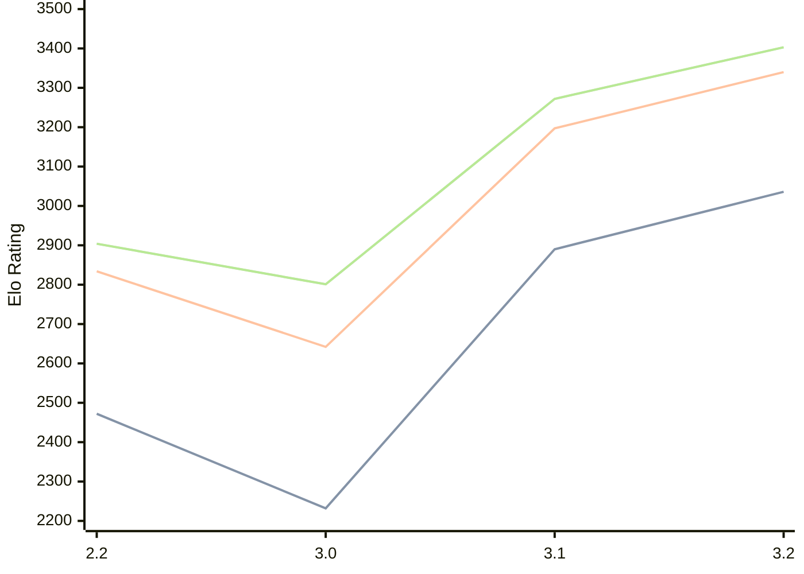

# Engine: Thrawn

Author: Feiyu Lin

Home: https://github.com/feftywacky/Thrawn

## Elo Ratings

| Version | Published | STC 8.0+0.08s  | LTC 60.0+0.60s | VLTC 2m24s+1.12s | Comment |
| --- | --- | --- | --- | --- | --- |
| 3.2 | 2026-09-04 | 3036(+146) | 3340(+143) | 3403(+131) |  |
| 3.1 | 2026-07-07 | 2890(+658) | 3197(+555) | 3272(+471) |  |
| 3.0 | 2026-05-25 | 2232(-240) | 2642(-192) | 2801(-103) |  |
| 2.2 | 2025-10-08 | 2472 | 2834 | 2904 |  |
 | | | cElo (∆ prev) | cElo (∆ prev) | cElo (∆ prev) | 

<a href="https://github.com/computer-chess-index/cci/issues/new?template=submit-version.yml&title=[VERSION]+Thrawn+<version>&body=###%20Engine%20name%0AThrawn%0A%0A###%20Version%0A3.2" target="_blank">Submit new version</a>

 Test Conditions:

GUI/CLI: <a href=https://github.com/cutechess/cutechess target="_blank">Cute-Chess</a> 
Elo Calculation: <a href=https://www.remi-coulom.fr/Bayesian-Elo/ target="_blank">Bayesian-Elo</a> 
CPU: Intel(R) Core(TM) i5-7500T 2.70GHz 
Opening book: 8_moves_v3 
\* STC: 8.0+0.08s, LTC: 60.0+0.60s, VLTC: 2m24s+1.12s

 Lists:
Ratings: <a href=https://github.com/computer-chess-index/cci/blob/main/lists/CCIRatings.csv target="_blank">Complete list</a>

Generated: 2026-09-15 04:43:10

## Ratings Verlauf

## Detailed Evaluation Results

| Version | Time Control | Elo  | Range +/- | Matches | Score | Average Opponent Elo | Draws |
| --- | --- | --- | --- | --- | --- | --- | --- |
| 3.2 | VLTC (2m24s+1.12s) | 3403 | 34 | 206 | 51% | 3397 | 79% |
| 3.2 | LTC (60.0+0.60s) | 3340 | 33 | 228 | 50% | 3339 | 71% |
| 3.2 | STC (8.0+0.08s) | 3036 | 32 | 288 | 54% | 3004 | 47% |
| --- | --- | --- | --- | --- | --- | --- | --- |
| 3.1 | VLTC (2m24s+1.12s) | 3272 | 27 | 350 | 53% | 3243 | 67% |
| 3.1 | LTC (60.0+0.60s) | 3197 | 27 | 360 | 53% | 3171 | 62% |
| 3.1 | STC (8.0+0.08s) | 2890 | 29 | 364 | 50% | 2888 | 46% |
| --- | --- | --- | --- | --- | --- | --- | --- |
| 3.0 | VLTC (2m24s+1.12s) | 2801 | 44 | 162 | 47% | 2826 | 35% |
| 3.0 | LTC (60.0+0.60s) | 2642 | 45 | 156 | 49% | 2650 | 35% |
| 3.0 | STC (8.0+0.08s) | 2232 | 52 | 124 | 48% | 2253 | 29% |
| --- | --- | --- | --- | --- | --- | --- | --- |
| 2.2 | VLTC (2m24s+1.12s) | 2904 | 24 | 510 | 47% | 2931 | 48% |
| 2.2 | LTC (60.0+0.60s) | 2834 | 27 | 434 | 50% | 2835 | 39% |
| 2.2 | STC (8.0+0.08s) | 2472 | 25 | 540 | 48% | 2493 | 29% |
| --- | --- | --- | --- | --- | --- | --- | --- |