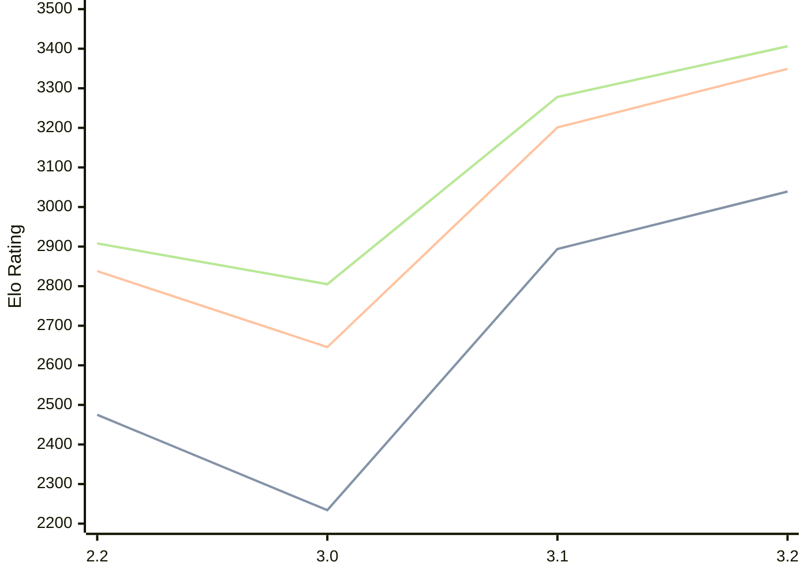

# Engine: Thrawn

Author: Feiyu Lin

Home: https://github.com/feftywacky/Thrawn

## Elo Ratings

| Version | Published | STC 8.0+0.08s  | LTC 60.0+0.60s | VLTC 2m24s+1.12s | Comment |
| --- | --- | --- | --- | --- | --- |
| 3.2 | 2026-09-04 | 3039(+145) | 3349(+148) | 3406(+128) |  |
| 3.1 | 2026-07-07 | 2894(+660) | 3201(+555) | 3278(+473) |  |
| 3.0 | 2026-05-25 | 2234(-241) | 2646(-192) | 2805(-103) |  |
| 2.2 | 2025-10-08 | 2475 | 2838 | 2908 |  |
 | | | cElo (∆ prev) | cElo (∆ prev) | cElo (∆ prev) | 

<a href="https://github.com/computer-chess-index/cci/issues/new?template=submit-version.yml&title=[VERSION]+Thrawn+<version>&body=###%20Engine%20name%0AThrawn%0A%0A###%20Version%0A3.2" target="_blank">Submit new version</a>

 Test Conditions:

GUI/CLI: <a href=https://github.com/cutechess/cutechess target="_blank">Cute-Chess</a> 
Elo Calculation: <a href=https://www.remi-coulom.fr/Bayesian-Elo/ target="_blank">Bayesian-Elo</a> 
CPU: Intel(R) Core(TM) i5-7500T 2.70GHz 
Opening book: 8_moves_v3 
\* STC: 8.0+0.08s, LTC: 60.0+0.60s, VLTC: 2m24s+1.12s

 Lists:
Ratings: <a href=https://github.com/computer-chess-index/cci/blob/main/lists/CCIRatings.csv target="_blank">Complete list</a>

Generated: 2026-10-08 04:44:04

## Ratings Verlauf

```mermaid
%%{init: {"theme":"base","themeVariables":{"seriesColors:['#a3a3a3','#222221','#faa371']}}}%%
xychart-beta
  x-axis ["2.2", "3.0", "3.1", "3.2"]
  y-axis "Elo Rating" 2200 --> 3500
  line "" [2475, 2234, 2894, 3039]
  line "STC (8.0+0.08s)" [2475, 2234, 2894, 3039]
  line "LTC (60.0+0.60s)" [2838, 2646, 3201, 3349]
  line "" [2908, 2805, 3278, 3406]
  line "VLTC (2m24s+1.12s)" [2908, 2805, 3278, 3406]
```

## Detailed Evaluation Results

| Version | Time Control | Elo  | Range +/- | Matches | Score | Average Opponent Elo | Draws |
| --- | --- | --- | --- | --- | --- | --- | --- |
| 3.2 | VLTC (2m24s+1.12s) | 3406 | 33 | 222 | 50% | 3402 | 80% |
| 3.2 | LTC (60.0+0.60s) | 3349 | 32 | 240 | 51% | 3344 | 71% |
| 3.2 | STC (8.0+0.08s) | 3039 | 31 | 308 | 53% | 3015 | 47% |
| --- | --- | --- | --- | --- | --- | --- | --- |
| 3.1 | VLTC (2m24s+1.12s) | 3278 | 27 | 350 | 53% | 3248 | 67% |
| 3.1 | LTC (60.0+0.60s) | 3201 | 27 | 360 | 53% | 3175 | 62% |
| 3.1 | STC (8.0+0.08s) | 2894 | 29 | 364 | 50% | 2892 | 46% |
| --- | --- | --- | --- | --- | --- | --- | --- |
| 3.0 | VLTC (2m24s+1.12s) | 2805 | 44 | 162 | 47% | 2830 | 35% |
| 3.0 | LTC (60.0+0.60s) | 2646 | 45 | 156 | 49% | 2654 | 35% |
| 3.0 | STC (8.0+0.08s) | 2234 | 52 | 124 | 48% | 2256 | 29% |
| --- | --- | --- | --- | --- | --- | --- | --- |
| 2.2 | VLTC (2m24s+1.12s) | 2908 | 24 | 510 | 47% | 2935 | 48% |
| 2.2 | LTC (60.0+0.60s) | 2838 | 27 | 434 | 50% | 2839 | 39% |
| 2.2 | STC (8.0+0.08s) | 2475 | 25 | 540 | 48% | 2496 | 29% |
| --- | --- | --- | --- | --- | --- | --- | --- |