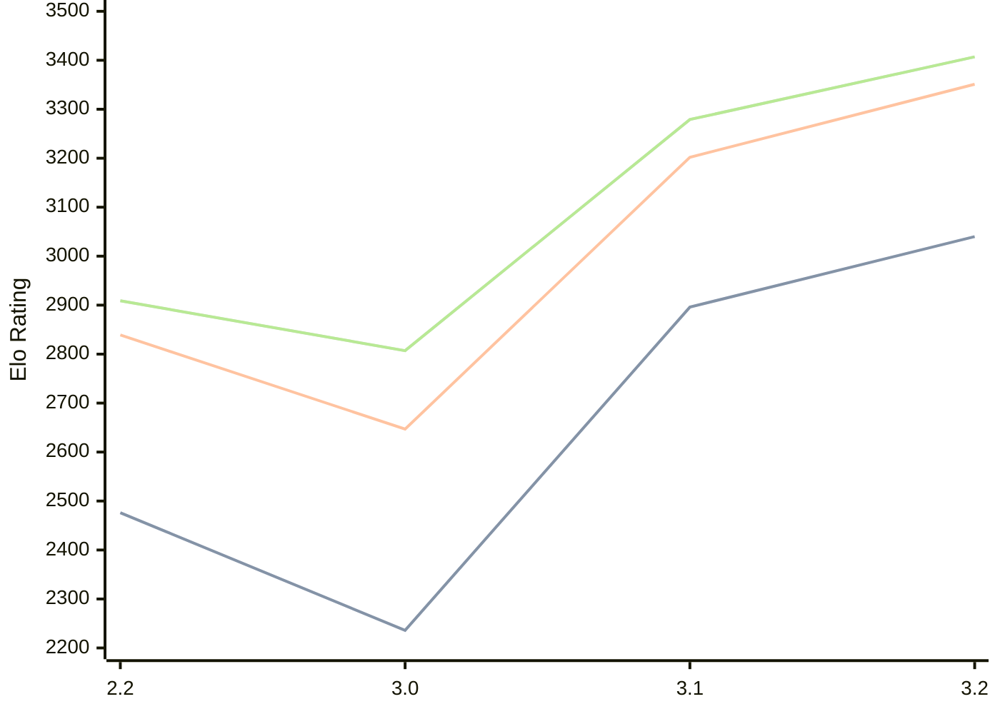

# Engine: Thrawn

Author: Feiyu Lin

Home: https://github.com/feftywacky/Thrawn

## Elo Ratings E1

| Version | Published | STC 8.0+0.08s  | LTC 60.0+0.60s | VLTC 2m24s+1.12s | Comment |
| --- | --- | --- | --- | --- | --- |
| 3.2 | 2026-09-04 | 2882 | 3285 | 3359 |  |
 | | | cElo (∆ prev) | cElo (∆ prev) | cElo (∆ prev) | 

## Elo Ratings P1

| Version | Published | STC 8.0+0.08s  | LTC 60.0+0.60s | VLTC 2m24s+1.12s | Comment |
| --- | --- | --- | --- | --- | --- |
| 3.2 | 2026-09-04 | 3245 | 3560 | 3610 |  |
 | | | cElo (∆ prev) | cElo (∆ prev) | cElo (∆ prev) | 

## Elo Ratings T1

| Version | Published | STC 8.0+0.08s  | LTC 60.0+0.60s | VLTC 2m24s+1.12s | Comment |
| --- | --- | --- | --- | --- | --- |
| 3.2 | 2026-09-04 | 3040(+144) | 3351(+149) | 3407(+128) |  |
| 3.1 | 2026-07-07 | 2896(+660) | 3202(+555) | 3279(+472) |  |
| 3.0 | 2026-05-25 | 2236(-240) | 2647(-192) | 2807(-102) |  |
| 2.2 | 2025-10-08 | 2476 | 2839 | 2909 |  |
 | | | cElo (∆ prev) | cElo (∆ prev) | cElo (∆ prev) | 

<a href="https://github.com/computer-chess-index/cci/issues/new?template=submit-version.yml&title=[VERSION]+Thrawn+<version>&body=###%20Engine%20name%0AThrawn%0A%0A###%20Version%0A3.2" target="_blank">Submit new version</a>

 Test Conditions:

GUI/CLI: <a href=https://github.com/cutechess/cutechess target="_blank">Cute-Chess</a> 
Elo Calculation: <a href=https://www.remi-coulom.fr/Bayesian-Elo/ target="_blank">Bayesian-Elo</a> 
CPU for P1: Intel(R) Core(TM) Ultra 7 265T (1.50 GHz) - P-Core 
CPU for E1: Intel(R) Core(TM) Ultra 7 265T (1.50 GHz) - E-Core 
CPU for T1: Intel(R) Core(TM) i5-7500T 2.70GHz 
Opening book: 8_moves_v3 
\* STC: 8.0+0.08s, LTC: 60.0+0.60s, VLTC: 2m24s+1.12s

 Lists:
Ratings: <a href=https://github.com/computer-chess-index/cci/blob/main/lists/CCIRatings.csv target="_blank">Complete list</a>

Generated: 2026-10-09 14:17:22

## Ratings Verlauf

```mermaid
%%{init: {"theme":"base","themeVariables":{"seriesColors:['#a3a3a3','#222221','#faa371']}}}%%
xychart-beta
  x-axis ["2.2", "3.0", "3.1", "3.2"]
  y-axis "Elo Rating" 2200 --> 3500
  line "" [2476, 2236, 2896, 3040]
  line "STC (8.0+0.08s)" [2476, 2236, 2896, 3040]
  line "LTC (60.0+0.60s)" [2839, 2647, 3202, 3351]
  line "" [2909, 2807, 3279, 3407]
  line "VLTC (2m24s+1.12s)" [2909, 2807, 3279, 3407]
```

## Detailed Evaluation Results

| Version | Time Control | Elo  | Range +/- | Matches | Score | Average Opponent Elo | Draws |
| --- | --- | --- | --- | --- | --- | --- | --- |
| 3.2 | VLTC (2m24s+1.12s) | 3407 | 33 | 222 | 50% | 3403 | 80% |
| 3.2 | VLTC (2m24s+1.12s) | 3610 | 41 | 140 | 53% | 3594 | 81% |
| 3.2 | VLTC (2m24s+1.12s) | 3359 | 32 | 250 | 49% | 3366 | 72% |
| 3.2 | LTC (60.0+0.60s) | 3351 | 32 | 240 | 51% | 3345 | 71% |
| 3.2 | LTC (60.0+0.60s) | 3560 | 35 | 212 | 50% | 3559 | 69% |
| 3.2 | LTC (60.0+0.60s) | 3285 | 32 | 232 | 49% | 3290 | 76% |
| 3.2 | STC (8.0+0.08s) | 3245 | 39 | 180 | 54% | 3212 | 56% |
| --- | --- | --- | --- | --- | --- | --- | --- |
| 3.2 | STC (8.0+0.08s) | 2882 | 33 | 276 | 44% | 2934 | 44% |
| --- | --- | --- | --- | --- | --- | --- | --- |
| 3.2 | STC (8.0+0.08s) | 3040 | 31 | 308 | 53% | 3016 | 47% |
| --- | --- | --- | --- | --- | --- | --- | --- |
| 3.1 | VLTC (2m24s+1.12s) | 3279 | 27 | 350 | 53% | 3249 | 67% |
| 3.1 | LTC (60.0+0.60s) | 3202 | 27 | 360 | 53% | 3177 | 62% |
| 3.1 | STC (8.0+0.08s) | 2896 | 29 | 364 | 50% | 2893 | 46% |
| --- | --- | --- | --- | --- | --- | --- | --- |
| 3.0 | VLTC (2m24s+1.12s) | 2807 | 44 | 162 | 47% | 2831 | 35% |
| 3.0 | LTC (60.0+0.60s) | 2647 | 45 | 156 | 49% | 2655 | 35% |
| 3.0 | STC (8.0+0.08s) | 2236 | 52 | 124 | 48% | 2257 | 29% |
| --- | --- | --- | --- | --- | --- | --- | --- |
| 2.2 | VLTC (2m24s+1.12s) | 2909 | 24 | 510 | 47% | 2936 | 48% |
| 2.2 | LTC (60.0+0.60s) | 2839 | 27 | 434 | 50% | 2840 | 39% |
| 2.2 | STC (8.0+0.08s) | 2476 | 25 | 540 | 48% | 2498 | 29% |
| --- | --- | --- | --- | --- | --- | --- | --- |