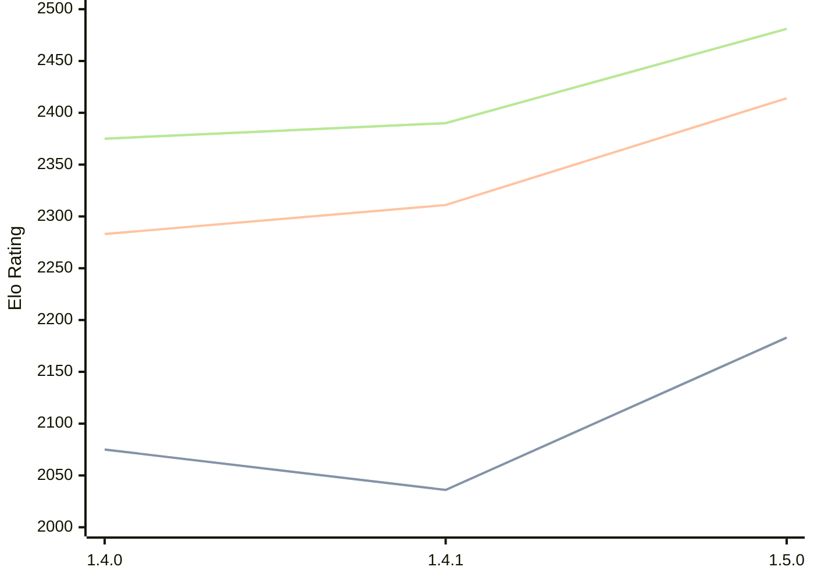

# Engine: Tofiks

Author: Arturs Priede

Home: https://github.com/likeawizard/tofiks

## Elo Ratings

| Version | Published | STC 8.0+0.08s  | LTC 60.0+0.60s | VLTC 2m24s+1.12s | Comment |
| --- | --- | --- | --- | --- | --- |
| 1.5.0 | 2026-04-23 | 2183(+147) | 2414(+103) | 2481(+91) |  |
| 1.4.1 | 2026-04-11 | 2036(-39) | 2311(+28) | 2390(+15) |  |
| 1.4.0 | 2026-04-09 | 2075(+new) | 2283(+new) | 2375(+new) |  |
| 1.3.0 | 2023-10-22 |  |  |  |  |
| 1.2.0 | 2023-09-29 |  |  |  |  |
| 1.1.0 | 2023-08-17 |  |  |  |  |
| 1.0.0 | 2022-11-19 |  |  |  |  |
 | | | cElo (∆ prev) | cElo (∆ prev) | cElo (∆ prev) | 

<a href="https://github.com/computer-chess-index/cci/issues/new?template=submit-version.yml&title=[VERSION]+Tofiks+<version>&body=###%20Engine%20name%0ATofiks%0A%0A###%20Version%0A1.5.0" target="_blank">Submit new version</a>

 Test Conditions:

GUI/CLI: <a href=https://github.com/cutechess/cutechess target="_blank">Cute-Chess</a> 
Elo Calculation: <a href=https://www.remi-coulom.fr/Bayesian-Elo/ target="_blank">Bayesian-Elo</a> 
CPU: Intel(R) Core(TM) i5-7500T 2.70GHz 
Opening book: 8_moves_v3 
\* STC: 8.0+0.08s, LTC: 60.0+0.60s, VLTC: 2m24s+1.12s

 Lists:
Ratings: <a href=https://github.com/computer-chess-index/cci/blob/main/lists/CCIRatings.csv target="_blank">Complete list</a>

Generated: 2026-06-08 06:28:56

## Ratings Verlauf

⬛ STC (8.0+0.08s) &nbsp;&nbsp; 🟧 LTC (60.0+0.60s) &nbsp;&nbsp; 🟩 VLTC (2m24s+1.12s)

dark mode: 🟩STC (8.0+0.08s) 🟧LTC (60.0+0.60s) ⬜VLTC (2m24s+1.12s)

## Detailed Evaluation Results

| Version | Time Control | Elo  | Range +/- | Matches | Score | Average Opponent Elo | Draws |
| --- | --- | --- | --- | --- | --- | --- | --- |
| 1.5.0 | VLTC (2m24s+1.12s) | 2481 | 30 | 364 | 50% | 2481 | 34% |
| 1.5.0 | LTC (60.0+0.60s) | 2414 | 29 | 390 | 49% | 2418 | 32% |
| 1.5.0 | STC (8.0+0.08s) | 2183 | 29 | 420 | 47% | 2205 | 21% |
| --- | --- | --- | --- | --- | --- | --- | --- |
| 1.4.1 | VLTC (2m24s+1.12s) | 2390 | 33 | 292 | 50% | 2385 | 33% |
| 1.4.1 | LTC (60.0+0.60s) | 2311 | 34 | 296 | 50% | 2310 | 29% |
| 1.4.1 | STC (8.0+0.08s) | 2036 | 34 | 302 | 51% | 2024 | 26% |
| --- | --- | --- | --- | --- | --- | --- | --- |
| 1.4.0 | VLTC (2m24s+1.12s) | 2375 | 40 | 216 | 47% | 2403 | 29% |
| 1.4.0 | LTC (60.0+0.60s) | 2283 | 39 | 226 | 53% | 2259 | 29% |
| 1.4.0 | STC (8.0+0.08s) | 2075 | 43 | 184 | 50% | 2070 | 23% |
| --- | --- | --- | --- | --- | --- | --- | --- |