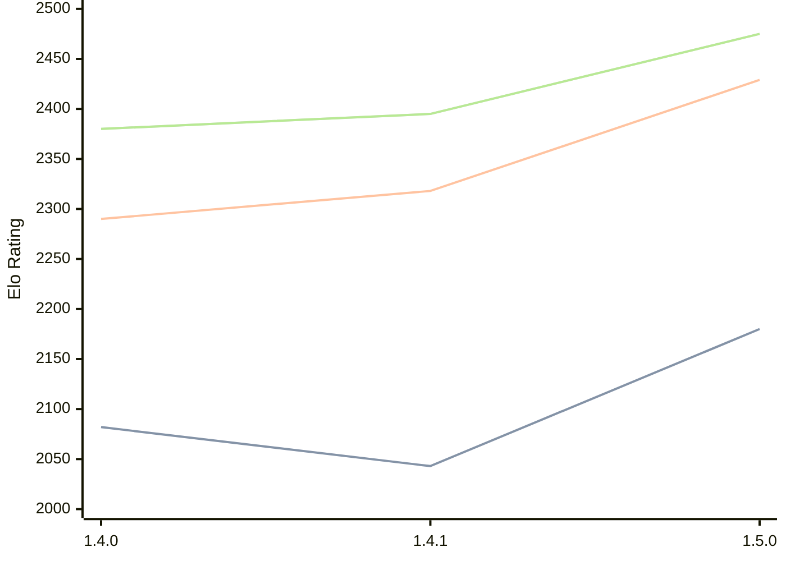

# Engine: Tofiks

Author: Arturs Priede

Home: https://github.com/likeawizard/tofiks

## Elo Ratings

| Version | Published | STC 8.0+0.08s  | LTC 60.0+0.60s | VLTC 2m24s+1.12s | Comment |
| --- | --- | --- | --- | --- | --- |
| 1.5.0 | 2026-04-23 | 2180(+137) | 2429(+111) | 2475(+80) |  |
| 1.4.1 | 2026-04-11 | 2043(-39) | 2318(+28) | 2395(+15) |  |
| 1.4.0 | 2026-04-09 | 2082 | 2290 | 2380 |  |
 | | | cElo (∆ prev) | cElo (∆ prev) | cElo (∆ prev) | 

<a href="https://github.com/computer-chess-index/cci/issues/new?template=submit-version.yml&title=[VERSION]+Tofiks+<version>&body=###%20Engine%20name%0ATofiks%0A%0A###%20Version%0A1.5.0" target="_blank">Submit new version</a>

 Test Conditions:

GUI/CLI: <a href=https://github.com/cutechess/cutechess target="_blank">Cute-Chess</a> 
Elo Calculation: <a href=https://www.remi-coulom.fr/Bayesian-Elo/ target="_blank">Bayesian-Elo</a> 
CPU: Intel(R) Core(TM) i5-7500T 2.70GHz 
Opening book: 8_moves_v3 
\* STC: 8.0+0.08s, LTC: 60.0+0.60s, VLTC: 2m24s+1.12s

 Lists:
Ratings: <a href=https://github.com/computer-chess-index/cci/blob/main/lists/CCIRatings.csv target="_blank">Complete list</a>

Generated: 2026-08-25 06:38:05

## Ratings Verlauf

⬛ STC (8.0+0.08s) &nbsp;&nbsp; 🟧 LTC (60.0+0.60s) &nbsp;&nbsp; 🟩 VLTC (2m24s+1.12s)

dark mode: 🟩STC (8.0+0.08s) 🟧LTC (60.0+0.60s) ⬜VLTC (2m24s+1.12s)

## Detailed Evaluation Results

| Version | Time Control | Elo  | Range +/- | Matches | Score | Average Opponent Elo | Draws |
| --- | --- | --- | --- | --- | --- | --- | --- |
| 1.5.0 | VLTC (2m24s+1.12s) | 2475 | 25 | 500 | 49% | 2480 | 34% |
| 1.5.0 | LTC (60.0+0.60s) | 2429 | 26 | 492 | 51% | 2422 | 33% |
| 1.5.0 | STC (8.0+0.08s) | 2180 | 26 | 536 | 47% | 2202 | 22% |
| --- | --- | --- | --- | --- | --- | --- | --- |
| 1.4.1 | VLTC (2m24s+1.12s) | 2395 | 33 | 292 | 50% | 2391 | 33% |
| 1.4.1 | LTC (60.0+0.60s) | 2318 | 34 | 296 | 50% | 2317 | 29% |
| 1.4.1 | STC (8.0+0.08s) | 2043 | 34 | 302 | 51% | 2030 | 26% |
| --- | --- | --- | --- | --- | --- | --- | --- |
| 1.4.0 | VLTC (2m24s+1.12s) | 2380 | 40 | 216 | 47% | 2408 | 29% |
| 1.4.0 | LTC (60.0+0.60s) | 2290 | 39 | 226 | 53% | 2265 | 29% |
| 1.4.0 | STC (8.0+0.08s) | 2082 | 43 | 184 | 50% | 2078 | 23% |
| --- | --- | --- | --- | --- | --- | --- | --- |