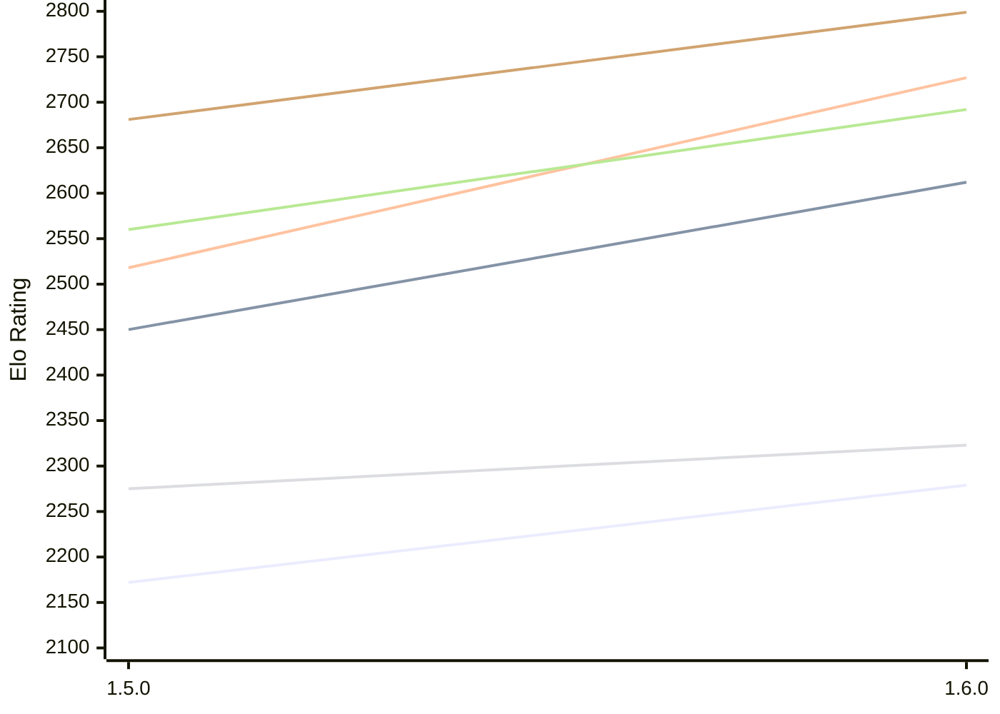
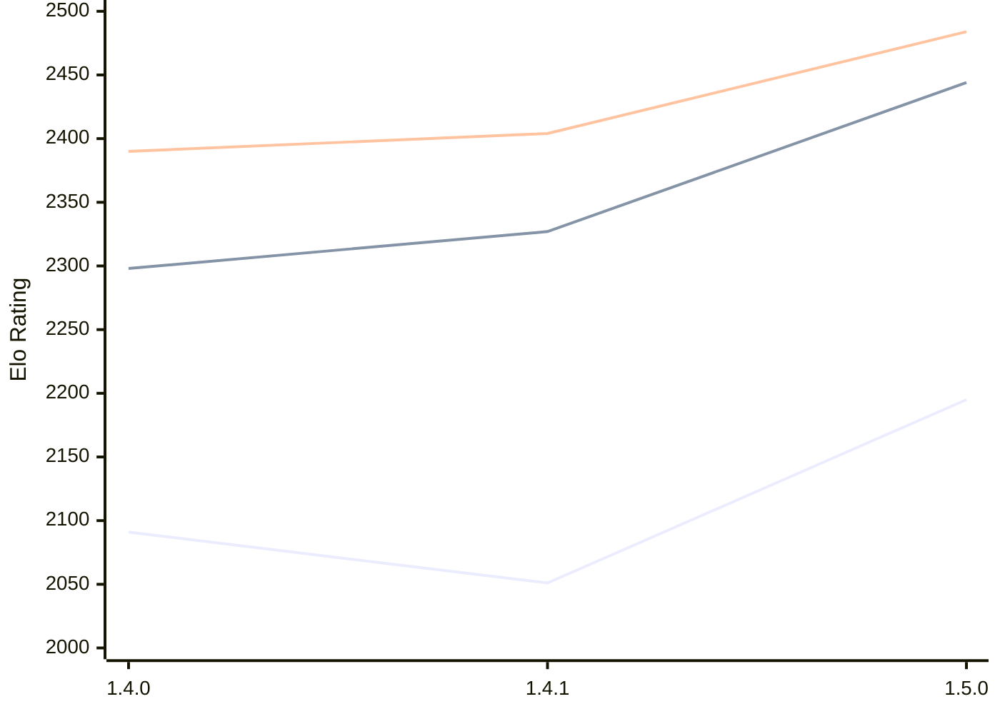

# Engine: Tofiks

Author: Arturs Priede

Home: https://github.com/likeawizard/tofiks

## Elo Ratings E1 (Ultra 7 265T (1.50 GHz) - E-Core)

| Version | Published | STC 8.0+0.08s  | LTC 60.0+0.60s | VLTC 2m24s+1.12s | Comment |
| --- | --- | --- | --- | --- | --- |
| 1.6.0 | 2026-10-18 | 2279(+107) | 2612(+162) | 2727(+209) |  |
| 1.5.0 | 2026-04-23 | 2172 | 2450 | 2518 |  |
 | | | cElo (∆ prev) | cElo (∆ prev) | cElo (∆ prev) | 

## Elo Ratings P1 (Ultra 7 265T (1.50 GHz) - P-Core)

| Version | Published | STC 8.0+0.08s  | LTC 60.0+0.60s | VLTC 2m24s+1.12s | Comment |
| --- | --- | --- | --- | --- | --- |
| 1.6.0 | 2026-10-18 | 2323(+48) | 2692(+132) | 2799(+118) |  |
| 1.5.0 | 2026-04-23 | 2275 | 2560 | 2681 |  |
 | | | cElo (∆ prev) | cElo (∆ prev) | cElo (∆ prev) | 

## Elo Ratings T1 (i5-7500T 2.70GHz)

| Version | Published | STC 8.0+0.08s  | LTC 60.0+0.60s | VLTC 2m24s+1.12s | Comment |
| --- | --- | --- | --- | --- | --- |
| 1.5.0 | 2026-04-23 | 2195(+144) | 2444(+117) | 2484(+80) |  |
| 1.4.1 | 2026-04-11 | 2051(-40) | 2327(+29) | 2404(+14) |  |
| 1.4.0 | 2026-04-09 | 2091 | 2298 | 2390 |  |
 | | | cElo (∆ prev) | cElo (∆ prev) | cElo (∆ prev) | 

<a href="https://github.com/computer-chess-index/cci/issues/new?template=submit-version.yml&title=[VERSION]+Tofiks+<version>&body=###%20Engine%20name%0ATofiks%0A%0A###%20Version%0A1.5.0" target="_blank">Submit new version</a>

 Test Conditions:

GUI/CLI: <a href=https://github.com/cutechess/cutechess target="_blank">Cute-Chess</a> 
Elo Calculation: <a href=https://www.remi-coulom.fr/Bayesian-Elo/ target="_blank">Bayesian-Elo</a> 
CPU for P1: Intel(R) Core(TM) Ultra 7 265T (1.50 GHz) - P-Core 
CPU for E1: Intel(R) Core(TM) Ultra 7 265T (1.50 GHz) - E-Core 
CPU for T1: Intel(R) Core(TM) i5-7500T 2.70GHz 
Opening book: 8_moves_v3 
\* STC: 8.0+0.08s, LTC: 60.0+0.60s, VLTC: 2m24s+1.12s

 Lists:
Ratings: <a href=https://github.com/computer-chess-index/cci/blob/main/lists/CCIRatings.csv target="_blank">Complete list</a>

Generated: 2026-11-12 05:43:25

## Ratings Verlauf E1 / P1

```mermaid
%%{init: {"theme":"base","themeVariables":{"seriesColors:['#a3a3a3','#222221','#faa371']}}}%%
xychart-beta
  x-axis ["1.5.0", "1.6.0"]
  y-axis "Elo Rating" 2100 --> 2800
  line "E1: STC (8.0+0.08s)" [2172, 2279]
  line "E1: LTC (60.0+0.60s)" [2450, 2612]
  line "E1: VLTC (2m24s+1.12s)" [2518, 2727]
  line "P1: STC (8.0+0.08s)" [2275, 2323]
  line "P1: LTC (60.0+0.60s)" [2560, 2692]
  line "P1: VLTC (2m24s+1.12s)" [2681, 2799]
```

## Ratings Verlauf T1

```mermaid
%%{init: {"theme":"base","themeVariables":{"seriesColors:['#a3a3a3','#222221','#faa371']}}}%%
xychart-beta
  x-axis ["1.4.0", "1.4.1", "1.5.0"]
  y-axis "Elo Rating" 2000 --> 2500
  line "T1: STC (8.0+0.08s)" [2091, 2051, 2195]
  line "T1: LTC (60.0+0.60s)" [2298, 2327, 2444]
  line "T1: VLTC (2m24s+1.12s)" [2390, 2404, 2484]
```

## Detailed Evaluation Results

| Version | Time Control | Variant | Elo  | Range +/- | Matches | Score | Average Opponent Elo | Draws |
| --- | --- |--- | --- | --- | --- | --- | --- | --- |
| 1.6.0 | VLTC (2m24s+1.12s) | P1 | 2799 | 41 | 200 | 54% | 2765 | 28% |
|  |  | E1 | 2727 | 35 | 280 | 51% | 2716 | 27% |
|  | LTC (60.0+0.60s) | E1 | 2612 | 33 | 296 | 51% | 2610 | 31% |
|  |  | P1 | 2692 | 45 | 166 | 50% | 2691 | 23% |
|  | STC (8.0+0.08s) | E1 | 2279 | 32 | 346 | 53% | 2245 | 21% |
|  |  | P1 | 2323 | 45 | 180 | 50% | 2327 | 20% |
| --- | --- |--- | --- | --- | --- | --- | --- | --- |
| 1.5.0 | VLTC (2m24s+1.12s) | T1 | 2484 | 25 | 510 | 49% | 2489 | 35% |
|  |  | P1 | 2681 | 40 | 212 | 46% | 2716 | 28% |
|  |  | E1 | 2518 | 38 | 220 | 49% | 2529 | 40% |
|  | LTC (60.0+0.60s) | T1 | 2444 | 25 | 516 | 51% | 2431 | 34% |
|  |  | P1 | 2560 | 45 | 164 | 46% | 2603 | 31% |
|  |  | E1 | 2450 | 38 | 246 | 53% | 2402 | 30% |
|  | STC (8.0+0.08s) | T1 | 2195 | 25 | 572 | 48% | 2210 | 22% |
|  |  | P1 | 2275 | 39 | 224 | 50% | 2287 | 29% |
|  |  | E1 | 2172 | 37 | 264 | 46% | 2221 | 25% |
| --- | --- |--- | --- | --- | --- | --- | --- | --- |
| 1.4.1 | VLTC (2m24s+1.12s) | T1 | 2404 | 33 | 292 | 50% | 2400 | 33% |
|  | LTC (60.0+0.60s) | T1 | 2327 | 34 | 296 | 50% | 2325 | 29% |
|  | STC (8.0+0.08s) | T1 | 2051 | 34 | 302 | 51% | 2039 | 26% |
| --- | --- |--- | --- | --- | --- | --- | --- | --- |
| 1.4.0 | VLTC (2m24s+1.12s) | T1 | 2390 | 40 | 216 | 47% | 2418 | 29% |
|  | LTC (60.0+0.60s) | T1 | 2298 | 39 | 226 | 53% | 2275 | 29% |
|  | STC (8.0+0.08s) | T1 | 2091 | 43 | 184 | 50% | 2086 | 23% |