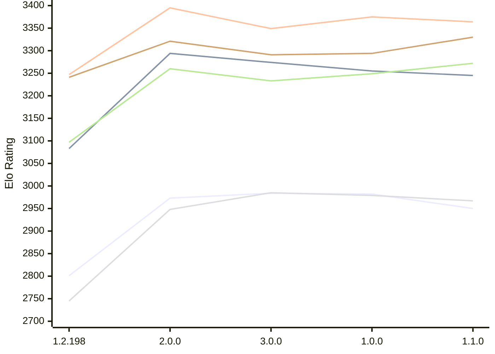

# Engine: Trebuchet

Author: Jonny Reckless

Home: https://github.com/jonny-reckless/zenith

## Elo Ratings E1 (Ultra 7 265T (1.50 GHz) - E-Core)

| Version | Published | STC 8.0+0.08s  | LTC 60.0+0.60s | VLTC 2m24s+1.12s | Comment |
| --- | --- | --- | --- | --- | --- |
| 1.1.0 | 2026-11-08 | 2950(-32) | 3245(-10) | 3364(-11) |  |
| 1.0.0 | 2026-11-07 | 2982(-2) | 3255(-19) | 3375(+26) |  |
| 3.0.0 | 2026-10-30 | 2984(+11) | 3274(-20) | 3349(-46) |  |
| 2.0.0 | 2026-10-15 | 2973(+172) | 3294(+211) | 3395(+148) |  |
| 1.2.198 | 2026-08-01 | 2801 | 3083 | 3247 |  |
 | | | cElo (∆ prev) | cElo (∆ prev) | cElo (∆ prev) | 

## Elo Ratings P1 (Ultra 7 265T (1.50 GHz) - P-Core)

| Version | Published | STC 8.0+0.08s  | LTC 60.0+0.60s | VLTC 2m24s+1.12s | Comment |
| --- | --- | --- | --- | --- | --- |
| 1.1.0 | 2026-11-08 | 2967(-12) | 3272(+23) | 3330(+36) |  |
| 1.0.0 | 2026-11-07 | 2979(-6) | 3249(+16) | 3294(+3) |  |
| 3.0.0 | 2026-10-30 | 2985(+37) | 3233(-27) | 3291(-30) |  |
| 2.0.0 | 2026-10-15 | 2948(+203) | 3260(+163) | 3321(+80) |  |
| 1.2.198 | 2026-08-01 | 2745 | 3097 | 3241 |  |
 | | | cElo (∆ prev) | cElo (∆ prev) | cElo (∆ prev) | 

## Elo Ratings T1 (i5-7500T 2.70GHz)

| Version | Published | STC 8.0+0.08s  | LTC 60.0+0.60s | VLTC 2m24s+1.12s | Comment |
| --- | --- | --- | --- | --- | --- |
| 1.2.198 | 2026-08-01 | 3067 | 3339 | 3387 |  |
 | | | cElo (∆ prev) | cElo (∆ prev) | cElo (∆ prev) | 

<a href="https://github.com/computer-chess-index/cci/issues/new?template=submit-version.yml&title=[VERSION]+Trebuchet+<version>&body=###%20Engine%20name%0ATrebuchet%0A%0A###%20Version%0A1.2.198" target="_blank">Submit new version</a>

 Test Conditions:

GUI/CLI: <a href=https://github.com/cutechess/cutechess target="_blank">Cute-Chess</a> 
Elo Calculation: <a href=https://www.remi-coulom.fr/Bayesian-Elo/ target="_blank">Bayesian-Elo</a> 
CPU for P1: Intel(R) Core(TM) Ultra 7 265T (1.50 GHz) - P-Core 
CPU for E1: Intel(R) Core(TM) Ultra 7 265T (1.50 GHz) - E-Core 
CPU for T1: Intel(R) Core(TM) i5-7500T 2.70GHz 
Opening book: 8_moves_v3 
\* STC: 8.0+0.08s, LTC: 60.0+0.60s, VLTC: 2m24s+1.12s

 Lists:
Ratings: <a href=https://github.com/computer-chess-index/cci/blob/main/lists/CCIRatings.csv target="_blank">Complete list</a>

Generated: 2026-11-20 05:43:52

## Ratings Verlauf E1 / P1

```mermaid
%%{init: {"theme":"base","themeVariables":{"seriesColors:['#a3a3a3','#222221','#faa371']}}}%%
xychart-beta
  x-axis ["1.2.198", "2.0.0", "3.0.0", "1.0.0", "1.1.0"]
  y-axis "Elo Rating" 2700 --> 3400
  line "E1: STC (8.0+0.08s)" [2801, 2973, 2984, 2982, 2950]
  line "E1: LTC (60.0+0.60s)" [3083, 3294, 3274, 3255, 3245]
  line "E1: VLTC (2m24s+1.12s)" [3247, 3395, 3349, 3375, 3364]
  line "P1: STC (8.0+0.08s)" [2745, 2948, 2985, 2979, 2967]
  line "P1: LTC (60.0+0.60s)" [3097, 3260, 3233, 3249, 3272]
  line "P1: VLTC (2m24s+1.12s)" [3241, 3321, 3291, 3294, 3330]
```

## Detailed Evaluation Results

| Version | Time Control | Variant | Elo  | Range +/- | Matches | Score | Average Opponent Elo | Draws |
| --- | --- |--- | --- | --- | --- | --- | --- | --- |
| 1.1.0 | VLTC (2m24s+1.12s) | P1 | 3330 | 38 | 174 | 48% | 3345 | 71% |
|  |  | E1 | 3364 | 32 | 252 | 49% | 3374 | 69% |
|  | LTC (60.0+0.60s) | P1 | 3272 | 29 | 316 | 46% | 3305 | 66% |
|  |  | E1 | 3245 | 32 | 256 | 50% | 3244 | 66% |
|  | STC (8.0+0.08s) | P1 | 2967 | 39 | 180 | 47% | 2992 | 58% |
|  |  | E1 | 2950 | 32 | 296 | 49% | 2957 | 44% |
| --- | --- |--- | --- | --- | --- | --- | --- | --- |
| 1.0.0 | VLTC (2m24s+1.12s) | P1 | 3294 | 47 | 112 | 50% | 3298 | 74% |
|  |  | E1 | 3375 | 28 | 346 | 57% | 3119 | 63% |
|  | LTC (60.0+0.60s) | P1 | 3249 | 48 | 108 | 51% | 3243 | 72% |
|  |  | E1 | 3255 | 30 | 288 | 48% | 3267 | 64% |
|  | STC (8.0+0.08s) | E1 | 2982 | 27 | 396 | 47% | 3004 | 45% |
|  |  | P1 | 2979 | 43 | 152 | 46% | 3011 | 51% |
| --- | --- |--- | --- | --- | --- | --- | --- | --- |
| 3.0.0 | VLTC (2m24s+1.12s) | P1 | 3291 | 38 | 168 | 51% | 3281 | 77% |
|  |  | E1 | 3349 | 31 | 264 | 51% | 3341 | 69% |
|  | LTC (60.0+0.60s) | P1 | 3233 | 37 | 192 | 52% | 3214 | 62% |
|  |  | E1 | 3274 | 29 | 324 | 54% | 3245 | 63% |
|  | STC (8.0+0.08s) | P1 | 2985 | 42 | 148 | 48% | 2998 | 60% |
|  |  | E1 | 2984 | 37 | 218 | 50% | 2978 | 43% |
| --- | --- |--- | --- | --- | --- | --- | --- | --- |
| 2.0.0 | VLTC (2m24s+1.12s) | P1 | 3321 | 34 | 224 | 51% | 3310 | 70% |
|  |  | E1 | 3395 | 29 | 300 | 49% | 3401 | 66% |
|  | LTC (60.0+0.60s) | P1 | 3260 | 39 | 174 | 53% | 3236 | 66% |
|  |  | E1 | 3294 | 32 | 266 | 52% | 3278 | 62% |
|  | STC (8.0+0.08s) | E1 | 2973 | 38 | 208 | 53% | 2943 | 44% |
|  |  | P1 | 2948 | 39 | 192 | 53% | 2917 | 44% |
| --- | --- |--- | --- | --- | --- | --- | --- | --- |
| 1.2.198 | VLTC (2m24s+1.12s) | T1 | 3387 | 31 | 272 | 51% | 3363 | 69% |
|  |  | P1 | 3241 | 33 | 252 | 44% | 3282 | 61% |
|  |  | E1 | 3247 | 29 | 326 | 41% | 3318 | 62% |
|  | LTC (60.0+0.60s) | T1 | 3339 | 34 | 236 | 54% | 3266 | 64% |
|  |  | P1 | 3097 | 32 | 288 | 39% | 3182 | 55% |
|  |  | E1 | 3083 | 28 | 370 | 39% | 3177 | 51% |
|  | STC (8.0+0.08s) | T1 | 3067 | 26 | 424 | 47% | 3067 | 54% |
|  |  | P1 | 2745 | 45 | 180 | 59% | 2651 | 26% |
|  |  | E1 | 2801 | 34 | 308 | 64% | 2673 | 29% |