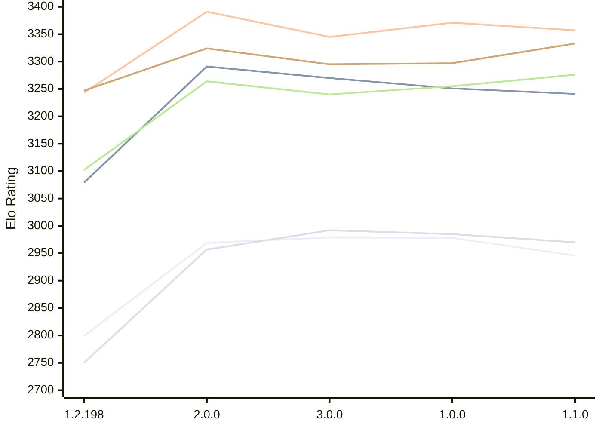

# Engine: Trebuchet

Author: Jonny Reckless

Home: https://github.com/jonny-reckless/zenith

## Elo Ratings E1 (Ultra 7 265T (1.50 GHz) - E-Core)

| Version | Published | STC 8.0+0.08s  | LTC 60.0+0.60s | VLTC 2m24s+1.12s | Comment |
| --- | --- | --- | --- | --- | --- |
| 1.1.0 | 2026-11-08 | 2946(-32) | 3241(-10) | 3357(-14) |  |
| 1.0.0 | 2026-11-07 | 2978(-1) | 3251(-19) | 3371(+26) |  |
| 3.0.0 | 2026-10-30 | 2979(+10) | 3270(-21) | 3345(-46) |  |
| 2.0.0 | 2026-10-15 | 2969(+170) | 3291(+212) | 3391(+148) |  |
| 1.2.198 | 2026-08-01 | 2799 | 3079 | 3243 |  |
 | | | cElo (∆ prev) | cElo (∆ prev) | cElo (∆ prev) | 

## Elo Ratings P1 (Ultra 7 265T (1.50 GHz) - P-Core)

| Version | Published | STC 8.0+0.08s  | LTC 60.0+0.60s | VLTC 2m24s+1.12s | Comment |
| --- | --- | --- | --- | --- | --- |
| 1.1.0 | 2026-11-08 | 2970(-15) | 3276(+21) | 3333(+36) |  |
| 1.0.0 | 2026-11-07 | 2985(-7) | 3255(+15) | 3297(+2) |  |
| 3.0.0 | 2026-10-30 | 2992(+35) | 3240(-24) | 3295(-29) |  |
| 2.0.0 | 2026-10-15 | 2957(+207) | 3264(+162) | 3324(+77) |  |
| 1.2.198 | 2026-08-01 | 2750 | 3102 | 3247 |  |
 | | | cElo (∆ prev) | cElo (∆ prev) | cElo (∆ prev) | 

## Elo Ratings T1 (i5-7500T 2.70GHz)

| Version | Published | STC 8.0+0.08s  | LTC 60.0+0.60s | VLTC 2m24s+1.12s | Comment |
| --- | --- | --- | --- | --- | --- |
| 1.2.198 | 2026-08-01 | 3067 | 3339 | 3387 |  |
 | | | cElo (∆ prev) | cElo (∆ prev) | cElo (∆ prev) | 

<a href="https://github.com/computer-chess-index/cci/issues/new?template=submit-version.yml&title=[VERSION]+Trebuchet+<version>&body=###%20Engine%20name%0ATrebuchet%0A%0A###%20Version%0A1.2.198" target="_blank">Submit new version</a>

 Test Conditions:

GUI/CLI: <a href=https://github.com/cutechess/cutechess target="_blank">Cute-Chess</a> 
Elo Calculation: <a href=https://www.remi-coulom.fr/Bayesian-Elo/ target="_blank">Bayesian-Elo</a> 
CPU for P1: Intel(R) Core(TM) Ultra 7 265T (1.50 GHz) - P-Core 
CPU for E1: Intel(R) Core(TM) Ultra 7 265T (1.50 GHz) - E-Core 
CPU for T1: Intel(R) Core(TM) i5-7500T 2.70GHz 
Opening book: 8_moves_v3 
\* STC: 8.0+0.08s, LTC: 60.0+0.60s, VLTC: 2m24s+1.12s

 Lists:
Ratings: <a href=https://github.com/computer-chess-index/cci/blob/main/lists/CCIRatings.csv target="_blank">Complete list</a>

Generated: 2026-11-21 05:43:46

## Ratings Verlauf E1 / P1

```mermaid
%%{init: {"theme":"base","themeVariables":{"seriesColors:['#a3a3a3','#222221','#faa371']}}}%%
xychart-beta
  x-axis ["1.2.198", "2.0.0", "3.0.0", "1.0.0", "1.1.0"]
  y-axis "Elo Rating" 2700 --> 3400
  line "E1: STC (8.0+0.08s)" [2799, 2969, 2979, 2978, 2946]
  line "E1: LTC (60.0+0.60s)" [3079, 3291, 3270, 3251, 3241]
  line "E1: VLTC (2m24s+1.12s)" [3243, 3391, 3345, 3371, 3357]
  line "P1: STC (8.0+0.08s)" [2750, 2957, 2992, 2985, 2970]
  line "P1: LTC (60.0+0.60s)" [3102, 3264, 3240, 3255, 3276]
  line "P1: VLTC (2m24s+1.12s)" [3247, 3324, 3295, 3297, 3333]
```

## Detailed Evaluation Results

| Version | Time Control | Variant | Elo  | Range +/- | Matches | Score | Average Opponent Elo | Draws |
| --- | --- |--- | --- | --- | --- | --- | --- | --- |
| 1.1.0 | VLTC (2m24s+1.12s) | P1 | 3333 | 38 | 174 | 48% | 3349 | 71% |
|  |  | E1 | 3357 | 31 | 260 | 48% | 3370 | 69% |
|  | LTC (60.0+0.60s) | P1 | 3276 | 29 | 316 | 46% | 3309 | 66% |
|  |  | E1 | 3241 | 32 | 256 | 50% | 3240 | 66% |
|  | STC (8.0+0.08s) | P1 | 2970 | 38 | 184 | 46% | 2997 | 57% |
|  |  | E1 | 2946 | 32 | 296 | 49% | 2951 | 44% |
| --- | --- |--- | --- | --- | --- | --- | --- | --- |
| 1.0.0 | VLTC (2m24s+1.12s) | P1 | 3297 | 47 | 112 | 50% | 3301 | 74% |
|  |  | E1 | 3371 | 28 | 346 | 57% | 3114 | 63% |
|  | LTC (60.0+0.60s) | E1 | 3251 | 30 | 288 | 48% | 3263 | 64% |
|  |  | P1 | 3255 | 46 | 120 | 51% | 3249 | 70% |
|  | STC (8.0+0.08s) | E1 | 2978 | 27 | 396 | 47% | 3000 | 45% |
|  |  | P1 | 2985 | 43 | 156 | 46% | 3016 | 51% |
| --- | --- |--- | --- | --- | --- | --- | --- | --- |
| 3.0.0 | VLTC (2m24s+1.12s) | P1 | 3295 | 38 | 168 | 51% | 3285 | 77% |
|  |  | E1 | 3345 | 31 | 264 | 51% | 3337 | 69% |
|  | LTC (60.0+0.60s) | P1 | 3240 | 37 | 192 | 52% | 3220 | 62% |
|  |  | E1 | 3270 | 29 | 324 | 54% | 3241 | 63% |
|  | STC (8.0+0.08s) | P1 | 2992 | 42 | 148 | 48% | 3006 | 60% |
|  |  | E1 | 2979 | 37 | 218 | 50% | 2974 | 43% |
| --- | --- |--- | --- | --- | --- | --- | --- | --- |
| 2.0.0 | VLTC (2m24s+1.12s) | P1 | 3324 | 34 | 224 | 51% | 3314 | 70% |
|  |  | E1 | 3391 | 29 | 300 | 49% | 3397 | 66% |
|  | LTC (60.0+0.60s) | E1 | 3291 | 32 | 266 | 52% | 3274 | 62% |
|  |  | P1 | 3264 | 39 | 174 | 53% | 3241 | 66% |
|  | STC (8.0+0.08s) | E1 | 2969 | 38 | 208 | 53% | 2939 | 44% |
|  |  | P1 | 2957 | 39 | 192 | 53% | 2925 | 44% |
| --- | --- |--- | --- | --- | --- | --- | --- | --- |
| 1.2.198 | VLTC (2m24s+1.12s) | T1 | 3387 | 31 | 272 | 51% | 3363 | 69% |
|  |  | P1 | 3247 | 33 | 252 | 44% | 3286 | 61% |
|  |  | E1 | 3243 | 29 | 326 | 41% | 3314 | 62% |
|  | LTC (60.0+0.60s) | T1 | 3339 | 34 | 236 | 54% | 3266 | 64% |
|  |  | P1 | 3102 | 32 | 288 | 39% | 3187 | 55% |
|  |  | E1 | 3079 | 28 | 370 | 39% | 3173 | 51% |
|  | STC (8.0+0.08s) | T1 | 3067 | 26 | 424 | 47% | 3067 | 54% |
|  |  | P1 | 2750 | 45 | 180 | 59% | 2657 | 26% |
|  |  | E1 | 2799 | 34 | 308 | 64% | 2669 | 29% |