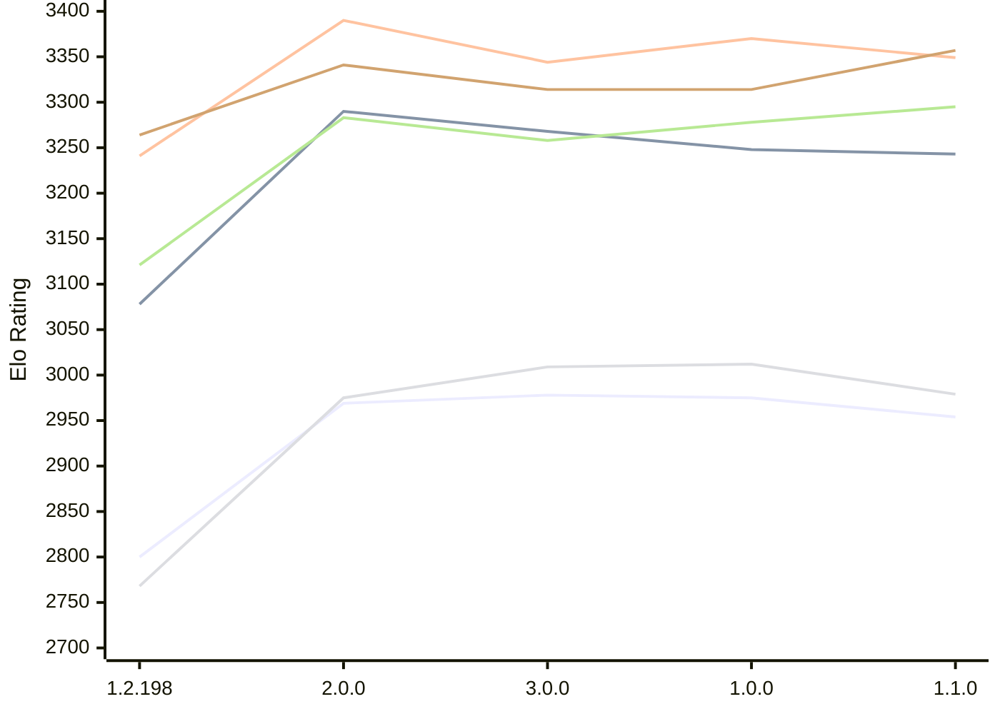

# Engine: Trebuchet

Author: Jonny Reckless

Home: https://github.com/jonny-reckless/zenith

## Elo Ratings E1 (Ultra 7 265T (1.50 GHz) - E-Core)

| Version | Published | STC 8.0+0.08s  | LTC 60.0+0.60s | VLTC 2m24s+1.12s | Comment |
| --- | --- | --- | --- | --- | --- |
| 1.1.0 | 2026-11-08 | 2954(-21) | 3243(-5) | 3349(-21) |  |
| 1.0.0 | 2026-11-07 | 2975(-3) | 3248(-20) | 3370(+26) |  |
| 3.0.0 | 2026-10-30 | 2978(+9) | 3268(-22) | 3344(-46) |  |
| 2.0.0 | 2026-10-15 | 2969(+169) | 3290(+212) | 3390(+149) |  |
| 1.2.198 | 2026-08-01 | 2800 | 3078 | 3241 |  |
 | | | cElo (∆ prev) | cElo (∆ prev) | cElo (∆ prev) | 

## Elo Ratings P1 (Ultra 7 265T (1.50 GHz) - P-Core)

| Version | Published | STC 8.0+0.08s  | LTC 60.0+0.60s | VLTC 2m24s+1.12s | Comment |
| --- | --- | --- | --- | --- | --- |
| 1.1.0 | 2026-11-08 | 2979(-33) | 3295(+17) | 3357(+43) |  |
| 1.0.0 | 2026-11-07 | 3012(+3) | 3278(+20) | 3314(0) |  |
| 3.0.0 | 2026-10-30 | 3009(+34) | 3258(-25) | 3314(-27) |  |
| 2.0.0 | 2026-10-15 | 2975(+207) | 3283(+162) | 3341(+77) |  |
| 1.2.198 | 2026-08-01 | 2768 | 3121 | 3264 |  |
 | | | cElo (∆ prev) | cElo (∆ prev) | cElo (∆ prev) | 

## Elo Ratings T1 (i5-7500T 2.70GHz)

| Version | Published | STC 8.0+0.08s  | LTC 60.0+0.60s | VLTC 2m24s+1.12s | Comment |
| --- | --- | --- | --- | --- | --- |
| 1.2.198 | 2026-08-01 | 3067 | 3339 | 3387 |  |
 | | | cElo (∆ prev) | cElo (∆ prev) | cElo (∆ prev) | 

<a href="https://github.com/computer-chess-index/cci/issues/new?template=submit-version.yml&title=[VERSION]+Trebuchet+<version>&body=###%20Engine%20name%0ATrebuchet%0A%0A###%20Version%0A1.2.198" target="_blank">Submit new version</a>

 Test Conditions:

GUI/CLI: <a href=https://github.com/cutechess/cutechess target="_blank">Cute-Chess</a> 
Elo Calculation: <a href=https://www.remi-coulom.fr/Bayesian-Elo/ target="_blank">Bayesian-Elo</a> 
CPU for P1: Intel(R) Core(TM) Ultra 7 265T (1.50 GHz) - P-Core 
CPU for E1: Intel(R) Core(TM) Ultra 7 265T (1.50 GHz) - E-Core 
CPU for T1: Intel(R) Core(TM) i5-7500T 2.70GHz 
Opening book: 8_moves_v3 
\* STC: 8.0+0.08s, LTC: 60.0+0.60s, VLTC: 2m24s+1.12s

 Lists:
Ratings: <a href=https://github.com/computer-chess-index/cci/blob/main/lists/CCIRatings.csv target="_blank">Complete list</a>

Generated: 2026-11-26 05:44:24

## Ratings Verlauf E1 / P1

```mermaid
%%{init: {"theme":"base","themeVariables":{"seriesColors:['#a3a3a3','#222221','#faa371']}}}%%
xychart-beta
  x-axis ["1.2.198", "2.0.0", "3.0.0", "1.0.0", "1.1.0"]
  y-axis "Elo Rating" 2700 --> 3400
  line "E1: STC (8.0+0.08s)" [2800, 2969, 2978, 2975, 2954]
  line "E1: LTC (60.0+0.60s)" [3078, 3290, 3268, 3248, 3243]
  line "E1: VLTC (2m24s+1.12s)" [3241, 3390, 3344, 3370, 3349]
  line "P1: STC (8.0+0.08s)" [2768, 2975, 3009, 3012, 2979]
  line "P1: LTC (60.0+0.60s)" [3121, 3283, 3258, 3278, 3295]
  line "P1: VLTC (2m24s+1.12s)" [3264, 3341, 3314, 3314, 3357]
```

## Detailed Evaluation Results

| Version | Time Control | Variant | Elo  | Range +/- | Matches | Score | Average Opponent Elo | Draws |
| --- | --- |--- | --- | --- | --- | --- | --- | --- |
| 1.1.0 | VLTC (2m24s+1.12s) | P1 | 3357 | 36 | 190 | 49% | 3367 | 71% |
|  |  | E1 | 3349 | 29 | 296 | 48% | 3366 | 69% |
|  | LTC (60.0+0.60s) | P1 | 3295 | 27 | 348 | 46% | 3324 | 66% |
|  |  | E1 | 3243 | 30 | 280 | 51% | 3239 | 68% |
|  | STC (8.0+0.08s) | P1 | 2979 | 32 | 264 | 46% | 3006 | 58% |
|  |  | E1 | 2954 | 30 | 328 | 50% | 2951 | 47% |
| --- | --- |--- | --- | --- | --- | --- | --- | --- |
| 1.0.0 | VLTC (2m24s+1.12s) | P1 | 3314 | 47 | 112 | 50% | 3318 | 74% |
|  |  | E1 | 3370 | 28 | 346 | 57% | 3113 | 63% |
|  | LTC (60.0+0.60s) | P1 | 3278 | 45 | 124 | 51% | 3270 | 70% |
|  |  | E1 | 3248 | 29 | 308 | 48% | 3262 | 64% |
|  | STC (8.0+0.08s) | P1 | 3012 | 41 | 172 | 47% | 3031 | 51% |
|  |  | E1 | 2975 | 27 | 404 | 47% | 2997 | 45% |
| --- | --- |--- | --- | --- | --- | --- | --- | --- |
| 3.0.0 | VLTC (2m24s+1.12s) | P1 | 3314 | 38 | 168 | 51% | 3303 | 77% |
|  |  | E1 | 3344 | 31 | 264 | 51% | 3336 | 69% |
|  | LTC (60.0+0.60s) | P1 | 3258 | 37 | 192 | 52% | 3239 | 62% |
|  |  | E1 | 3268 | 29 | 324 | 54% | 3241 | 63% |
|  | STC (8.0+0.08s) | P1 | 3009 | 42 | 148 | 48% | 3024 | 60% |
|  |  | E1 | 2978 | 37 | 218 | 50% | 2974 | 43% |
| --- | --- |--- | --- | --- | --- | --- | --- | --- |
| 2.0.0 | VLTC (2m24s+1.12s) | P1 | 3341 | 34 | 224 | 51% | 3332 | 70% |
|  |  | E1 | 3390 | 29 | 300 | 49% | 3395 | 66% |
|  | LTC (60.0+0.60s) | P1 | 3283 | 39 | 174 | 53% | 3260 | 66% |
|  |  | E1 | 3290 | 32 | 266 | 52% | 3272 | 62% |
|  | STC (8.0+0.08s) | P1 | 2975 | 39 | 192 | 53% | 2944 | 44% |
|  |  | E1 | 2969 | 38 | 208 | 53% | 2939 | 44% |
| --- | --- |--- | --- | --- | --- | --- | --- | --- |
| 1.2.198 | VLTC (2m24s+1.12s) | T1 | 3387 | 31 | 272 | 51% | 3363 | 69% |
|  |  | P1 | 3264 | 33 | 252 | 44% | 3305 | 61% |
|  |  | E1 | 3241 | 29 | 326 | 41% | 3313 | 62% |
|  | LTC (60.0+0.60s) | T1 | 3339 | 34 | 236 | 54% | 3266 | 64% |
|  |  | P1 | 3121 | 32 | 288 | 39% | 3206 | 55% |
|  |  | E1 | 3078 | 28 | 370 | 39% | 3170 | 51% |
|  | STC (8.0+0.08s) | T1 | 3067 | 26 | 424 | 47% | 3067 | 54% |
|  |  | P1 | 2768 | 45 | 180 | 59% | 2674 | 26% |
|  |  | E1 | 2800 | 34 | 308 | 64% | 2670 | 29% |