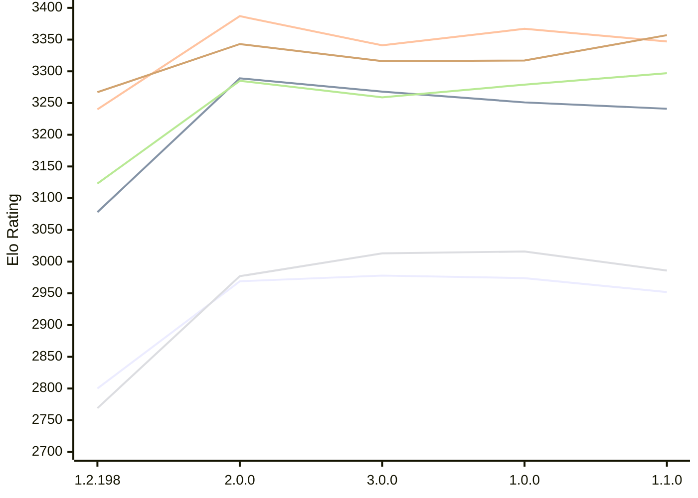

# Engine: Trebuchet

Author: Jonny Reckless

Home: https://github.com/jonny-reckless/zenith

## Elo Ratings E1 (Ultra 7 265T (1.50 GHz) - E-Core)

| Version | Published | STC 8.0+0.08s  | LTC 60.0+0.60s | VLTC 2m24s+1.12s | Comment |
| --- | --- | --- | --- | --- | --- |
| 1.1.0 | 2026-11-08 | 2952(-22) | 3241(-10) | 3347(-20) |  |
| 1.0.0 | 2026-11-07 | 2974(-4) | 3251(-17) | 3367(+26) |  |
| 3.0.0 | 2026-10-30 | 2978(+9) | 3268(-21) | 3341(-46) |  |
| 2.0.0 | 2026-10-15 | 2969(+169) | 3289(+211) | 3387(+147) |  |
| 1.2.198 | 2026-08-01 | 2800 | 3078 | 3240 |  |
 | | | cElo (∆ prev) | cElo (∆ prev) | cElo (∆ prev) | 

## Elo Ratings P1 (Ultra 7 265T (1.50 GHz) - P-Core)

| Version | Published | STC 8.0+0.08s  | LTC 60.0+0.60s | VLTC 2m24s+1.12s | Comment |
| --- | --- | --- | --- | --- | --- |
| 1.1.0 | 2026-11-08 | 2986(-30) | 3297(+18) | 3357(+40) |  |
| 1.0.0 | 2026-11-07 | 3016(+3) | 3279(+20) | 3317(+1) |  |
| 3.0.0 | 2026-10-30 | 3013(+36) | 3259(-26) | 3316(-27) |  |
| 2.0.0 | 2026-10-15 | 2977(+208) | 3285(+162) | 3343(+76) |  |
| 1.2.198 | 2026-08-01 | 2769 | 3123 | 3267 |  |
 | | | cElo (∆ prev) | cElo (∆ prev) | cElo (∆ prev) | 

## Elo Ratings T1 (i5-7500T 2.70GHz)

| Version | Published | STC 8.0+0.08s  | LTC 60.0+0.60s | VLTC 2m24s+1.12s | Comment |
| --- | --- | --- | --- | --- | --- |
| 1.2.198 | 2026-08-01 | 3067 | 3339 | 3387 |  |
 | | | cElo (∆ prev) | cElo (∆ prev) | cElo (∆ prev) | 

<a href="https://github.com/computer-chess-index/cci/issues/new?template=submit-version.yml&title=[VERSION]+Trebuchet+<version>&body=###%20Engine%20name%0ATrebuchet%0A%0A###%20Version%0A1.2.198" target="_blank">Submit new version</a>

 Test Conditions:

GUI/CLI: <a href=https://github.com/cutechess/cutechess target="_blank">Cute-Chess</a> 
Elo Calculation: <a href=https://www.remi-coulom.fr/Bayesian-Elo/ target="_blank">Bayesian-Elo</a> 
CPU for P1: Intel(R) Core(TM) Ultra 7 265T (1.50 GHz) - P-Core 
CPU for E1: Intel(R) Core(TM) Ultra 7 265T (1.50 GHz) - E-Core 
CPU for T1: Intel(R) Core(TM) i5-7500T 2.70GHz 
Opening book: 8_moves_v3 
\* STC: 8.0+0.08s, LTC: 60.0+0.60s, VLTC: 2m24s+1.12s

 Lists:
Ratings: <a href=https://github.com/computer-chess-index/cci/blob/main/lists/CCIRatings.csv target="_blank">Complete list</a>

Generated: 2026-11-28 05:44:10

## Ratings Verlauf E1 / P1

```mermaid
%%{init: {"theme":"base","themeVariables":{"seriesColors:['#a3a3a3','#222221','#faa371']}}}%%
xychart-beta
  x-axis ["1.2.198", "2.0.0", "3.0.0", "1.0.0", "1.1.0"]
  y-axis "Elo Rating" 2700 --> 3400
  line "E1: STC (8.0+0.08s)" [2800, 2969, 2978, 2974, 2952]
  line "E1: LTC (60.0+0.60s)" [3078, 3289, 3268, 3251, 3241]
  line "E1: VLTC (2m24s+1.12s)" [3240, 3387, 3341, 3367, 3347]
  line "P1: STC (8.0+0.08s)" [2769, 2977, 3013, 3016, 2986]
  line "P1: LTC (60.0+0.60s)" [3123, 3285, 3259, 3279, 3297]
  line "P1: VLTC (2m24s+1.12s)" [3267, 3343, 3316, 3317, 3357]
```

## Detailed Evaluation Results

| Version | Time Control | Variant | Elo  | Range +/- | Matches | Score | Average Opponent Elo | Draws |
| --- | --- |--- | --- | --- | --- | --- | --- | --- |
| 1.1.0 | VLTC (2m24s+1.12s) | P1 | 3357 | 35 | 202 | 49% | 3367 | 71% |
|  |  | E1 | 3347 | 29 | 296 | 48% | 3363 | 69% |
|  | LTC (60.0+0.60s) | P1 | 3297 | 27 | 348 | 46% | 3325 | 66% |
|  |  | E1 | 3241 | 29 | 304 | 50% | 3239 | 67% |
|  | STC (8.0+0.08s) | P1 | 2986 | 32 | 268 | 47% | 3009 | 58% |
|  |  | E1 | 2952 | 29 | 348 | 50% | 2951 | 47% |
| --- | --- |--- | --- | --- | --- | --- | --- | --- |
| 1.0.0 | VLTC (2m24s+1.12s) | P1 | 3317 | 47 | 112 | 50% | 3320 | 74% |
|  |  | E1 | 3367 | 28 | 354 | 57% | 3117 | 63% |
|  | LTC (60.0+0.60s) | P1 | 3279 | 45 | 124 | 51% | 3271 | 70% |
|  |  | E1 | 3251 | 29 | 316 | 49% | 3260 | 65% |
|  | STC (8.0+0.08s) | P1 | 3016 | 41 | 172 | 47% | 3035 | 51% |
|  |  | E1 | 2974 | 27 | 416 | 47% | 2996 | 45% |
| --- | --- |--- | --- | --- | --- | --- | --- | --- |
| 3.0.0 | VLTC (2m24s+1.12s) | P1 | 3316 | 38 | 168 | 51% | 3305 | 77% |
|  |  | E1 | 3341 | 31 | 264 | 51% | 3333 | 69% |
|  | LTC (60.0+0.60s) | P1 | 3259 | 37 | 192 | 52% | 3240 | 62% |
|  |  | E1 | 3268 | 29 | 324 | 54% | 3241 | 63% |
|  | STC (8.0+0.08s) | P1 | 3013 | 42 | 148 | 48% | 3028 | 60% |
|  |  | E1 | 2978 | 37 | 218 | 50% | 2973 | 43% |
| --- | --- |--- | --- | --- | --- | --- | --- | --- |
| 2.0.0 | VLTC (2m24s+1.12s) | P1 | 3343 | 34 | 224 | 51% | 3333 | 70% |
|  |  | E1 | 3387 | 29 | 300 | 49% | 3393 | 66% |
|  | LTC (60.0+0.60s) | P1 | 3285 | 39 | 174 | 53% | 3262 | 66% |
|  |  | E1 | 3289 | 32 | 266 | 52% | 3271 | 62% |
|  | STC (8.0+0.08s) | P1 | 2977 | 39 | 192 | 53% | 2947 | 44% |
|  |  | E1 | 2969 | 38 | 208 | 53% | 2938 | 44% |
| --- | --- |--- | --- | --- | --- | --- | --- | --- |
| 1.2.198 | VLTC (2m24s+1.12s) | T1 | 3387 | 31 | 272 | 51% | 3363 | 69% |
|  |  | P1 | 3267 | 33 | 252 | 44% | 3306 | 61% |
|  |  | E1 | 3240 | 29 | 326 | 41% | 3312 | 62% |
|  | LTC (60.0+0.60s) | T1 | 3339 | 34 | 236 | 54% | 3266 | 64% |
|  |  | P1 | 3123 | 32 | 288 | 39% | 3208 | 55% |
|  |  | E1 | 3078 | 28 | 370 | 39% | 3170 | 51% |
|  | STC (8.0+0.08s) | P1 | 2769 | 45 | 180 | 59% | 2676 | 26% |
|  |  | E1 | 2800 | 34 | 308 | 64% | 2670 | 29% |
|  |  | T1 | 3067 | 26 | 424 | 47% | 3067 | 54% |