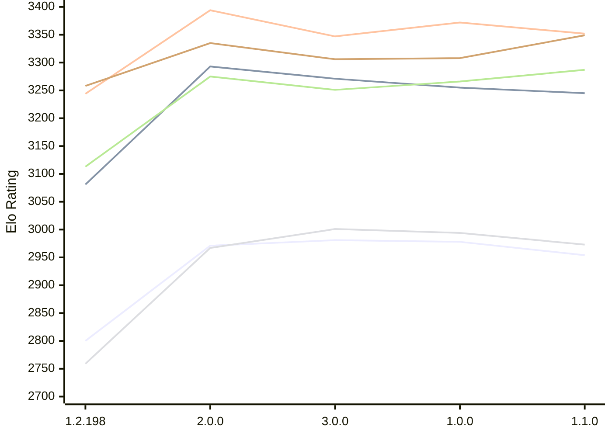

# Engine: Trebuchet

Author: Jonny Reckless

Home: https://github.com/jonny-reckless/zenith

## Elo Ratings E1 (Ultra 7 265T (1.50 GHz) - E-Core)

| Version | Published | STC 8.0+0.08s  | LTC 60.0+0.60s | VLTC 2m24s+1.12s | Comment |
| --- | --- | --- | --- | --- | --- |
| 1.1.0 | 2026-11-08 | 2954(-24) | 3245(-10) | 3352(-20) |  |
| 1.0.0 | 2026-11-07 | 2978(-3) | 3255(-16) | 3372(+25) |  |
| 3.0.0 | 2026-10-30 | 2981(+10) | 3271(-22) | 3347(-47) |  |
| 2.0.0 | 2026-10-15 | 2971(+171) | 3293(+212) | 3394(+150) |  |
| 1.2.198 | 2026-08-01 | 2800 | 3081 | 3244 |  |
 | | | cElo (∆ prev) | cElo (∆ prev) | cElo (∆ prev) | 

## Elo Ratings P1 (Ultra 7 265T (1.50 GHz) - P-Core)

| Version | Published | STC 8.0+0.08s  | LTC 60.0+0.60s | VLTC 2m24s+1.12s | Comment |
| --- | --- | --- | --- | --- | --- |
| 1.1.0 | 2026-11-08 | 2973(-21) | 3287(+21) | 3349(+41) |  |
| 1.0.0 | 2026-11-07 | 2994(-7) | 3266(+15) | 3308(+2) |  |
| 3.0.0 | 2026-10-30 | 3001(+34) | 3251(-24) | 3306(-29) |  |
| 2.0.0 | 2026-10-15 | 2967(+208) | 3275(+162) | 3335(+77) |  |
| 1.2.198 | 2026-08-01 | 2759 | 3113 | 3258 |  |
 | | | cElo (∆ prev) | cElo (∆ prev) | cElo (∆ prev) | 

## Elo Ratings T1 (i5-7500T 2.70GHz)

| Version | Published | STC 8.0+0.08s  | LTC 60.0+0.60s | VLTC 2m24s+1.12s | Comment |
| --- | --- | --- | --- | --- | --- |
| 1.2.198 | 2026-08-01 | 3067 | 3339 | 3387 |  |
 | | | cElo (∆ prev) | cElo (∆ prev) | cElo (∆ prev) | 

<a href="https://github.com/computer-chess-index/cci/issues/new?template=submit-version.yml&title=[VERSION]+Trebuchet+<version>&body=###%20Engine%20name%0ATrebuchet%0A%0A###%20Version%0A1.2.198" target="_blank">Submit new version</a>

 Test Conditions:

GUI/CLI: <a href=https://github.com/cutechess/cutechess target="_blank">Cute-Chess</a> 
Elo Calculation: <a href=https://www.remi-coulom.fr/Bayesian-Elo/ target="_blank">Bayesian-Elo</a> 
CPU for P1: Intel(R) Core(TM) Ultra 7 265T (1.50 GHz) - P-Core 
CPU for E1: Intel(R) Core(TM) Ultra 7 265T (1.50 GHz) - E-Core 
CPU for T1: Intel(R) Core(TM) i5-7500T 2.70GHz 
Opening book: 8_moves_v3 
\* STC: 8.0+0.08s, LTC: 60.0+0.60s, VLTC: 2m24s+1.12s

 Lists:
Ratings: <a href=https://github.com/computer-chess-index/cci/blob/main/lists/CCIRatings.csv target="_blank">Complete list</a>

Generated: 2026-11-24 05:44:10

## Ratings Verlauf E1 / P1

```mermaid
%%{init: {"theme":"base","themeVariables":{"seriesColors:['#a3a3a3','#222221','#faa371']}}}%%
xychart-beta
  x-axis ["1.2.198", "2.0.0", "3.0.0", "1.0.0", "1.1.0"]
  y-axis "Elo Rating" 2700 --> 3400
  line "E1: STC (8.0+0.08s)" [2800, 2971, 2981, 2978, 2954]
  line "E1: LTC (60.0+0.60s)" [3081, 3293, 3271, 3255, 3245]
  line "E1: VLTC (2m24s+1.12s)" [3244, 3394, 3347, 3372, 3352]
  line "P1: STC (8.0+0.08s)" [2759, 2967, 3001, 2994, 2973]
  line "P1: LTC (60.0+0.60s)" [3113, 3275, 3251, 3266, 3287]
  line "P1: VLTC (2m24s+1.12s)" [3258, 3335, 3306, 3308, 3349]
```

## Detailed Evaluation Results

| Version | Time Control | Variant | Elo  | Range +/- | Matches | Score | Average Opponent Elo | Draws |
| --- | --- |--- | --- | --- | --- | --- | --- | --- |
| 1.1.0 | VLTC (2m24s+1.12s) | P1 | 3349 | 37 | 186 | 49% | 3359 | 72% |
|  |  | E1 | 3352 | 29 | 296 | 48% | 3368 | 69% |
|  | LTC (60.0+0.60s) | P1 | 3287 | 28 | 340 | 46% | 3316 | 66% |
|  |  | E1 | 3245 | 31 | 268 | 51% | 3241 | 67% |
|  | STC (8.0+0.08s) | E1 | 2954 | 31 | 312 | 50% | 2954 | 45% |
|  |  | P1 | 2973 | 33 | 244 | 47% | 2998 | 57% |
| --- | --- |--- | --- | --- | --- | --- | --- | --- |
| 1.0.0 | VLTC (2m24s+1.12s) | P1 | 3308 | 47 | 112 | 50% | 3310 | 74% |
|  |  | E1 | 3372 | 28 | 346 | 57% | 3116 | 63% |
|  | LTC (60.0+0.60s) | P1 | 3266 | 46 | 120 | 51% | 3260 | 70% |
|  |  | E1 | 3255 | 30 | 292 | 49% | 3264 | 64% |
|  | STC (8.0+0.08s) | P1 | 2994 | 43 | 156 | 46% | 3025 | 51% |
|  |  | E1 | 2978 | 27 | 396 | 47% | 3000 | 45% |
| --- | --- |--- | --- | --- | --- | --- | --- | --- |
| 3.0.0 | VLTC (2m24s+1.12s) | P1 | 3306 | 38 | 168 | 51% | 3295 | 77% |
|  |  | E1 | 3347 | 31 | 264 | 51% | 3339 | 69% |
|  | LTC (60.0+0.60s) | E1 | 3271 | 29 | 324 | 54% | 3244 | 63% |
|  |  | P1 | 3251 | 37 | 192 | 52% | 3231 | 62% |
|  | STC (8.0+0.08s) | E1 | 2981 | 37 | 218 | 50% | 2977 | 43% |
|  |  | P1 | 3001 | 42 | 148 | 48% | 3016 | 60% |
| --- | --- |--- | --- | --- | --- | --- | --- | --- |
| 2.0.0 | VLTC (2m24s+1.12s) | P1 | 3335 | 34 | 224 | 51% | 3324 | 70% |
|  |  | E1 | 3394 | 29 | 300 | 49% | 3398 | 66% |
|  | LTC (60.0+0.60s) | P1 | 3275 | 39 | 174 | 53% | 3252 | 66% |
|  |  | E1 | 3293 | 32 | 266 | 52% | 3275 | 62% |
|  | STC (8.0+0.08s) | P1 | 2967 | 39 | 192 | 53% | 2936 | 44% |
|  |  | E1 | 2971 | 38 | 208 | 53% | 2942 | 44% |
| --- | --- |--- | --- | --- | --- | --- | --- | --- |
| 1.2.198 | VLTC (2m24s+1.12s) | P1 | 3258 | 33 | 252 | 44% | 3297 | 61% |
|  |  | E1 | 3244 | 29 | 326 | 41% | 3316 | 62% |
|  |  | T1 | 3387 | 31 | 272 | 51% | 3363 | 69% |
|  | LTC (60.0+0.60s) | P1 | 3113 | 32 | 288 | 39% | 3198 | 55% |
|  |  | E1 | 3081 | 28 | 370 | 39% | 3173 | 51% |
|  |  | T1 | 3339 | 34 | 236 | 54% | 3266 | 64% |
|  | STC (8.0+0.08s) | P1 | 2759 | 45 | 180 | 59% | 2666 | 26% |
|  |  | E1 | 2800 | 34 | 308 | 64% | 2670 | 29% |
|  |  | T1 | 3067 | 26 | 424 | 47% | 3067 | 54% |