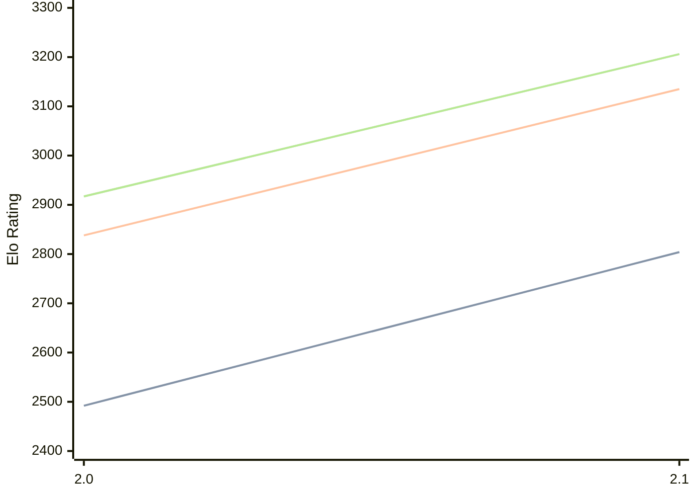

# Engine: Tunguska

Author: Fernando Tenorio

Home: https://github.com/fernandotenorio/Tunguska

## Elo Ratings

| Version | Published | STC 8.0+0.08s  | LTC 60.0+0.60s | VLTC 2m24s+1.12s | Comment |
| --- | --- | --- | --- | --- | --- |
| 2.1 | 2026-04-08 | 2804(+312) | 3135(+297) | 3206(+289) |  |
| 2.0 | 2026-03-18 | 2492 | 2838 | 2917 |  |
 | | | cElo (∆ prev) | cElo (∆ prev) | cElo (∆ prev) | 

<a href="https://github.com/computer-chess-index/cci/issues/new?template=submit-version.yml&title=[VERSION]+Tunguska+<version>&body=###%20Engine%20name%0ATunguska%0A%0A###%20Version%0A2.1" target="_blank">Submit new version</a>

 Test Conditions:

GUI/CLI: <a href=https://github.com/cutechess/cutechess target="_blank">Cute-Chess</a> 
Elo Calculation: <a href=https://www.remi-coulom.fr/Bayesian-Elo/ target="_blank">Bayesian-Elo</a> 
CPU: Intel(R) Core(TM) i5-7500T 2.70GHz 
Opening book: 8_moves_v3 
\* STC: 8.0+0.08s, LTC: 60.0+0.60s, VLTC: 2m24s+1.12s

 Lists:
Ratings: <a href=https://github.com/computer-chess-index/cci/blob/main/lists/CCIRatings.csv target="_blank">Complete list</a>

Generated: 2026-08-04 06:33:37

## Ratings Verlauf

⬛ STC (8.0+0.08s) &nbsp;&nbsp; 🟧 LTC (60.0+0.60s) &nbsp;&nbsp; 🟩 VLTC (2m24s+1.12s)

dark mode: 🟩STC (8.0+0.08s) 🟧LTC (60.0+0.60s) ⬜VLTC (2m24s+1.12s)

## Detailed Evaluation Results

| Version | Time Control | Elo  | Range +/- | Matches | Score | Average Opponent Elo | Draws |
| --- | --- | --- | --- | --- | --- | --- | --- |
| 2.1 | VLTC (2m24s+1.12s) | 3206 | 24 | 452 | 51% | 3195 | 59% |
| 2.1 | LTC (60.0+0.60s) | 3135 | 26 | 414 | 52% | 3113 | 58% |
| 2.1 | STC (8.0+0.08s) | 2804 | 24 | 496 | 48% | 2819 | 46% |
| --- | --- | --- | --- | --- | --- | --- | --- |
| 2.0 | VLTC (2m24s+1.12s) | 2917 | 30 | 356 | 51% | 2901 | 37% |
| 2.0 | LTC (60.0+0.60s) | 2838 | 31 | 328 | 50% | 2830 | 36% |
| 2.0 | STC (8.0+0.08s) | 2492 | 31 | 368 | 50% | 2485 | 25% |
| --- | --- | --- | --- | --- | --- | --- | --- |