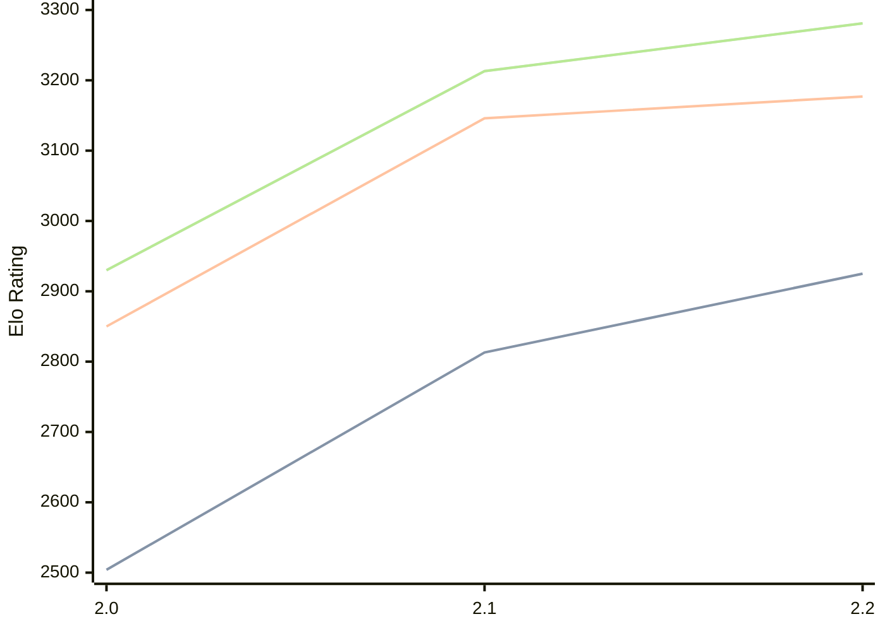

# Engine: Tunguska

Author: Fernando Tenorio

Home: https://github.com/fernandotenorio/Tunguska

## Elo Ratings

| Version | Published | STC 8.0+0.08s  | LTC 60.0+0.60s | VLTC 2m24s+1.12s | Comment |
| --- | --- | --- | --- | --- | --- |
| 2.2 | 2026-09-07 | 2925(+112) | 3177(+31) | 3281(+68) |  |
| 2.1 | 2026-04-08 | 2813(+309) | 3146(+296) | 3213(+283) |  |
| 2.0 | 2026-03-18 | 2504 | 2850 | 2930 |  |
 | | | cElo (∆ prev) | cElo (∆ prev) | cElo (∆ prev) | 

<a href="https://github.com/computer-chess-index/cci/issues/new?template=submit-version.yml&title=[VERSION]+Tunguska+<version>&body=###%20Engine%20name%0ATunguska%0A%0A###%20Version%0A2.2" target="_blank">Submit new version</a>

 Test Conditions:

GUI/CLI: <a href=https://github.com/cutechess/cutechess target="_blank">Cute-Chess</a> 
Elo Calculation: <a href=https://www.remi-coulom.fr/Bayesian-Elo/ target="_blank">Bayesian-Elo</a> 
CPU: Intel(R) Core(TM) i5-7500T 2.70GHz 
Opening book: 8_moves_v3 
\* STC: 8.0+0.08s, LTC: 60.0+0.60s, VLTC: 2m24s+1.12s

 Lists:
Ratings: <a href=https://github.com/computer-chess-index/cci/blob/main/lists/CCIRatings.csv target="_blank">Complete list</a>

Generated: 2026-09-09 04:44:28

## Ratings Verlauf

## Detailed Evaluation Results

| Version | Time Control | Elo  | Range +/- | Matches | Score | Average Opponent Elo | Draws |
| --- | --- | --- | --- | --- | --- | --- | --- |
| 2.2 | VLTC (2m24s+1.12s) | 3281 | 44 | 136 | 50% | 3279 | 65% |
| 2.2 | LTC (60.0+0.60s) | 3177 | 65 | 64 | 48% | 3193 | 58% |
| 2.2 | STC (8.0+0.08s) | 2925 | 62 | 76 | 53% | 2903 | 47% |
| --- | --- | --- | --- | --- | --- | --- | --- |
| 2.1 | VLTC (2m24s+1.12s) | 3213 | 24 | 488 | 50% | 3210 | 59% |
| 2.1 | LTC (60.0+0.60s) | 3146 | 24 | 458 | 52% | 3129 | 59% |
| 2.1 | STC (8.0+0.08s) | 2813 | 23 | 540 | 48% | 2831 | 46% |
| --- | --- | --- | --- | --- | --- | --- | --- |
| 2.0 | VLTC (2m24s+1.12s) | 2930 | 30 | 356 | 51% | 2913 | 37% |
| 2.0 | LTC (60.0+0.60s) | 2850 | 31 | 328 | 50% | 2843 | 36% |
| 2.0 | STC (8.0+0.08s) | 2504 | 31 | 368 | 50% | 2498 | 25% |
| --- | --- | --- | --- | --- | --- | --- | --- |