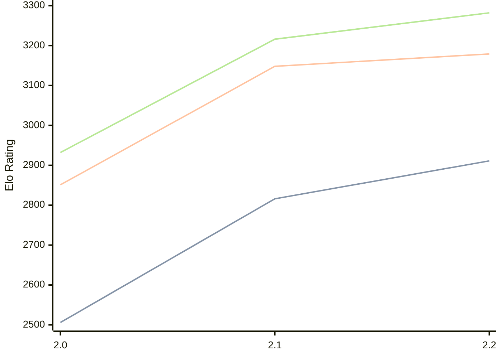

# Engine: Tunguska

Author: Fernando Tenorio

Home: https://github.com/fernandotenorio/Tunguska

## Elo Ratings

| Version | Published | STC 8.0+0.08s  | LTC 60.0+0.60s | VLTC 2m24s+1.12s | Comment |
| --- | --- | --- | --- | --- | --- |
| 2.2 | 2026-09-07 | 2911(+95) | 3179(+31) | 3282(+66) |  |
| 2.1 | 2026-04-08 | 2816(+310) | 3148(+297) | 3216(+284) |  |
| 2.0 | 2026-03-18 | 2506 | 2851 | 2932 |  |
 | | | cElo (∆ prev) | cElo (∆ prev) | cElo (∆ prev) | 

<a href="https://github.com/computer-chess-index/cci/issues/new?template=submit-version.yml&title=[VERSION]+Tunguska+<version>&body=###%20Engine%20name%0ATunguska%0A%0A###%20Version%0A2.2" target="_blank">Submit new version</a>

 Test Conditions:

GUI/CLI: <a href=https://github.com/cutechess/cutechess target="_blank">Cute-Chess</a> 
Elo Calculation: <a href=https://www.remi-coulom.fr/Bayesian-Elo/ target="_blank">Bayesian-Elo</a> 
CPU: Intel(R) Core(TM) i5-7500T 2.70GHz 
Opening book: 8_moves_v3 
\* STC: 8.0+0.08s, LTC: 60.0+0.60s, VLTC: 2m24s+1.12s

 Lists:
Ratings: <a href=https://github.com/computer-chess-index/cci/blob/main/lists/CCIRatings.csv target="_blank">Complete list</a>

Generated: 2026-09-19 04:43:35

## Ratings Verlauf

## Detailed Evaluation Results

| Version | Time Control | Elo  | Range +/- | Matches | Score | Average Opponent Elo | Draws |
| --- | --- | --- | --- | --- | --- | --- | --- |
| 2.2 | VLTC (2m24s+1.12s) | 3282 | 30 | 280 | 50% | 3282 | 68% |
| 2.2 | LTC (60.0+0.60s) | 3179 | 34 | 236 | 50% | 3181 | 61% |
| 2.2 | STC (8.0+0.08s) | 2911 | 34 | 244 | 50% | 2915 | 51% |
| --- | --- | --- | --- | --- | --- | --- | --- |
| 2.1 | VLTC (2m24s+1.12s) | 3216 | 24 | 488 | 50% | 3212 | 59% |
| 2.1 | LTC (60.0+0.60s) | 3148 | 24 | 458 | 52% | 3131 | 59% |
| 2.1 | STC (8.0+0.08s) | 2816 | 23 | 540 | 48% | 2834 | 46% |
| --- | --- | --- | --- | --- | --- | --- | --- |
| 2.0 | VLTC (2m24s+1.12s) | 2932 | 30 | 356 | 51% | 2916 | 37% |
| 2.0 | LTC (60.0+0.60s) | 2851 | 31 | 328 | 50% | 2844 | 36% |
| 2.0 | STC (8.0+0.08s) | 2506 | 31 | 368 | 50% | 2499 | 25% |
| --- | --- | --- | --- | --- | --- | --- | --- |