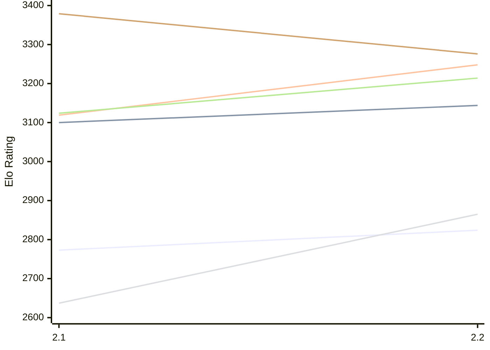
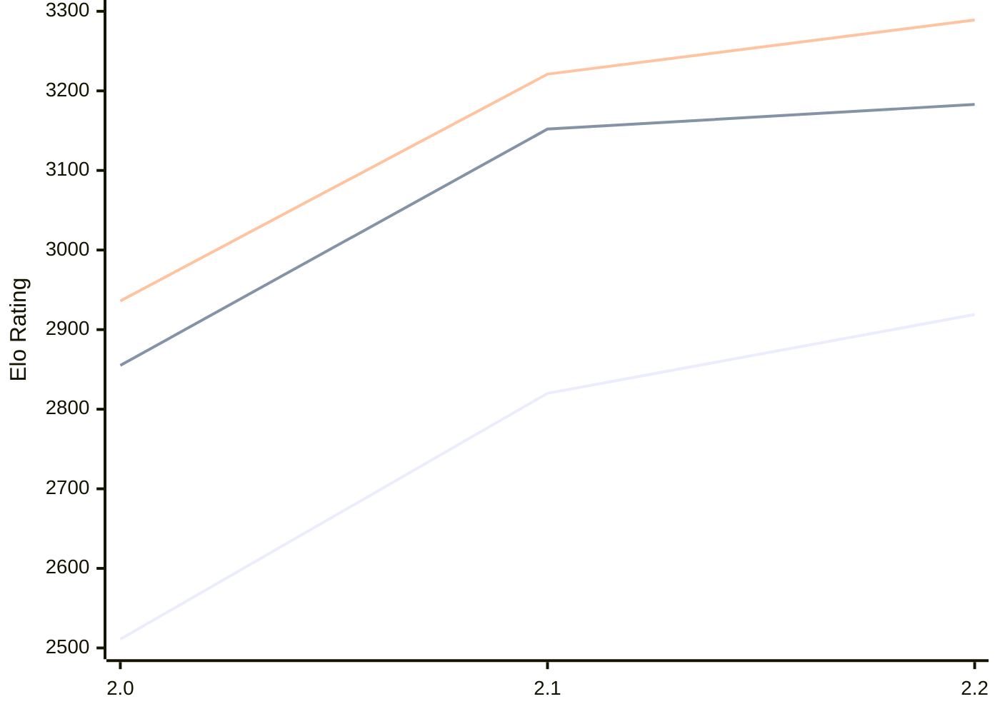

# Engine: Tunguska

Author: Fernando Tenorio

Home: https://github.com/fernandotenorio/Tunguska

## Elo Ratings E1 (Ultra 7 265T (1.50 GHz) - E-Core)

| Version | Published | STC 8.0+0.08s  | LTC 60.0+0.60s | VLTC 2m24s+1.12s | Comment |
| --- | --- | --- | --- | --- | --- |
| 2.2 | 2026-09-07 | 2824(+51) | 3144(+44) | 3248(+129) |  |
| 2.1 | 2026-04-08 | 2773 | 3100 | 3119 |  |
 | | | cElo (∆ prev) | cElo (∆ prev) | cElo (∆ prev) | 

## Elo Ratings P1 (Ultra 7 265T (1.50 GHz) - P-Core)

| Version | Published | STC 8.0+0.08s  | LTC 60.0+0.60s | VLTC 2m24s+1.12s | Comment |
| --- | --- | --- | --- | --- | --- |
| 2.2 | 2026-09-07 | 2865(+228) | 3214(+90) | 3276(-103) |  |
| 2.1 | 2026-04-08 | 2637 | 3124 | 3379 |  |
 | | | cElo (∆ prev) | cElo (∆ prev) | cElo (∆ prev) | 

## Elo Ratings T1 (i5-7500T 2.70GHz)

| Version | Published | STC 8.0+0.08s  | LTC 60.0+0.60s | VLTC 2m24s+1.12s | Comment |
| --- | --- | --- | --- | --- | --- |
| 2.2 | 2026-09-07 | 2919(+99) | 3183(+31) | 3289(+68) |  |
| 2.1 | 2026-04-08 | 2820(+309) | 3152(+297) | 3221(+285) |  |
| 2.0 | 2026-03-18 | 2511 | 2855 | 2936 |  |
 | | | cElo (∆ prev) | cElo (∆ prev) | cElo (∆ prev) | 

<a href="https://github.com/computer-chess-index/cci/issues/new?template=submit-version.yml&title=[VERSION]+Tunguska+<version>&body=###%20Engine%20name%0ATunguska%0A%0A###%20Version%0A2.2" target="_blank">Submit new version</a>

 Test Conditions:

GUI/CLI: <a href=https://github.com/cutechess/cutechess target="_blank">Cute-Chess</a> 
Elo Calculation: <a href=https://www.remi-coulom.fr/Bayesian-Elo/ target="_blank">Bayesian-Elo</a> 
CPU for P1: Intel(R) Core(TM) Ultra 7 265T (1.50 GHz) - P-Core 
CPU for E1: Intel(R) Core(TM) Ultra 7 265T (1.50 GHz) - E-Core 
CPU for T1: Intel(R) Core(TM) i5-7500T 2.70GHz 
Opening book: 8_moves_v3 
\* STC: 8.0+0.08s, LTC: 60.0+0.60s, VLTC: 2m24s+1.12s

 Lists:
Ratings: <a href=https://github.com/computer-chess-index/cci/blob/main/lists/CCIRatings.csv target="_blank">Complete list</a>

Generated: 2026-11-13 05:44:03

## Ratings Verlauf E1 / P1

```mermaid
%%{init: {"theme":"base","themeVariables":{"seriesColors:['#a3a3a3','#222221','#faa371']}}}%%
xychart-beta
  x-axis ["2.1", "2.2"]
  y-axis "Elo Rating" 2600 --> 3400
  line "E1: STC (8.0+0.08s)" [2773, 2824]
  line "E1: LTC (60.0+0.60s)" [3100, 3144]
  line "E1: VLTC (2m24s+1.12s)" [3119, 3248]
  line "P1: STC (8.0+0.08s)" [2637, 2865]
  line "P1: LTC (60.0+0.60s)" [3124, 3214]
  line "P1: VLTC (2m24s+1.12s)" [3379, 3276]
```

## Ratings Verlauf T1

```mermaid
%%{init: {"theme":"base","themeVariables":{"seriesColors:['#a3a3a3','#222221','#faa371']}}}%%
xychart-beta
  x-axis ["2.0", "2.1", "2.2"]
  y-axis "Elo Rating" 2500 --> 3300
  line "T1: STC (8.0+0.08s)" [2511, 2820, 2919]
  line "T1: LTC (60.0+0.60s)" [2855, 3152, 3183]
  line "T1: VLTC (2m24s+1.12s)" [2936, 3221, 3289]
```

## Detailed Evaluation Results

| Version | Time Control | Variant | Elo  | Range +/- | Matches | Score | Average Opponent Elo | Draws |
| --- | --- |--- | --- | --- | --- | --- | --- | --- |
| 2.2 | VLTC (2m24s+1.12s) | T1 | 3289 | 30 | 284 | 50% | 3286 | 68% |
|  |  | P1 | 3276 | 29 | 308 | 47% | 3295 | 61% |
|  |  | E1 | 3248 | 25 | 436 | 48% | 3263 | 58% |
|  | LTC (60.0+0.60s) | T1 | 3183 | 33 | 244 | 49% | 3186 | 61% |
|  |  | P1 | 3214 | 29 | 324 | 49% | 3222 | 57% |
|  |  | E1 | 3144 | 24 | 478 | 46% | 3173 | 58% |
|  | STC (8.0+0.08s) | P1 | 2865 | 32 | 288 | 47% | 2897 | 44% |
|  |  | E1 | 2824 | 27 | 416 | 46% | 2838 | 47% |
|  |  | T1 | 2919 | 34 | 252 | 50% | 2919 | 51% |
| --- | --- |--- | --- | --- | --- | --- | --- | --- |
| 2.1 | VLTC (2m24s+1.12s) | E1 | 3119 | 119 | 32 | 61% | 2878 | 22% |
|  |  | T1 | 3221 | 24 | 488 | 50% | 3217 | 59% |
|  |  | P1 | 3379 | 148 | 12 | 67% | 3255 | 50% |
|  | LTC (60.0+0.60s) | T1 | 3152 | 24 | 458 | 52% | 3135 | 59% |
|  |  | P1 | 3124 | 135 | 20 | 75% | 2820 | 30% |
|  |  | E1 | 3100 | 110 | 28 | 64% | 2789 | 36% |
|  | STC (8.0+0.08s) | T1 | 2820 | 23 | 540 | 48% | 2838 | 46% |
|  |  | P1 | 2637 | 115 | 28 | 39% | 2668 | 36% |
|  |  | E1 | 2773 | 90 | 48 | 42% | 2844 | 29% |
| --- | --- |--- | --- | --- | --- | --- | --- | --- |
| 2.0 | VLTC (2m24s+1.12s) | T1 | 2936 | 30 | 356 | 51% | 2920 | 37% |
|  | LTC (60.0+0.60s) | T1 | 2855 | 31 | 328 | 50% | 2849 | 36% |
|  | STC (8.0+0.08s) | T1 | 2511 | 31 | 368 | 50% | 2504 | 25% |