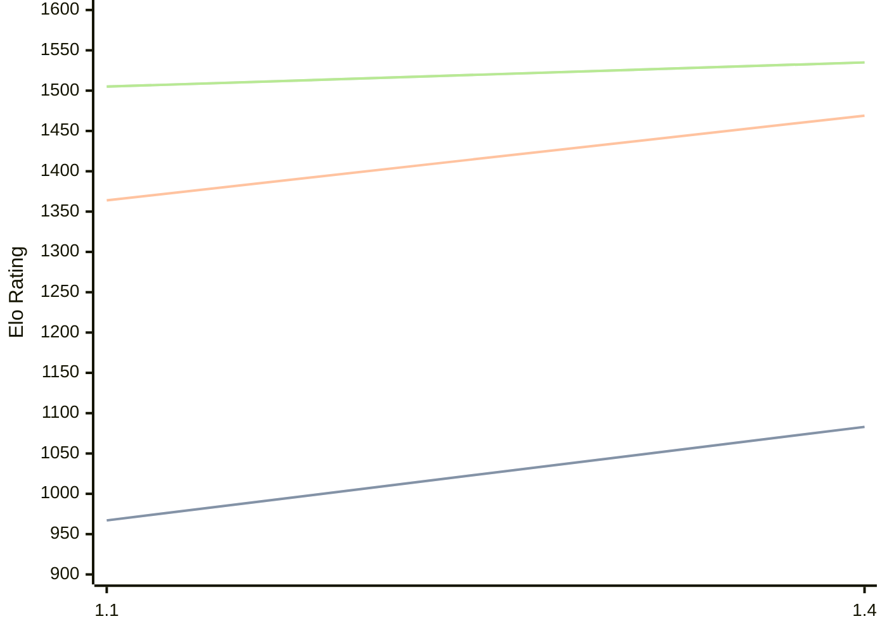

# Engine: USunfish

Author: Angel Monreal

Home: https://github.com/fizban99/micropython-usunfish

## Elo Ratings

| Version | Published | STC 8.0+0.08s  | LTC 60.0+0.60s | VLTC 2m24s+1.12s | Comment |
| --- | --- | --- | --- | --- | --- |
| 1.4 | 2026-09-12 | 1083(+new) | 1469(+new) | 1535(+new) |  |
| 1.3 | 2026-06-28 |  |  |  |  |
| 1.2a | 2026-06-07 |  |  |  |  |
| 1.2 | 2026-06-04 |  |  |  |  |
| 1.1 | 2026-05-15 | 967(+new) | 1364(+new) | 1505(+new) |  |
| 1.0a | 2026-05-05 |  |  |  |  |
| 1.0 | 2026-05-02 |  |  |  |  |
 | | | cElo (∆ prev) | cElo (∆ prev) | cElo (∆ prev) | 

<a href="https://github.com/computer-chess-index/cci/issues/new?template=submit-version.yml&title=[VERSION]+USunfish+<version>&body=###%20Engine%20name%0AUSunfish%0A%0A###%20Version%0A1.4" target="_blank">Submit new version</a>

 Test Conditions:

GUI/CLI: <a href=https://github.com/cutechess/cutechess target="_blank">Cute-Chess</a> 
Elo Calculation: <a href=https://www.remi-coulom.fr/Bayesian-Elo/ target="_blank">Bayesian-Elo</a> 
CPU: Intel(R) Core(TM) i5-7500T 2.70GHz 
Opening book: 8_moves_v3 
\* STC: 8.0+0.08s, LTC: 60.0+0.60s, VLTC: 2m24s+1.12s

 Lists:
Ratings: <a href=https://github.com/computer-chess-index/cci/blob/main/lists/CCIRatings.csv target="_blank">Complete list</a>

Generated: 2026-09-25 04:43:45

## Ratings Verlauf

## Detailed Evaluation Results

| Version | Time Control | Elo  | Range +/- | Matches | Score | Average Opponent Elo | Draws |
| --- | --- | --- | --- | --- | --- | --- | --- |
| 1.4 | VLTC (2m24s+1.12s) | 1535 | 39 | 234 | 53% | 1505 | 21% |
| 1.4 | LTC (60.0+0.60s) | 1469 | 40 | 220 | 52% | 1447 | 20% |
| 1.4 | STC (8.0+0.08s) | 1083 | 36 | 278 | 49% | 1096 | 19% |
| --- | --- | --- | --- | --- | --- | --- | --- |
| 1.1 | VLTC (2m24s+1.12s) | 1505 | 32 | 360 | 51% | 1490 | 19% |
| 1.1 | LTC (60.0+0.60s) | 1364 | 33 | 344 | 51% | 1351 | 18% |
| 1.1 | STC (8.0+0.08s) | 967 | 31 | 404 | 54% | 914 | 21% |
| --- | --- | --- | --- | --- | --- | --- | --- |