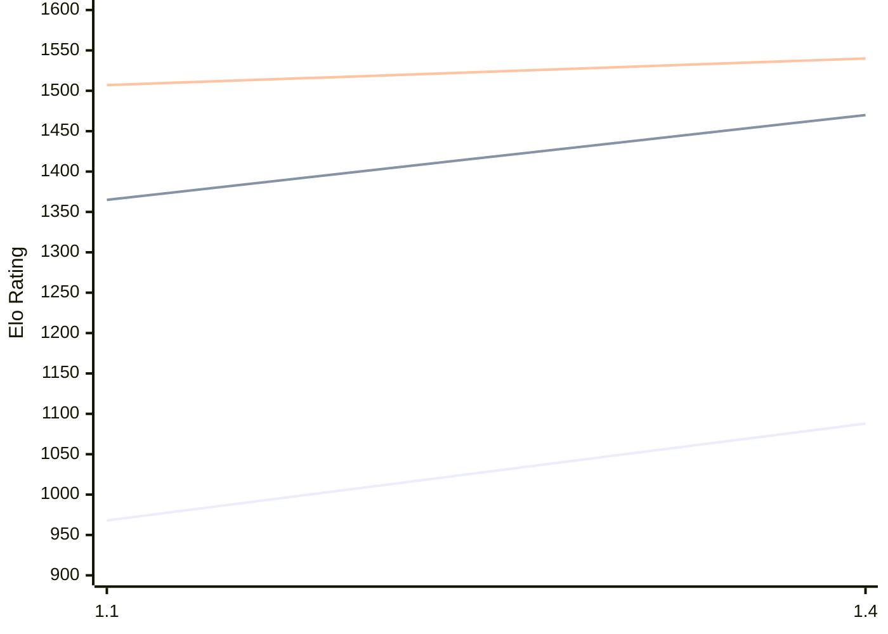

# Engine: USunfish

Author: Angel Monreal

Home: https://github.com/fizban99/micropython-usunfish

## Elo Ratings E1 (Ultra 7 265T (1.50 GHz) - E-Core)

| Version | Published | STC 8.0+0.08s  | LTC 60.0+0.60s | VLTC 2m24s+1.12s | Comment |
| --- | --- | --- | --- | --- | --- |
| 1.4 | 2026-09-12 | 1071 | 1476 | 1548 |  |
 | | | cElo (∆ prev) | cElo (∆ prev) | cElo (∆ prev) | 

## Elo Ratings P1 (Ultra 7 265T (1.50 GHz) - P-Core)

| Version | Published | STC 8.0+0.08s  | LTC 60.0+0.60s | VLTC 2m24s+1.12s | Comment |
| --- | --- | --- | --- | --- | --- |
| 1.4 | 2026-09-12 | 1065 | 1446 | 1604 |  |
 | | | cElo (∆ prev) | cElo (∆ prev) | cElo (∆ prev) | 

## Elo Ratings T1 (i5-7500T 2.70GHz)

| Version | Published | STC 8.0+0.08s  | LTC 60.0+0.60s | VLTC 2m24s+1.12s | Comment |
| --- | --- | --- | --- | --- | --- |
| 1.4 | 2026-09-12 | 1088(+120) | 1470(+105) | 1540(+33) |  |
| 1.1 | 2026-05-15 | 968 | 1365 | 1507 |  |
 | | | cElo (∆ prev) | cElo (∆ prev) | cElo (∆ prev) | 

<a href="https://github.com/computer-chess-index/cci/issues/new?template=submit-version.yml&title=[VERSION]+USunfish+<version>&body=###%20Engine%20name%0AUSunfish%0A%0A###%20Version%0A1.4" target="_blank">Submit new version</a>

 Test Conditions:

GUI/CLI: <a href=https://github.com/cutechess/cutechess target="_blank">Cute-Chess</a> 
Elo Calculation: <a href=https://www.remi-coulom.fr/Bayesian-Elo/ target="_blank">Bayesian-Elo</a> 
CPU for P1: Intel(R) Core(TM) Ultra 7 265T (1.50 GHz) - P-Core 
CPU for E1: Intel(R) Core(TM) Ultra 7 265T (1.50 GHz) - E-Core 
CPU for T1: Intel(R) Core(TM) i5-7500T 2.70GHz 
Opening book: 8_moves_v3 
\* STC: 8.0+0.08s, LTC: 60.0+0.60s, VLTC: 2m24s+1.12s

 Lists:
Ratings: <a href=https://github.com/computer-chess-index/cci/blob/main/lists/CCIRatings.csv target="_blank">Complete list</a>

Generated: 2026-10-27 05:44:13

## Ratings Verlauf T1

```mermaid
%%{init: {"theme":"base","themeVariables":{"seriesColors:['#a3a3a3','#222221','#faa371']}}}%%
xychart-beta
  x-axis ["1.1", "1.4"]
  y-axis "Elo Rating" 900 --> 1600
  line "T1: STC (8.0+0.08s)" [968, 1088]
  line "T1: LTC (60.0+0.60s)" [1365, 1470]
  line "T1: VLTC (2m24s+1.12s)" [1507, 1540]
```

## Detailed Evaluation Results

| Version | Time Control | Variant | Elo  | Range +/- | Matches | Score | Average Opponent Elo | Draws |
| --- | --- |--- | --- | --- | --- | --- | --- | --- |
| 1.4 | VLTC (2m24s+1.12s) | T1 | 1540 | 39 | 238 | 54% | 1507 | 21% |
|  |  | P1 | 1604 | 38 | 256 | 52% | 1584 | 14% |
|  |  | E1 | 1548 | 39 | 236 | 48% | 1581 | 22% |
|  | LTC (60.0+0.60s) | T1 | 1470 | 40 | 220 | 52% | 1449 | 20% |
|  |  | P1 | 1446 | 47 | 166 | 47% | 1509 | 19% |
|  |  | E1 | 1476 | 39 | 242 | 48% | 1496 | 18% |
|  | STC (8.0+0.08s) | T1 | 1088 | 36 | 282 | 49% | 1100 | 19% |
|  |  | P1 | 1065 | 45 | 172 | 50% | 1067 | 22% |
|  |  | E1 | 1071 | 33 | 312 | 48% | 1089 | 26% |
| --- | --- |--- | --- | --- | --- | --- | --- | --- |
| 1.1 | VLTC (2m24s+1.12s) | T1 | 1507 | 32 | 360 | 51% | 1492 | 19% |
|  | LTC (60.0+0.60s) | T1 | 1365 | 33 | 344 | 51% | 1354 | 18% |
|  | STC (8.0+0.08s) | T1 | 968 | 31 | 404 | 54% | 915 | 21% |