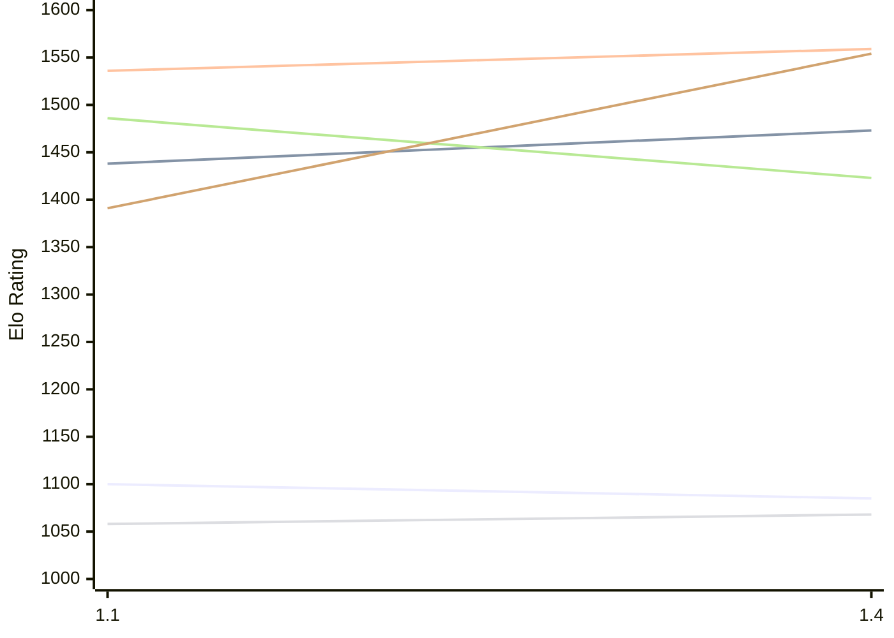
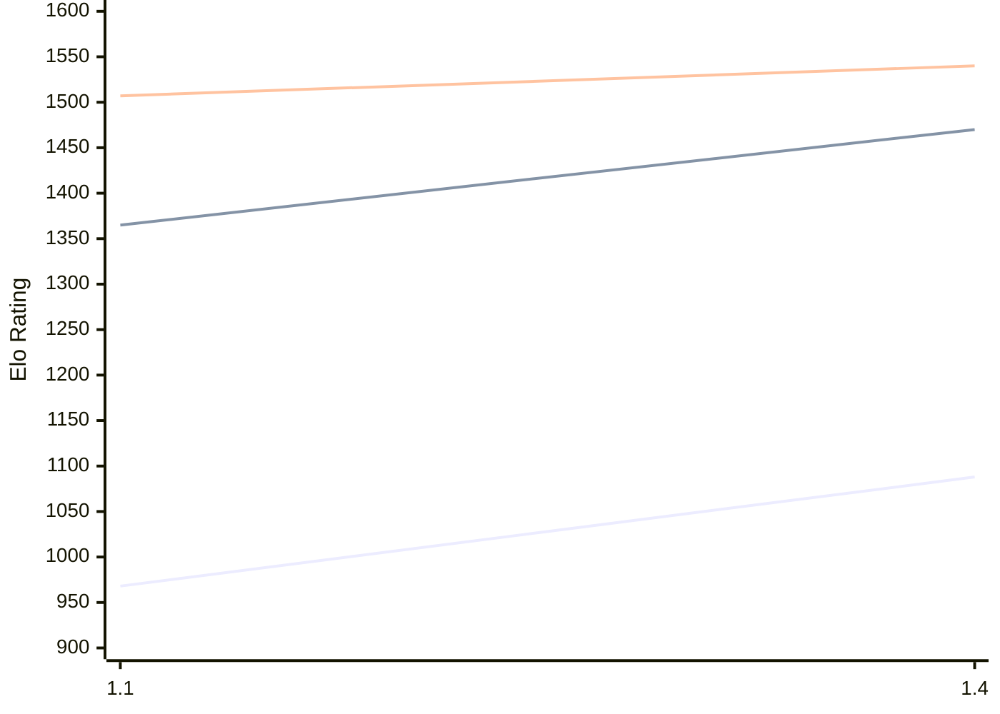

# Engine: USunfish

Author: Angel Monreal

Home: https://github.com/fizban99/micropython-usunfish

## Elo Ratings E1 (Ultra 7 265T (1.50 GHz) - E-Core)

| Version | Published | STC 8.0+0.08s  | LTC 60.0+0.60s | VLTC 2m24s+1.12s | Comment |
| --- | --- | --- | --- | --- | --- |
| 1.4 | 2026-09-12 | 1085(-15) | 1473(+35) | 1559(+23) |  |
| 1.1 | 2026-05-15 | 1100 | 1438 | 1536 |  |
 | | | cElo (∆ prev) | cElo (∆ prev) | cElo (∆ prev) | 

## Elo Ratings P1 (Ultra 7 265T (1.50 GHz) - P-Core)

| Version | Published | STC 8.0+0.08s  | LTC 60.0+0.60s | VLTC 2m24s+1.12s | Comment |
| --- | --- | --- | --- | --- | --- |
| 1.4 | 2026-09-12 | 1068(+10) | 1423(-63) | 1554(+163) |  |
| 1.1 | 2026-05-15 | 1058 | 1486 | 1391 |  |
 | | | cElo (∆ prev) | cElo (∆ prev) | cElo (∆ prev) | 

## Elo Ratings T1 (i5-7500T 2.70GHz)

| Version | Published | STC 8.0+0.08s  | LTC 60.0+0.60s | VLTC 2m24s+1.12s | Comment |
| --- | --- | --- | --- | --- | --- |
| 1.4 | 2026-09-12 | 1088(+120) | 1470(+105) | 1540(+33) |  |
| 1.1 | 2026-05-15 | 968 | 1365 | 1507 |  |
 | | | cElo (∆ prev) | cElo (∆ prev) | cElo (∆ prev) | 

<a href="https://github.com/computer-chess-index/cci/issues/new?template=submit-version.yml&title=[VERSION]+USunfish+<version>&body=###%20Engine%20name%0AUSunfish%0A%0A###%20Version%0A1.4" target="_blank">Submit new version</a>

 Test Conditions:

GUI/CLI: <a href=https://github.com/cutechess/cutechess target="_blank">Cute-Chess</a> 
Elo Calculation: <a href=https://www.remi-coulom.fr/Bayesian-Elo/ target="_blank">Bayesian-Elo</a> 
CPU for P1: Intel(R) Core(TM) Ultra 7 265T (1.50 GHz) - P-Core 
CPU for E1: Intel(R) Core(TM) Ultra 7 265T (1.50 GHz) - E-Core 
CPU for T1: Intel(R) Core(TM) i5-7500T 2.70GHz 
Opening book: 8_moves_v3 
\* STC: 8.0+0.08s, LTC: 60.0+0.60s, VLTC: 2m24s+1.12s

 Lists:
Ratings: <a href=https://github.com/computer-chess-index/cci/blob/main/lists/CCIRatings.csv target="_blank">Complete list</a>

Generated: 2026-11-13 05:44:10

## Ratings Verlauf E1 / P1

```mermaid
%%{init: {"theme":"base","themeVariables":{"seriesColors:['#a3a3a3','#222221','#faa371']}}}%%
xychart-beta
  x-axis ["1.1", "1.4"]
  y-axis "Elo Rating" 1000 --> 1600
  line "E1: STC (8.0+0.08s)" [1100, 1085]
  line "E1: LTC (60.0+0.60s)" [1438, 1473]
  line "E1: VLTC (2m24s+1.12s)" [1536, 1559]
  line "P1: STC (8.0+0.08s)" [1058, 1068]
  line "P1: LTC (60.0+0.60s)" [1486, 1423]
  line "P1: VLTC (2m24s+1.12s)" [1391, 1554]
```

## Ratings Verlauf T1

```mermaid
%%{init: {"theme":"base","themeVariables":{"seriesColors:['#a3a3a3','#222221','#faa371']}}}%%
xychart-beta
  x-axis ["1.1", "1.4"]
  y-axis "Elo Rating" 900 --> 1600
  line "T1: STC (8.0+0.08s)" [968, 1088]
  line "T1: LTC (60.0+0.60s)" [1365, 1470]
  line "T1: VLTC (2m24s+1.12s)" [1507, 1540]
```

## Detailed Evaluation Results

| Version | Time Control | Variant | Elo  | Range +/- | Matches | Score | Average Opponent Elo | Draws |
| --- | --- |--- | --- | --- | --- | --- | --- | --- |
| 1.4 | VLTC (2m24s+1.12s) | T1 | 1540 | 39 | 238 | 54% | 1507 | 21% |
|  |  | P1 | 1554 | 35 | 300 | 52% | 1539 | 16% |
|  |  | E1 | 1559 | 34 | 302 | 51% | 1565 | 22% |
|  | LTC (60.0+0.60s) | T1 | 1470 | 40 | 220 | 52% | 1449 | 20% |
|  |  | P1 | 1423 | 43 | 200 | 49% | 1440 | 24% |
|  |  | E1 | 1473 | 33 | 330 | 50% | 1465 | 19% |
|  | STC (8.0+0.08s) | T1 | 1088 | 36 | 282 | 49% | 1100 | 19% |
|  |  | P1 | 1068 | 38 | 232 | 49% | 1083 | 24% |
|  |  | E1 | 1085 | 31 | 366 | 49% | 1091 | 26% |
| --- | --- |--- | --- | --- | --- | --- | --- | --- |
| 1.1 | VLTC (2m24s+1.12s) | T1 | 1507 | 32 | 360 | 51% | 1492 | 19% |
|  |  | P1 | 1391 | 123 | 46 | 28% | 1771 | 9% |
|  |  | E1 | 1536 | 76 | 86 | 37% | 1755 | 14% |
|  | LTC (60.0+0.60s) | T1 | 1365 | 33 | 344 | 51% | 1354 | 18% |
|  |  | P1 | 1486 | 95 | 56 | 45% | 1611 | 14% |
|  |  | E1 | 1438 | 75 | 80 | 47% | 1553 | 16% |
|  | STC (8.0+0.08s) | T1 | 968 | 31 | 404 | 54% | 915 | 21% |
|  |  | P1 | 1058 | 182 | 36 | 7% | 1976 | 3% |
|  |  | E1 | 1100 | 79 | 86 | 27% | 1542 | 14% |