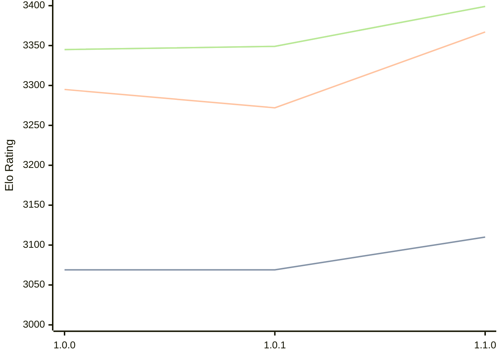

# Engine: Ursus

Author: Zander Chown

Home: https://github.com/zchown/Ursus

## Elo Ratings

| Version | Published | STC 8.0+0.08s  | LTC 60.0+0.60s | VLTC 2m24s+1.12s | Comment |
| --- | --- | --- | --- | --- | --- |
| 1.1.0 | 2026-08-18 | 3110(+41) | 3367(+95) | 3399(+50) |  |
| 1.0.1 | 2026-07-27 | 3069(0) | 3272(-23) | 3349(+4) |  |
| 1.0.0 | 2026-06-30 | 3069 | 3295 | 3345 |  |
 | | | cElo (∆ prev) | cElo (∆ prev) | cElo (∆ prev) | 

<a href="https://github.com/computer-chess-index/cci/issues/new?template=submit-version.yml&title=[VERSION]+Ursus+<version>&body=###%20Engine%20name%0AUrsus%0A%0A###%20Version%0A1.1.0" target="_blank">Submit new version</a>

 Test Conditions:

GUI/CLI: <a href=https://github.com/cutechess/cutechess target="_blank">Cute-Chess</a> 
Elo Calculation: <a href=https://www.remi-coulom.fr/Bayesian-Elo/ target="_blank">Bayesian-Elo</a> 
CPU: Intel(R) Core(TM) i5-7500T 2.70GHz 
Opening book: 8_moves_v3 
\* STC: 8.0+0.08s, LTC: 60.0+0.60s, VLTC: 2m24s+1.12s

 Lists:
Ratings: <a href=https://github.com/computer-chess-index/cci/blob/main/lists/CCIRatings.csv target="_blank">Complete list</a>

Generated: 2026-09-06 04:40:01

## Ratings Verlauf

## Detailed Evaluation Results

| Version | Time Control | Elo  | Range +/- | Matches | Score | Average Opponent Elo | Draws |
| --- | --- | --- | --- | --- | --- | --- | --- |
| 1.1.0 | VLTC (2m24s+1.12s) | 3399 | 38 | 168 | 51% | 3393 | 73% |
| 1.1.0 | LTC (60.0+0.60s) | 3367 | 40 | 156 | 50% | 3368 | 70% |
| 1.1.0 | STC (8.0+0.08s) | 3110 | 42 | 156 | 48% | 3125 | 54% |
| --- | --- | --- | --- | --- | --- | --- | --- |
| 1.0.1 | VLTC (2m24s+1.12s) | 3349 | 37 | 184 | 48% | 3360 | 68% |
| 1.0.1 | LTC (60.0+0.60s) | 3272 | 37 | 184 | 49% | 3276 | 66% |
| 1.0.1 | STC (8.0+0.08s) | 3069 | 46 | 132 | 52% | 3056 | 52% |
| --- | --- | --- | --- | --- | --- | --- | --- |
| 1.0.0 | VLTC (2m24s+1.12s) | 3345 | 40 | 160 | 55% | 3299 | 71% |
| 1.0.0 | LTC (60.0+0.60s) | 3295 | 40 | 166 | 55% | 3244 | 62% |
| 1.0.0 | STC (8.0+0.08s) | 3069 | 49 | 120 | 55% | 3015 | 53% |
| --- | --- | --- | --- | --- | --- | --- | --- |