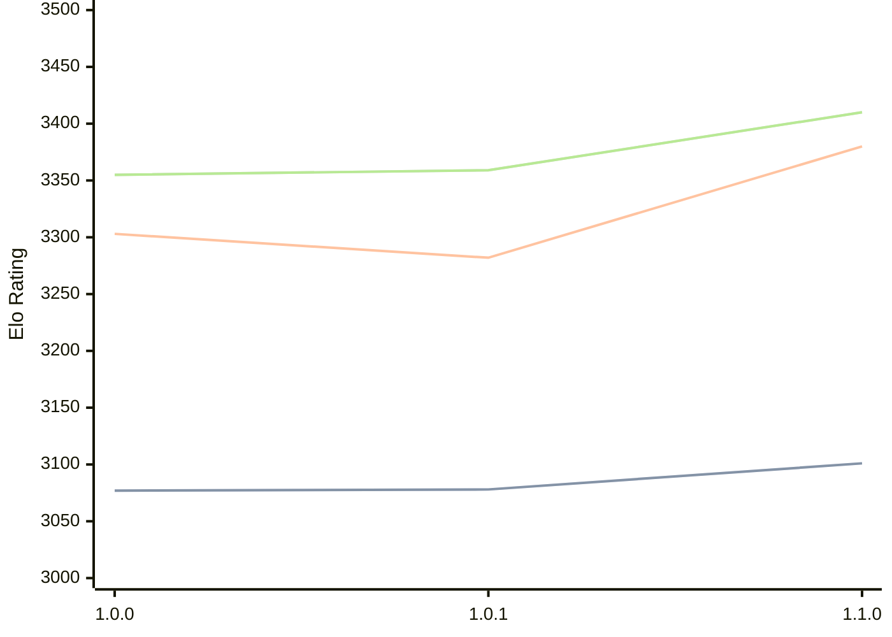

# Engine: Ursus

Author: Zander Chown

Home: https://github.com/zchown/Ursus

## Elo Ratings E1

| Version | Published | STC 8.0+0.08s  | LTC 60.0+0.60s | VLTC 2m24s+1.12s | Comment |
| --- | --- | --- | --- | --- | --- |
|  |  |  |  |  |  |
 | | | cElo (∆ prev) | cElo (∆ prev) | cElo (∆ prev) | 

## Elo Ratings P1

| Version | Published | STC 8.0+0.08s  | LTC 60.0+0.60s | VLTC 2m24s+1.12s | Comment |
| --- | --- | --- | --- | --- | --- |
|  |  |  |  |  |  |
 | | | cElo (∆ prev) | cElo (∆ prev) | cElo (∆ prev) | 

## Elo Ratings T1

| Version | Published | STC 8.0+0.08s  | LTC 60.0+0.60s | VLTC 2m24s+1.12s | Comment |
| --- | --- | --- | --- | --- | --- |
| 1.1.0 | 2026-08-18 | 3101(+23) | 3380(+98) | 3410(+51) |  |
| 1.0.1 | 2026-07-27 | 3078(+1) | 3282(-21) | 3359(+4) |  |
| 1.0.0 | 2026-06-30 | 3077 | 3303 | 3355 |  |
 | | | cElo (∆ prev) | cElo (∆ prev) | cElo (∆ prev) | 

<a href="https://github.com/computer-chess-index/cci/issues/new?template=submit-version.yml&title=[VERSION]+Ursus+<version>&body=###%20Engine%20name%0AUrsus%0A%0A###%20Version%0A1.1.0" target="_blank">Submit new version</a>

 Test Conditions:

GUI/CLI: <a href=https://github.com/cutechess/cutechess target="_blank">Cute-Chess</a> 
Elo Calculation: <a href=https://www.remi-coulom.fr/Bayesian-Elo/ target="_blank">Bayesian-Elo</a> 
CPU for P1: Intel(R) Core(TM) Ultra 7 265T (1.50 GHz) - P-Core 
CPU for E1: Intel(R) Core(TM) Ultra 7 265T (1.50 GHz) - E-Core 
CPU for T1: Intel(R) Core(TM) i5-7500T 2.70GHz 
Opening book: 8_moves_v3 
\* STC: 8.0+0.08s, LTC: 60.0+0.60s, VLTC: 2m24s+1.12s

 Lists:
Ratings: <a href=https://github.com/computer-chess-index/cci/blob/main/lists/CCIRatings.csv target="_blank">Complete list</a>

Generated: 2026-10-09 14:17:46

## Ratings Verlauf

```mermaid
%%{init: {"theme":"base","themeVariables":{"seriesColors:['#a3a3a3','#222221','#faa371']}}}%%
xychart-beta
  x-axis ["1.0.0", "1.0.1", "1.1.0"]
  y-axis "Elo Rating" 3000 --> 3500
  line "" [3077, 3078, 3101]
  line "STC (8.0+0.08s)" [3077, 3078, 3101]
  line "LTC (60.0+0.60s)" [3303, 3282, 3380]
  line "" [3355, 3359, 3410]
  line "VLTC (2m24s+1.12s)" [3355, 3359, 3410]
```

## Detailed Evaluation Results

| Version | Time Control | Elo  | Range +/- | Matches | Score | Average Opponent Elo | Draws |
| --- | --- | --- | --- | --- | --- | --- | --- |
| 1.1.0 | VLTC (2m24s+1.12s) | 3410 | 38 | 172 | 51% | 3402 | 73% |
| 1.1.0 | LTC (60.0+0.60s) | 3380 | 38 | 172 | 50% | 3378 | 69% |
| 1.1.0 | STC (8.0+0.08s) | 3101 | 35 | 220 | 48% | 3121 | 57% |
| --- | --- | --- | --- | --- | --- | --- | --- |
| 1.0.1 | VLTC (2m24s+1.12s) | 3359 | 37 | 184 | 48% | 3370 | 68% |
| 1.0.1 | LTC (60.0+0.60s) | 3282 | 37 | 184 | 49% | 3285 | 66% |
| 1.0.1 | STC (8.0+0.08s) | 3078 | 46 | 132 | 52% | 3066 | 52% |
| --- | --- | --- | --- | --- | --- | --- | --- |
| 1.0.0 | VLTC (2m24s+1.12s) | 3355 | 40 | 160 | 55% | 3309 | 71% |
| 1.0.0 | LTC (60.0+0.60s) | 3303 | 40 | 166 | 55% | 3252 | 62% |
| 1.0.0 | STC (8.0+0.08s) | 3077 | 49 | 120 | 55% | 3023 | 53% |
| --- | --- | --- | --- | --- | --- | --- | --- |