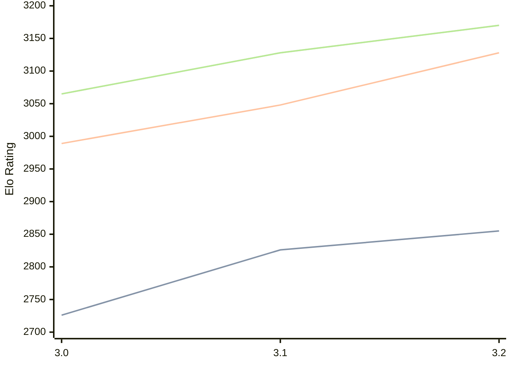

# Engine: Vajolet2

Author: Marco Belli

Home: https://github.com/elcabesa/vajolet

## Elo Ratings

| Version | Published | STC 8.0+0.08s  | LTC 60.0+0.60s | VLTC 2m24s+1.12s | Comment |
| --- | --- | --- | --- | --- | --- |
| 3.2 | 2026-05-17 | 2855(+29) | 3128(+80) | 3170(+42) |  |
| 3.1 | 2026-04-03 | 2826(+100) | 3048(+59) | 3128(+63) |  |
| 3.0 | 2025-12-21 | 2726 | 2989 | 3065 |  |
 | | | cElo (∆ prev) | cElo (∆ prev) | cElo (∆ prev) | 

<a href="https://github.com/computer-chess-index/cci/issues/new?template=submit-version.yml&title=[VERSION]+Vajolet2+<version>&body=###%20Engine%20name%0AVajolet2%0A%0A###%20Version%0A3.2" target="_blank">Submit new version</a>

 Test Conditions:

GUI/CLI: <a href=https://github.com/cutechess/cutechess target="_blank">Cute-Chess</a> 
Elo Calculation: <a href=https://www.remi-coulom.fr/Bayesian-Elo/ target="_blank">Bayesian-Elo</a> 
CPU: Intel(R) Core(TM) i5-7500T 2.70GHz 
Opening book: 8_moves_v3 
\* STC: 8.0+0.08s, LTC: 60.0+0.60s, VLTC: 2m24s+1.12s

 Lists:
Ratings: <a href=https://github.com/computer-chess-index/cci/blob/main/lists/CCIRatings.csv target="_blank">Complete list</a>

Generated: 2026-08-25 06:40:17

## Ratings Verlauf

⬛ STC (8.0+0.08s) &nbsp;&nbsp; 🟧 LTC (60.0+0.60s) &nbsp;&nbsp; 🟩 VLTC (2m24s+1.12s)

dark mode: 🟩STC (8.0+0.08s) 🟧LTC (60.0+0.60s) ⬜VLTC (2m24s+1.12s)

## Detailed Evaluation Results

| Version | Time Control | Elo  | Range +/- | Matches | Score | Average Opponent Elo | Draws |
| --- | --- | --- | --- | --- | --- | --- | --- |
| 3.2 | VLTC (2m24s+1.12s) | 3170 | 28 | 350 | 49% | 3181 | 53% |
| 3.2 | LTC (60.0+0.60s) | 3128 | 28 | 368 | 51% | 3120 | 48% |
| 3.2 | STC (8.0+0.08s) | 2855 | 26 | 444 | 50% | 2858 | 39% |
| --- | --- | --- | --- | --- | --- | --- | --- |
| 3.1 | VLTC (2m24s+1.12s) | 3128 | 29 | 352 | 50% | 3129 | 47% |
| 3.1 | LTC (60.0+0.60s) | 3048 | 27 | 406 | 50% | 3046 | 43% |
| 3.1 | STC (8.0+0.08s) | 2826 | 28 | 384 | 50% | 2823 | 41% |
| --- | --- | --- | --- | --- | --- | --- | --- |
| 3.0 | VLTC (2m24s+1.12s) | 3065 | 31 | 318 | 52% | 3047 | 46% |
| 3.0 | LTC (60.0+0.60s) | 2989 | 29 | 344 | 52% | 2969 | 44% |
| 3.0 | STC (8.0+0.08s) | 2726 | 29 | 386 | 52% | 2695 | 37% |
| --- | --- | --- | --- | --- | --- | --- | --- |