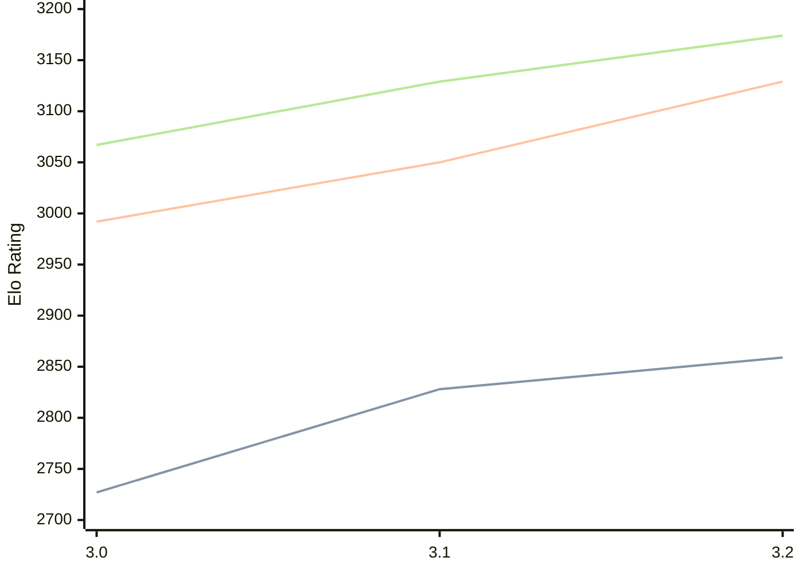

# Engine: Vajolet2

Author: Marco Belli

Home: https://github.com/elcabesa/vajolet

## Elo Ratings

| Version | Published | STC 8.0+0.08s  | LTC 60.0+0.60s | VLTC 2m24s+1.12s | Comment |
| --- | --- | --- | --- | --- | --- |
| 3.2 | 2026-05-17 | 2859(+31) | 3129(+79) | 3174(+45) |  |
| 3.1 | 2026-04-03 | 2828(+101) | 3050(+58) | 3129(+62) |  |
| 3.0 | 2025-12-21 | 2727 | 2992 | 3067 |  |
 | | | cElo (∆ prev) | cElo (∆ prev) | cElo (∆ prev) | 

<a href="https://github.com/computer-chess-index/cci/issues/new?template=submit-version.yml&title=[VERSION]+Vajolet2+<version>&body=###%20Engine%20name%0AVajolet2%0A%0A###%20Version%0A3.2" target="_blank">Submit new version</a>

 Test Conditions:

GUI/CLI: <a href=https://github.com/cutechess/cutechess target="_blank">Cute-Chess</a> 
Elo Calculation: <a href=https://www.remi-coulom.fr/Bayesian-Elo/ target="_blank">Bayesian-Elo</a> 
CPU: Intel(R) Core(TM) i5-7500T 2.70GHz 
Opening book: 8_moves_v3 
\* STC: 8.0+0.08s, LTC: 60.0+0.60s, VLTC: 2m24s+1.12s

 Lists:
Ratings: <a href=https://github.com/computer-chess-index/cci/blob/main/lists/CCIRatings.csv target="_blank">Complete list</a>

Generated: 2026-08-31 04:40:18

## Ratings Verlauf

## Detailed Evaluation Results

| Version | Time Control | Elo  | Range +/- | Matches | Score | Average Opponent Elo | Draws |
| --- | --- | --- | --- | --- | --- | --- | --- |
| 3.2 | VLTC (2m24s+1.12s) | 3174 | 28 | 354 | 49% | 3183 | 53% |
| 3.2 | LTC (60.0+0.60s) | 3129 | 28 | 368 | 51% | 3123 | 48% |
| 3.2 | STC (8.0+0.08s) | 2859 | 26 | 448 | 50% | 2861 | 39% |
| --- | --- | --- | --- | --- | --- | --- | --- |
| 3.1 | VLTC (2m24s+1.12s) | 3129 | 29 | 352 | 50% | 3132 | 47% |
| 3.1 | LTC (60.0+0.60s) | 3050 | 27 | 406 | 50% | 3047 | 43% |
| 3.1 | STC (8.0+0.08s) | 2828 | 28 | 384 | 50% | 2824 | 41% |
| --- | --- | --- | --- | --- | --- | --- | --- |
| 3.0 | VLTC (2m24s+1.12s) | 3067 | 31 | 318 | 52% | 3050 | 46% |
| 3.0 | LTC (60.0+0.60s) | 2992 | 29 | 344 | 52% | 2971 | 44% |
| 3.0 | STC (8.0+0.08s) | 2727 | 29 | 386 | 52% | 2696 | 37% |
| --- | --- | --- | --- | --- | --- | --- | --- |