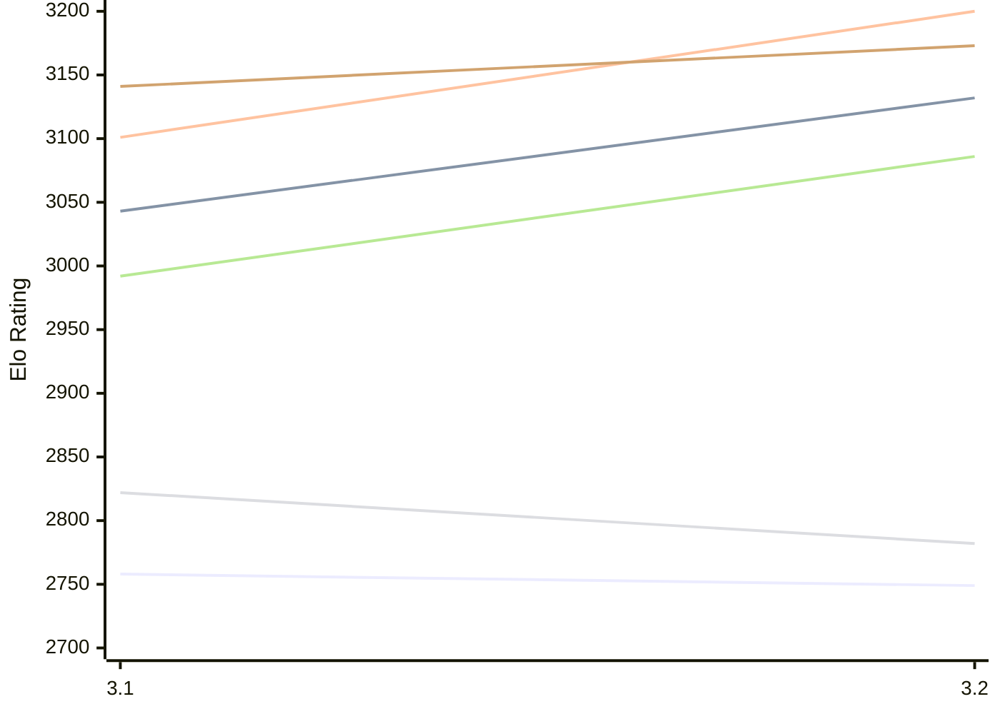
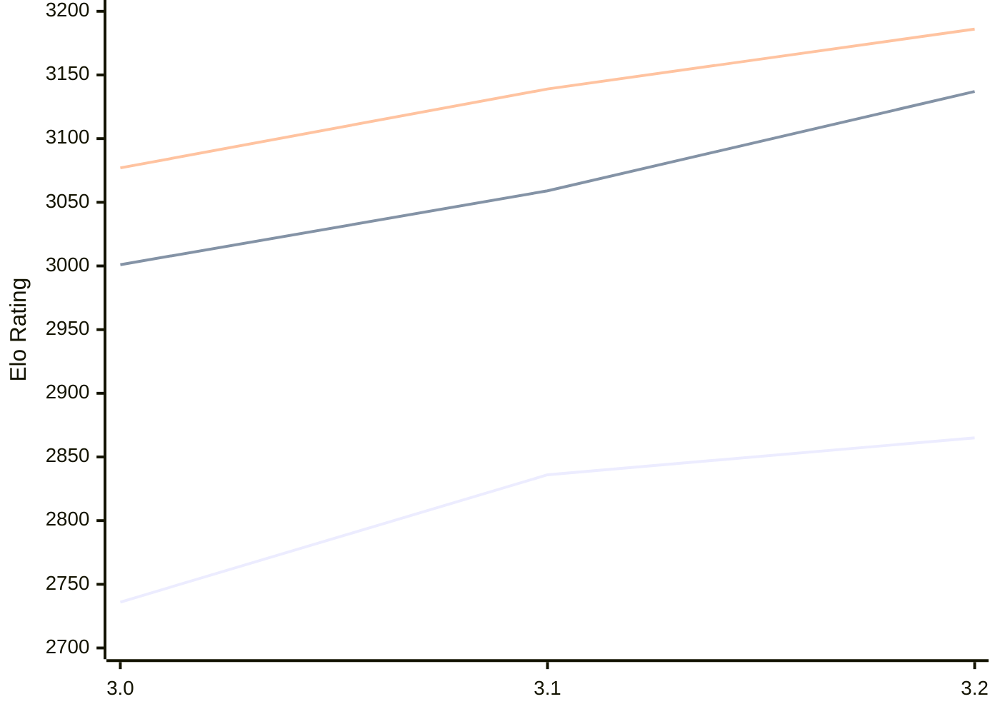

# Engine: Vajolet2

Author: Marco Belli

Home: https://github.com/elcabesa/vajolet

## Elo Ratings E1 (Ultra 7 265T (1.50 GHz) - E-Core)

| Version | Published | STC 8.0+0.08s  | LTC 60.0+0.60s | VLTC 2m24s+1.12s | Comment |
| --- | --- | --- | --- | --- | --- |
| 3.2 | 2026-05-17 | 2749(-9) | 3132(+89) | 3200(+99) |  |
| 3.1 | 2026-04-03 | 2758 | 3043 | 3101 |  |
 | | | cElo (∆ prev) | cElo (∆ prev) | cElo (∆ prev) | 

## Elo Ratings P1 (Ultra 7 265T (1.50 GHz) - P-Core)

| Version | Published | STC 8.0+0.08s  | LTC 60.0+0.60s | VLTC 2m24s+1.12s | Comment |
| --- | --- | --- | --- | --- | --- |
| 3.2 | 2026-05-17 | 2782(-40) | 3086(+94) | 3173(+32) |  |
| 3.1 | 2026-04-03 | 2822 | 2992 | 3141 |  |
 | | | cElo (∆ prev) | cElo (∆ prev) | cElo (∆ prev) | 

## Elo Ratings T1 (i5-7500T 2.70GHz)

| Version | Published | STC 8.0+0.08s  | LTC 60.0+0.60s | VLTC 2m24s+1.12s | Comment |
| --- | --- | --- | --- | --- | --- |
| 3.2 | 2026-05-17 | 2865(+29) | 3137(+78) | 3186(+47) |  |
| 3.1 | 2026-04-03 | 2836(+100) | 3059(+58) | 3139(+62) |  |
| 3.0 | 2025-12-21 | 2736 | 3001 | 3077 |  |
 | | | cElo (∆ prev) | cElo (∆ prev) | cElo (∆ prev) | 

<a href="https://github.com/computer-chess-index/cci/issues/new?template=submit-version.yml&title=[VERSION]+Vajolet2+<version>&body=###%20Engine%20name%0AVajolet2%0A%0A###%20Version%0A3.2" target="_blank">Submit new version</a>

 Test Conditions:

GUI/CLI: <a href=https://github.com/cutechess/cutechess target="_blank">Cute-Chess</a> 
Elo Calculation: <a href=https://www.remi-coulom.fr/Bayesian-Elo/ target="_blank">Bayesian-Elo</a> 
CPU for P1: Intel(R) Core(TM) Ultra 7 265T (1.50 GHz) - P-Core 
CPU for E1: Intel(R) Core(TM) Ultra 7 265T (1.50 GHz) - E-Core 
CPU for T1: Intel(R) Core(TM) i5-7500T 2.70GHz 
Opening book: 8_moves_v3 
\* STC: 8.0+0.08s, LTC: 60.0+0.60s, VLTC: 2m24s+1.12s

 Lists:
Ratings: <a href=https://github.com/computer-chess-index/cci/blob/main/lists/CCIRatings.csv target="_blank">Complete list</a>

Generated: 2026-11-21 05:44:01

## Ratings Verlauf E1 / P1

```mermaid
%%{init: {"theme":"base","themeVariables":{"seriesColors:['#a3a3a3','#222221','#faa371']}}}%%
xychart-beta
  x-axis ["3.1", "3.2"]
  y-axis "Elo Rating" 2700 --> 3200
  line "E1: STC (8.0+0.08s)" [2758, 2749]
  line "E1: LTC (60.0+0.60s)" [3043, 3132]
  line "E1: VLTC (2m24s+1.12s)" [3101, 3200]
  line "P1: STC (8.0+0.08s)" [2822, 2782]
  line "P1: LTC (60.0+0.60s)" [2992, 3086]
  line "P1: VLTC (2m24s+1.12s)" [3141, 3173]
```

## Ratings Verlauf T1

```mermaid
%%{init: {"theme":"base","themeVariables":{"seriesColors:['#a3a3a3','#222221','#faa371']}}}%%
xychart-beta
  x-axis ["3.0", "3.1", "3.2"]
  y-axis "Elo Rating" 2700 --> 3200
  line "T1: STC (8.0+0.08s)" [2736, 2836, 2865]
  line "T1: LTC (60.0+0.60s)" [3001, 3059, 3137]
  line "T1: VLTC (2m24s+1.12s)" [3077, 3139, 3186]
```

## Detailed Evaluation Results

| Version | Time Control | Variant | Elo  | Range +/- | Matches | Score | Average Opponent Elo | Draws |
| --- | --- |--- | --- | --- | --- | --- | --- | --- |
| 3.2 | VLTC (2m24s+1.12s) | T1 | 3186 | 27 | 386 | 49% | 3191 | 53% |
|  |  | P1 | 3173 | 31 | 302 | 50% | 3163 | 55% |
|  |  | E1 | 3200 | 26 | 435 | 52% | 3160 | 46% |
|  | LTC (60.0+0.60s) | T1 | 3137 | 27 | 400 | 51% | 3132 | 50% |
|  |  | P1 | 3086 | 32 | 298 | 50% | 3066 | 43% |
|  |  | E1 | 3132 | 27 | 426 | 54% | 3066 | 41% |
|  | STC (8.0+0.08s) | T1 | 2865 | 25 | 492 | 50% | 2867 | 39% |
|  |  | P1 | 2782 | 33 | 302 | 47% | 2816 | 34% |
|  |  | E1 | 2749 | 27 | 464 | 45% | 2778 | 31% |
| --- | --- |--- | --- | --- | --- | --- | --- | --- |
| 3.1 | VLTC (2m24s+1.12s) | T1 | 3139 | 29 | 352 | 50% | 3140 | 47% |
|  |  | P1 | 3141 | 89 | 36 | 40% | 3218 | 47% |
|  |  | E1 | 3101 | 61 | 80 | 40% | 3194 | 48% |
|  | LTC (60.0+0.60s) | T1 | 3059 | 27 | 406 | 50% | 3056 | 43% |
|  |  | P1 | 2992 | 79 | 48 | 54% | 2947 | 46% |
|  |  | E1 | 3043 | 58 | 84 | 48% | 3063 | 52% |
|  | STC (8.0+0.08s) | T1 | 2836 | 28 | 384 | 50% | 2832 | 41% |
|  |  | P1 | 2822 | 61 | 92 | 51% | 2778 | 34% |
|  |  | E1 | 2758 | 61 | 88 | 51% | 2692 | 38% |
| --- | --- |--- | --- | --- | --- | --- | --- | --- |
| 3.0 | VLTC (2m24s+1.12s) | T1 | 3077 | 31 | 318 | 52% | 3059 | 46% |
|  | LTC (60.0+0.60s) | T1 | 3001 | 29 | 344 | 52% | 2981 | 44% |
|  | STC (8.0+0.08s) | T1 | 2736 | 29 | 386 | 52% | 2705 | 37% |