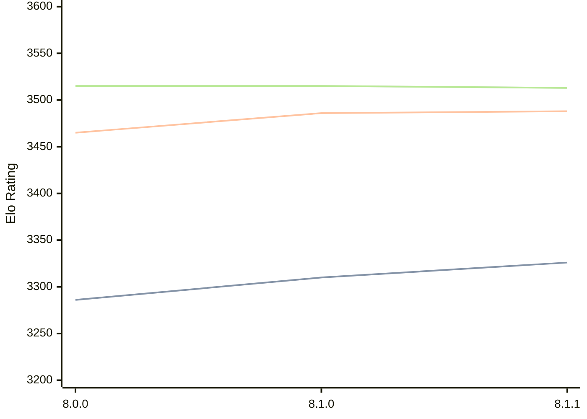

# Engine: Velvet

Author: Mhonert

Home: https://github.com/mhonert/velvet-chess

## Elo Ratings

| Version | Published | STC 8.0+0.08s  | LTC 60.0+0.60s | VLTC 2m24s+1.12s | Comment |
| --- | --- | --- | --- | --- | --- |
| 8.1.1 | 2024-11-06 | 3326(+16) | 3488(+2) | 3513(-2) |  |
| 8.1.0 | 2024-10-28 | 3310(+24) | 3486(+21) | 3515(0) |  |
| 8.0.0 | 2024-08-17 | 3286(+new) | 3465(+new) | 3515(+new) |  |
| 7.3.0 | 2024-04-08 |  |  |  |  |
| 7.2.0 | 2024-04-07 |  |  |  |  |
| 7.1.0 | 2024-03-08 |  |  |  |  |
| 7.0.0 | 2024-02-20 |  |  |  |  |
| 6.0.0 | 2023-12-21 |  |  |  |  |
| 5.3.0 | 2023-08-10 |  |  |  |  |
| 5.2.1 | 2023-06-12 |  |  |  |  |
| 5.2.0 | 2023-05-13 |  |  |  |  |
| 5.1.0 | 2023-02-13 |  |  |  |  |
| 5.0.0 | 2022-12-31 |  |  |  |  |
| 4.1.0 | 2022-08-18 |  |  |  |  |
| 4.0.1 | 2022-07-06 |  |  |  |  |
| 4.0.0 | 2022-07-03 |  |  |  |  |
| 3.3.0 | 2022-03-18 |  |  |  |  |
| 3.2.0 | 2022-02-05 |  |  |  |  |
| 3.1.3 | 2022-01-22 |  |  |  |  |
| 3.1.2 | 2022-01-22 |  |  |  |  |
| 3.1.1 | 2022-01-21 |  |  |  |  |
| 3.1.0 | 2021-11-14 |  |  |  |  |
| 3.0.0 | 2021-10-19 |  |  |  |  |
| 2.0.0 | 2021-07-24 |  |  |  |  |
| 1.2.0 | 2021-02-19 |  |  |  |  |
| 1.1.0 | 2020-12-20 |  |  |  |  |
| 1.0.0 | 2020-08-11 |  |  |  |  |
 | | | cElo (∆ prev) | cElo (∆ prev) | cElo (∆ prev) | 

<a href="https://github.com/computer-chess-index/cci/issues/new?template=submit-version.yml&title=[VERSION]+Velvet+<version>&body=###%20Engine%20name%0AVelvet%0A%0A###%20Version%0A8.1.1" target="_blank">Submit new version</a>

 Test Conditions:

GUI/CLI: <a href=https://github.com/cutechess/cutechess target="_blank">Cute-Chess</a> 
Elo Calculation: <a href=https://www.remi-coulom.fr/Bayesian-Elo/ target="_blank">Bayesian-Elo</a> 
CPU: Intel(R) Core(TM) i5-7500T 2.70GHz 
Opening book: 8_moves_v3 
\* STC: 8.0+0.08s, LTC: 60.0+0.60s, VLTC: 2m24s+1.12s

 Lists:
Ratings: <a href=https://github.com/computer-chess-index/cci/blob/main/lists/CCIRatings.csv target="_blank">Complete list</a>

Generated: 2026-05-03 07:47:18

## Ratings Verlauf

⬛ STC (8.0+0.08s) &nbsp;&nbsp; 🟧 LTC (60.0+0.60s) &nbsp;&nbsp; 🟩 VLTC (2m24s+1.12s)

dark mode: 🟩STC (8.0+0.08s) 🟧LTC (60.0+0.60s) ⬜VLTC (2m24s+1.12s)

## Detailed Evaluation Results

| Version | Time Control | Elo  | Range +/- | Matches | Score | Average Opponent Elo | Draws |
| --- | --- | --- | --- | --- | --- | --- | --- |
| 8.1.1 | VLTC (2m24s+1.12s) | 3513 | 12 | 1612 | 50% | 3515 | 79% |
| 8.1.1 | D1 | 1156 | 16 | 1556 | 48% | 1176 | 16% |
| 8.1.1 | D10 | 3024 | 14 | 1528 | 50% | 3025 | 50% |
| 8.1.1 | D11 | 3116 | 13 | 1624 | 50% | 3114 | 56% |
| 8.1.1 | D12 | 3198 | 13 | 1652 | 50% | 3195 | 59% |
| 8.1.1 | D13 | 3262 | 13 | 1620 | 51% | 3255 | 61% |
| 8.1.1 | D14 | 3318 | 13 | 1632 | 50% | 3316 | 68% |
| 8.1.1 | D15 | 3364 | 12 | 1644 | 51% | 3360 | 71% |
| 8.1.1 | D16 | 3401 | 12 | 1740 | 50% | 3402 | 73% |
| 8.1.1 | D17 | 3433 | 12 | 1860 | 50% | 3430 | 74% |
| 8.1.1 | D18 | 3455 | 15 | 1042 | 50% | 3455 | 78% |
| 8.1.1 | D2 | 1609 | 16 | 1418 | 48% | 1627 | 18% |
| 8.1.1 | D3 | 1972 | 15 | 1548 | 50% | 1970 | 20% |
| 8.1.1 | D4 | 2188 | 15 | 1556 | 50% | 2188 | 23% |
| 8.1.1 | D5 | 2404 | 15 | 1518 | 47% | 2434 | 27% |
| 8.1.1 | D6 | 2556 | 15 | 1548 | 50% | 2556 | 31% |
| 8.1.1 | D7 | 2678 | 14 | 1560 | 50% | 2681 | 36% |
| 8.1.1 | D8 | 2805 | 14 | 1512 | 50% | 2808 | 40% |
| 8.1.1 | D9 | 2935 | 14 | 1484 | 51% | 2915 | 46% |
| 8.1.1 | S10 | 3347 | 13 | 1644 | 50% | 3347 | 66% |
| 8.1.1 | S40 | 3464 | 12 | 1676 | 50% | 3467 | 75% |
| 8.1.1 | LTC (60.0+0.60s) | 3488 | 12 | 1660 | 50% | 3487 | 77% |
| 8.1.1 | STC (8.0+0.08s) | 3326 | 13 | 1630 | 50% | 3326 | 65% |
| --- | --- | --- | --- | --- | --- | --- | --- |
| 8.1.0 | VLTC (2m24s+1.12s) | 3515 | 32 | 228 | 46% | 3542 | 82% |
| 8.1.0 | D1 | 1237 | 49 | 164 | 44% | 1324 | 17% |
| 8.1.0 | D10 | 3050 | 52 | 100 | 48% | 3065 | 60% |
| 8.1.0 | D11 | 3147 | 51 | 100 | 48% | 3164 | 61% |
| 8.1.0 | D12 | 3222 | 50 | 108 | 46% | 3249 | 59% |
| 8.1.0 | D13 | 3248 | 53 | 88 | 49% | 3259 | 70% |
| 8.1.0 | D14 | 3337 | 47 | 112 | 46% | 3368 | 70% |
| 8.1.0 | D15 | 3380 | 49 | 104 | 50% | 3384 | 70% |
| 8.1.0 | D16 | 3374 | 52 | 96 | 52% | 3362 | 68% |
| 8.1.0 | D17 | 3391 | 53 | 84 | 53% | 3372 | 80% |
| 8.1.0 | D2 | 1577 | 59 | 112 | 49% | 1605 | 15% |
| 8.1.0 | D3 | 1964 | 64 | 92 | 51% | 1951 | 18% |
| 8.1.0 | D4 | 2101 | 63 | 88 | 44% | 2160 | 26% |
| 8.1.0 | D5 | 2442 | 50 | 140 | 44% | 2508 | 23% |
| 8.1.0 | D6 | 2546 | 47 | 148 | 51% | 2537 | 30% |
| 8.1.0 | D7 | 2750 | 57 | 100 | 52% | 2731 | 30% |
| 8.1.0 | D8 | 2849 | 56 | 92 | 49% | 2842 | 49% |
| 8.1.0 | D9 | 2907 | 65 | 68 | 46% | 2935 | 51% |
| 8.1.0 | S10 | 3343 | 39 | 168 | 50% | 3343 | 67% |
| 8.1.0 | S40 | 3459 | 35 | 196 | 50% | 3460 | 76% |
| 8.1.0 | LTC (60.0+0.60s) | 3486 | 38 | 172 | 51% | 3476 | 77% |
| 8.1.0 | STC (8.0+0.08s) | 3310 | 36 | 208 | 48% | 3326 | 58% |
| --- | --- | --- | --- | --- | --- | --- | --- |
| 8.0.0 | VLTC (2m24s+1.12s) | 3515 | 33 | 228 | 49% | 3522 | 78% |
| 8.0.0 | D1 | 1068 | 20 | 844 | 49% | 1073 | 33% |
| 8.0.0 | D10 | 3079 | 15 | 1252 | 51% | 3073 | 55% |
| 8.0.0 | D11 | 3166 | 17 | 906 | 50% | 3163 | 57% |
| 8.0.0 | D12 | 3218 | 17 | 956 | 50% | 3221 | 62% |
| 8.0.0 | D13 | 3294 | 16 | 1036 | 50% | 3282 | 64% |
| 8.0.0 | D14 | 3344 | 16 | 971 | 51% | 3333 | 68% |
| 8.0.0 | D15 | 3379 | 17 | 880 | 51% | 3375 | 75% |
| 8.0.0 | D16 | 3416 | 17 | 900 | 51% | 3406 | 73% |
| 8.0.0 | D17 | 3445 | 16 | 928 | 50% | 3443 | 79% |
| 8.0.0 | D18 | 3463 | 24 | 414 | 51% | 3457 | 78% |
| 8.0.0 | D2 | 1615 | 17 | 1216 | 51% | 1601 | 20% |
| 8.0.0 | D3 | 1959 | 19 | 956 | 51% | 1944 | 21% |
| 8.0.0 | D4 | 2206 | 20 | 880 | 50% | 2207 | 23% |
| 8.0.0 | D5 | 2433 | 17 | 1152 | 50% | 2435 | 27% |
| 8.0.0 | D6 | 2564 | 17 | 1152 | 49% | 2572 | 32% |
| 8.0.0 | D7 | 2719 | 19 | 888 | 51% | 2711 | 39% |
| 8.0.0 | D8 | 2832 | 18 | 924 | 51% | 2827 | 44% |
| 8.0.0 | D9 | 2950 | 18 | 903 | 50% | 2952 | 49% |
| 8.0.0 | S10 | 3312 | 32 | 256 | 50% | 3313 | 61% |
| 8.0.0 | S40 | 3428 | 33 | 240 | 50% | 3433 | 68% |
| 8.0.0 | LTC (60.0+0.60s) | 3465 | 36 | 192 | 51% | 3457 | 76% |
| 8.0.0 | STC (8.0+0.08s) | 3286 | 29 | 308 | 50% | 3287 | 66% |
| --- | --- | --- | --- | --- | --- | --- | --- |
| 7.3.0 | D1 | 1071 | 20 | 880 | 53% | 1044 | 28% |
| 7.3.0 | D10 | 3015 | 24 | 500 | 47% | 3036 | 53% |
| 7.3.0 | D11 | 3083 | 22 | 580 | 46% | 3112 | 56% |
| 7.3.0 | D12 | 3166 | 22 | 540 | 48% | 3179 | 60% |
| 7.3.0 | D13 | 3222 | 22 | 540 | 46% | 3252 | 63% |
| 7.3.0 | D14 | 3275 | 21 | 560 | 48% | 3289 | 68% |
| 7.3.0 | D15 | 3325 | 21 | 571 | 48% | 3337 | 65% |
| 7.3.0 | D16 | 3374 | 22 | 540 | 53% | 3353 | 68% |
| 7.3.0 | D17 | 3413 | 26 | 360 | 51% | 3409 | 72% |
| 7.3.0 | D18 | 3429 | 24 | 440 | 51% | 3424 | 75% |
| 7.3.0 | D2 | 1550 | 28 | 480 | 52% | 1528 | 18% |
| 7.3.0 | D3 | 1902 | 25 | 580 | 53% | 1875 | 17% |
| 7.3.0 | D4 | 2111 | 23 | 680 | 47% | 2136 | 21% |
| 7.3.0 | D5 | 2329 | 25 | 580 | 47% | 2358 | 24% |
| 7.3.0 | D6 | 2511 | 24 | 560 | 49% | 2522 | 31% |
| 7.3.0 | D7 | 2626 | 22 | 640 | 48% | 2639 | 35% |
| 7.3.0 | D8 | 2743 | 22 | 640 | 52% | 2727 | 39% |
| 7.3.0 | D9 | 2863 | 24 | 520 | 52% | 2847 | 42% |
| 7.2.0 |  |  |  |  |  |  |  |
| 7.1.0 |  |  |  |  |  |  |  |
| 7.0.0 |  |  |  |  |  |  |  |
| 6.0.0 |  |  |  |  |  |  |  |
| 5.3.0 |  |  |  |  |  |  |  |
| 5.2.1 |  |  |  |  |  |  |  |
| 5.2.0 |  |  |  |  |  |  |  |
| 5.1.0 |  |  |  |  |  |  |  |
| 5.0.0 |  |  |  |  |  |  |  |
| 4.1.0 |  |  |  |  |  |  |  |
| 4.0.1 |  |  |  |  |  |  |  |
| 4.0.0 |  |  |  |  |  |  |  |
| 3.3.0 |  |  |  |  |  |  |  |
| 3.2.0 |  |  |  |  |  |  |  |
| 3.1.3 |  |  |  |  |  |  |  |
| 3.1.2 |  |  |  |  |  |  |  |
| 3.1.1 |  |  |  |  |  |  |  |
| 3.1.0 |  |  |  |  |  |  |  |
| 3.0.0 |  |  |  |  |  |  |  |
| 2.0.0 |  |  |  |  |  |  |  |
| 1.2.0 |  |  |  |  |  |  |  |
| 1.1.0 |  |  |  |  |  |  |  |
| 1.0.0 |  |  |  |  |  |  |  |