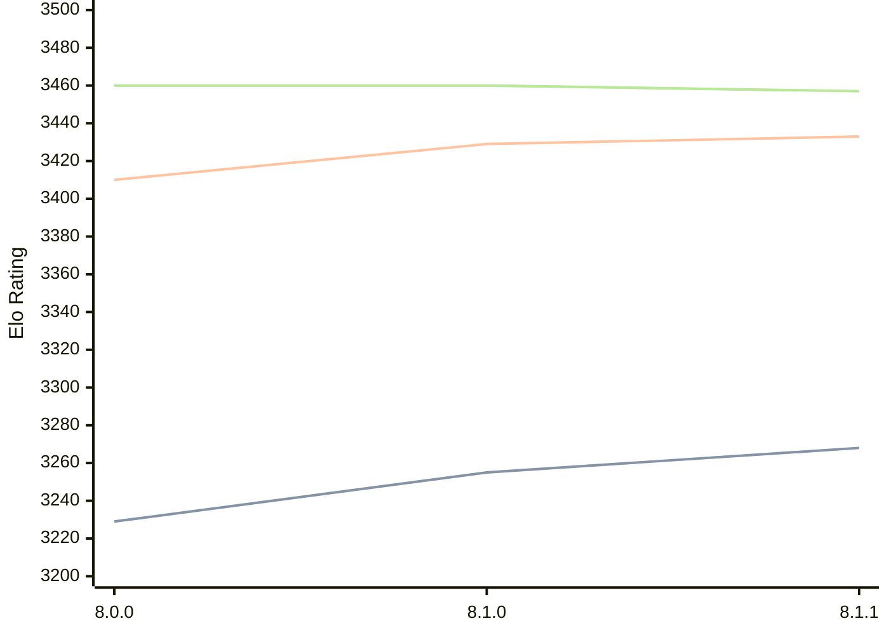

# Engine: Velvet

Author: Mhonert

Home: https://github.com/mhonert/velvet-chess

## Elo Ratings

| Version | Published | STC 8.0+0.08s  | LTC 60.0+0.60s | VLTC 2m24s+1.12s | Comment |
| --- | --- | --- | --- | --- | --- |
| 8.1.1 | 2024-11-06 | 3268(+13) | 3433(+4) | 3457(-3) |  |
| 8.1.0 | 2024-10-28 | 3255(+26) | 3429(+19) | 3460(0) |  |
| 8.0.0 | 2024-08-17 | 3229(+new) | 3410(+new) | 3460(+new) |  |
| 7.3.0 | 2024-04-08 |  |  |  |  |
| 7.2.0 | 2024-04-07 |  |  |  |  |
| 7.1.0 | 2024-03-08 |  |  |  |  |
| 7.0.0 | 2024-02-20 |  |  |  |  |
| 6.0.0 | 2023-12-21 |  |  |  |  |
| 5.3.0 | 2023-08-10 |  |  |  |  |
| 5.2.1 | 2023-06-12 |  |  |  |  |
| 5.2.0 | 2023-05-13 |  |  |  |  |
| 5.1.0 | 2023-02-13 |  |  |  |  |
| 5.0.0 | 2022-12-31 |  |  |  |  |
| 4.1.0 | 2022-08-18 |  |  |  |  |
| 4.0.1 | 2022-07-06 |  |  |  |  |
| 4.0.0 | 2022-07-03 |  |  |  |  |
| 3.3.0 | 2022-03-18 |  |  |  |  |
| 3.2.0 | 2022-02-05 |  |  |  |  |
| 3.1.3 | 2022-01-22 |  |  |  |  |
| 3.1.2 | 2022-01-22 |  |  |  |  |
| 3.1.1 | 2022-01-21 |  |  |  |  |
| 3.1.0 | 2021-11-14 |  |  |  |  |
| 3.0.0 | 2021-10-19 |  |  |  |  |
| 2.0.0 | 2021-07-24 |  |  |  |  |
| 1.2.0 | 2021-02-19 |  |  |  |  |
| 1.1.0 | 2020-12-20 |  |  |  |  |
| 1.0.0 | 2020-08-11 |  |  |  |  |
 | | | cElo (∆ prev) | cElo (∆ prev) | cElo (∆ prev) | 

<a href="https://github.com/computer-chess-index/cci/issues/new?template=submit-version.yml&title=[VERSION]+Velvet+<version>&body=###%20Engine%20name%0AVelvet%0A%0A###%20Version%0A8.1.1" target="_blank">Submit new version</a>

 Test Conditions:

GUI/CLI: <a href=https://github.com/cutechess/cutechess target="_blank">Cute-Chess</a> 
Elo Calculation: <a href=https://www.remi-coulom.fr/Bayesian-Elo/ target="_blank">Bayesian-Elo</a> 
CPU: Intel(R) Core(TM) i5-7500T 2.70GHz 
Opening book: 8_moves_v3 
\* STC: 8.0+0.08s, LTC: 60.0+0.60s, VLTC: 2m24s+1.12s

 Lists:
Ratings: <a href=https://github.com/computer-chess-index/cci/blob/main/lists/CCIRatings.csv target="_blank">Complete list</a>

Generated: 2026-07-09 06:46:59

## Ratings Verlauf

## Ratings Verlauf

⬛ STC (8.0+0.08s) &nbsp;&nbsp; 🟧 LTC (60.0+0.60s) &nbsp;&nbsp; 🟩 VLTC (2m24s+1.12s)

dark mode: 🟩STC (8.0+0.08s) 🟧LTC (60.0+0.60s) ⬜VLTC (2m24s+1.12s)

## Detailed Evaluation Results

| Version | Time Control | Elo  | Range +/- | Matches | Score | Average Opponent Elo | Draws |
| --- | --- | --- | --- | --- | --- | --- | --- |
| 8.1.1 | VLTC (2m24s+1.12s) | 3457 | 12 | 1636 | 50% | 3459 | 79% |
| 8.1.1 | LTC (60.0+0.60s) | 3433 | 12 | 1684 | 50% | 3430 | 77% |
| 8.1.1 | STC (8.0+0.08s) | 3268 | 12 | 1698 | 50% | 3271 | 65% |
| --- | --- | --- | --- | --- | --- | --- | --- |
| 8.1.0 | VLTC (2m24s+1.12s) | 3460 | 32 | 228 | 46% | 3487 | 82% |
| 8.1.0 | LTC (60.0+0.60s) | 3429 | 38 | 172 | 51% | 3421 | 77% |
| 8.1.0 | STC (8.0+0.08s) | 3255 | 36 | 208 | 48% | 3271 | 58% |
| --- | --- | --- | --- | --- | --- | --- | --- |
| 8.0.0 | VLTC (2m24s+1.12s) | 3460 | 33 | 228 | 49% | 3467 | 78% |
| 8.0.0 | LTC (60.0+0.60s) | 3410 | 36 | 192 | 51% | 3402 | 76% |
| 8.0.0 | STC (8.0+0.08s) | 3229 | 29 | 308 | 50% | 3231 | 66% |
| --- | --- | --- | --- | --- | --- | --- | --- |