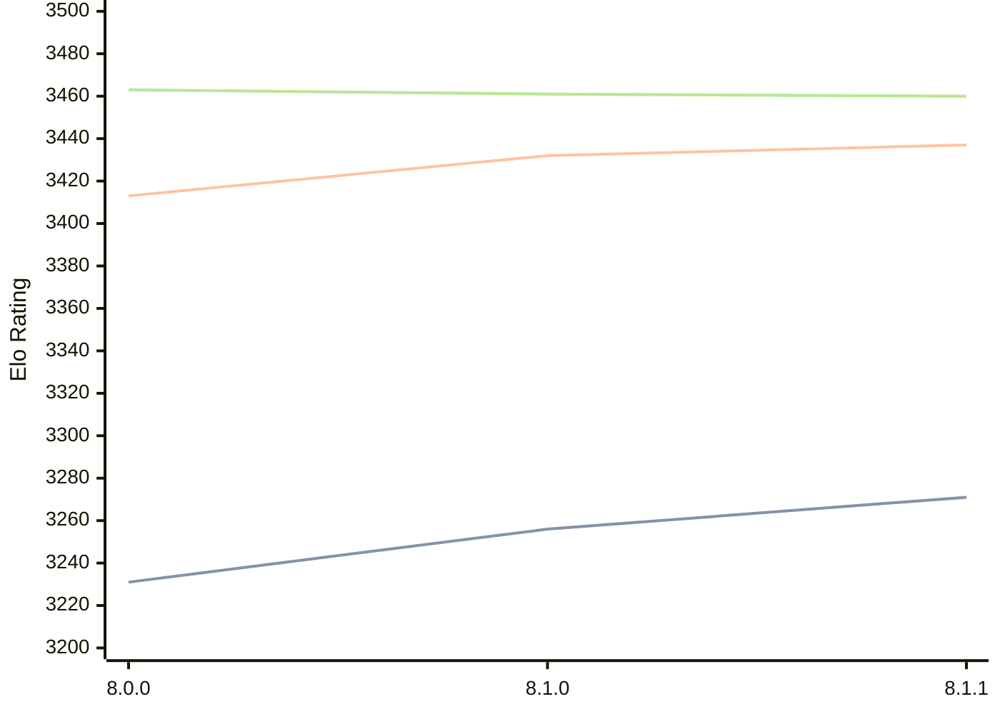

# Engine: Velvet

Author: Mhonert

Home: https://github.com/mhonert/velvet-chess

## Elo Ratings

| Version | Published | STC 8.0+0.08s  | LTC 60.0+0.60s | VLTC 2m24s+1.12s | Comment |
| --- | --- | --- | --- | --- | --- |
| 8.1.1 | 2024-11-06 | 3271(+15) | 3437(+5) | 3460(-1) |  |
| 8.1.0 | 2024-10-28 | 3256(+25) | 3432(+19) | 3461(-2) |  |
| 8.0.0 | 2024-08-17 | 3231(+new) | 3413(+new) | 3463(+new) |  |
| 7.3.0 | 2024-04-08 |  |  |  |  |
 | | | cElo (∆ prev) | cElo (∆ prev) | cElo (∆ prev) | 

<a href="https://github.com/computer-chess-index/cci/issues/new?template=submit-version.yml&title=[VERSION]+Velvet+<version>&body=###%20Engine%20name%0AVelvet%0A%0A###%20Version%0A8.1.1" target="_blank">Submit new version</a>

 Test Conditions:

GUI/CLI: <a href=https://github.com/cutechess/cutechess target="_blank">Cute-Chess</a> 
Elo Calculation: <a href=https://www.remi-coulom.fr/Bayesian-Elo/ target="_blank">Bayesian-Elo</a> 
CPU: Intel(R) Core(TM) i5-7500T 2.70GHz 
Opening book: 8_moves_v3 
\* STC: 8.0+0.08s, LTC: 60.0+0.60s, VLTC: 2m24s+1.12s

 Lists:
Ratings: <a href=https://github.com/computer-chess-index/cci/blob/main/lists/CCIRatings.csv target="_blank">Complete list</a>

Generated: 2026-08-09 06:34:10

## Ratings Verlauf

⬛ STC (8.0+0.08s) &nbsp;&nbsp; 🟧 LTC (60.0+0.60s) &nbsp;&nbsp; 🟩 VLTC (2m24s+1.12s)

dark mode: 🟩STC (8.0+0.08s) 🟧LTC (60.0+0.60s) ⬜VLTC (2m24s+1.12s)

## Detailed Evaluation Results

| Version | Time Control | Elo  | Range +/- | Matches | Score | Average Opponent Elo | Draws |
| --- | --- | --- | --- | --- | --- | --- | --- |
| 8.1.1 | VLTC (2m24s+1.12s) | 3460 | 12 | 1672 | 50% | 3461 | 79% |
| 8.1.1 | LTC (60.0+0.60s) | 3437 | 12 | 1728 | 51% | 3433 | 77% |
| 8.1.1 | STC (8.0+0.08s) | 3271 | 12 | 1760 | 50% | 3272 | 65% |
| --- | --- | --- | --- | --- | --- | --- | --- |
| 8.1.0 | VLTC (2m24s+1.12s) | 3461 | 32 | 228 | 46% | 3490 | 82% |
| 8.1.0 | LTC (60.0+0.60s) | 3432 | 38 | 172 | 51% | 3422 | 77% |
| 8.1.0 | STC (8.0+0.08s) | 3256 | 36 | 208 | 48% | 3272 | 58% |
| --- | --- | --- | --- | --- | --- | --- | --- |
| 8.0.0 | VLTC (2m24s+1.12s) | 3463 | 33 | 228 | 49% | 3468 | 78% |
| 8.0.0 | LTC (60.0+0.60s) | 3413 | 36 | 192 | 51% | 3405 | 76% |
| 8.0.0 | STC (8.0+0.08s) | 3231 | 29 | 308 | 50% | 3232 | 66% |
| --- | --- | --- | --- | --- | --- | --- | --- |