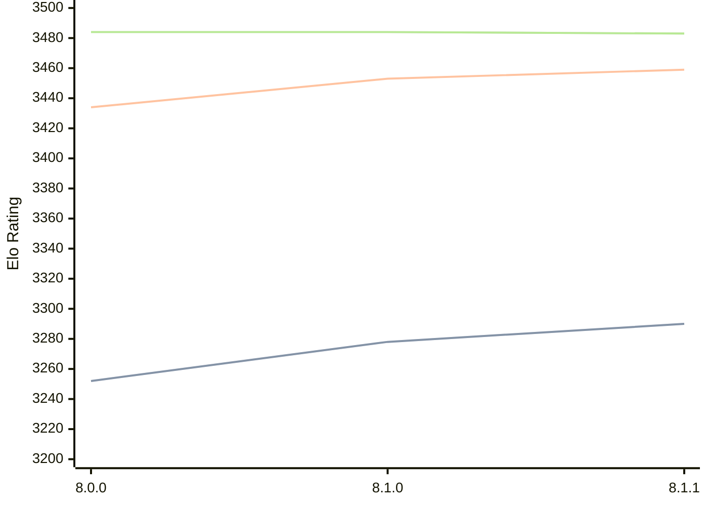

# Engine: Velvet

Author: Mhonert

Home: https://github.com/mhonert/velvet-chess

## Elo Ratings E1

| Version | Published | STC 8.0+0.08s  | LTC 60.0+0.60s | VLTC 2m24s+1.12s | Comment |
| --- | --- | --- | --- | --- | --- |
| 8.1.1 | 2024-11-06 | 3195 | 3398 | 3474 |  |
 | | | cElo (∆ prev) | cElo (∆ prev) | cElo (∆ prev) | 

## Elo Ratings P1

| Version | Published | STC 8.0+0.08s  | LTC 60.0+0.60s | VLTC 2m24s+1.12s | Comment |
| --- | --- | --- | --- | --- | --- |
| 8.1.1 | 2024-11-06 | 3511 | 3634 | 3706 |  |
 | | | cElo (∆ prev) | cElo (∆ prev) | cElo (∆ prev) | 

## Elo Ratings T1

| Version | Published | STC 8.0+0.08s  | LTC 60.0+0.60s | VLTC 2m24s+1.12s | Comment |
| --- | --- | --- | --- | --- | --- |
| 8.1.1 | 2024-11-06 | 3290(+12) | 3459(+6) | 3483(-1) |  |
| 8.1.0 | 2024-10-28 | 3278(+26) | 3453(+19) | 3484(0) |  |
| 8.0.0 | 2024-08-17 | 3252 | 3434 | 3484 |  |
 | | | cElo (∆ prev) | cElo (∆ prev) | cElo (∆ prev) | 

<a href="https://github.com/computer-chess-index/cci/issues/new?template=submit-version.yml&title=[VERSION]+Velvet+<version>&body=###%20Engine%20name%0AVelvet%0A%0A###%20Version%0A8.1.1" target="_blank">Submit new version</a>

 Test Conditions:

GUI/CLI: <a href=https://github.com/cutechess/cutechess target="_blank">Cute-Chess</a> 
Elo Calculation: <a href=https://www.remi-coulom.fr/Bayesian-Elo/ target="_blank">Bayesian-Elo</a> 
CPU for P1: Intel(R) Core(TM) Ultra 7 265T (1.50 GHz) - P-Core 
CPU for E1: Intel(R) Core(TM) Ultra 7 265T (1.50 GHz) - E-Core 
CPU for T1: Intel(R) Core(TM) i5-7500T 2.70GHz 
Opening book: 8_moves_v3 
\* STC: 8.0+0.08s, LTC: 60.0+0.60s, VLTC: 2m24s+1.12s

 Lists:
Ratings: <a href=https://github.com/computer-chess-index/cci/blob/main/lists/CCIRatings.csv target="_blank">Complete list</a>

Generated: 2026-10-10 04:43:51

## Ratings Verlauf

```mermaid
%%{init: {"theme":"base","themeVariables":{"seriesColors:['#a3a3a3','#222221','#faa371']}}}%%
xychart-beta
  x-axis ["8.0.0", "8.1.0", "8.1.1"]
  y-axis "Elo Rating" 3200 --> 3500
  line "" [3252, 3278, 3290]
  line "STC (8.0+0.08s)" [3252, 3278, 3290]
  line "LTC (60.0+0.60s)" [3434, 3453, 3459]
  line "" [3484, 3484, 3483]
  line "VLTC (2m24s+1.12s)" [3484, 3484, 3483]
```

## Detailed Evaluation Results

| Version | Time Control | Elo  | Range +/- | Matches | Score | Average Opponent Elo | Draws |
| --- | --- | --- | --- | --- | --- | --- | --- |
| 8.1.1 | VLTC (2m24s+1.12s) | 3706 | 42 | 132 | 52% | 3686 | 80% |
| 8.1.1 | VLTC (2m24s+1.12s) | 3474 | 41 | 146 | 54% | 3443 | 77% |
| 8.1.1 | VLTC (2m24s+1.12s) | 3483 | 12 | 1712 | 50% | 3483 | 79% |
| 8.1.1 | LTC (60.0+0.60s) | 3634 | 39 | 158 | 56% | 3590 | 77% |
| 8.1.1 | LTC (60.0+0.60s) | 3398 | 41 | 150 | 49% | 3407 | 71% |
| 8.1.1 | LTC (60.0+0.60s) | 3459 | 12 | 1776 | 51% | 3455 | 77% |
| 8.1.1 | STC (8.0+0.08s) | 3195 | 32 | 258 | 45% | 3232 | 66% |
| --- | --- | --- | --- | --- | --- | --- | --- |
| 8.1.1 | STC (8.0+0.08s) | 3290 | 12 | 1840 | 49% | 3294 | 65% |
| --- | --- | --- | --- | --- | --- | --- | --- |
| 8.1.1 | STC (8.0+0.08s) | 3511 | 38 | 184 | 49% | 3515 | 62% |
| --- | --- | --- | --- | --- | --- | --- | --- |
| 8.1.0 | VLTC (2m24s+1.12s) | 3484 | 32 | 228 | 46% | 3511 | 82% |
| 8.1.0 | LTC (60.0+0.60s) | 3453 | 38 | 172 | 51% | 3445 | 77% |
| 8.1.0 | STC (8.0+0.08s) | 3278 | 36 | 208 | 48% | 3293 | 58% |
| --- | --- | --- | --- | --- | --- | --- | --- |
| 8.0.0 | VLTC (2m24s+1.12s) | 3484 | 33 | 228 | 49% | 3491 | 78% |
| 8.0.0 | LTC (60.0+0.60s) | 3434 | 36 | 192 | 51% | 3426 | 76% |
| 8.0.0 | STC (8.0+0.08s) | 3252 | 29 | 308 | 50% | 3252 | 66% |
| --- | --- | --- | --- | --- | --- | --- | --- |