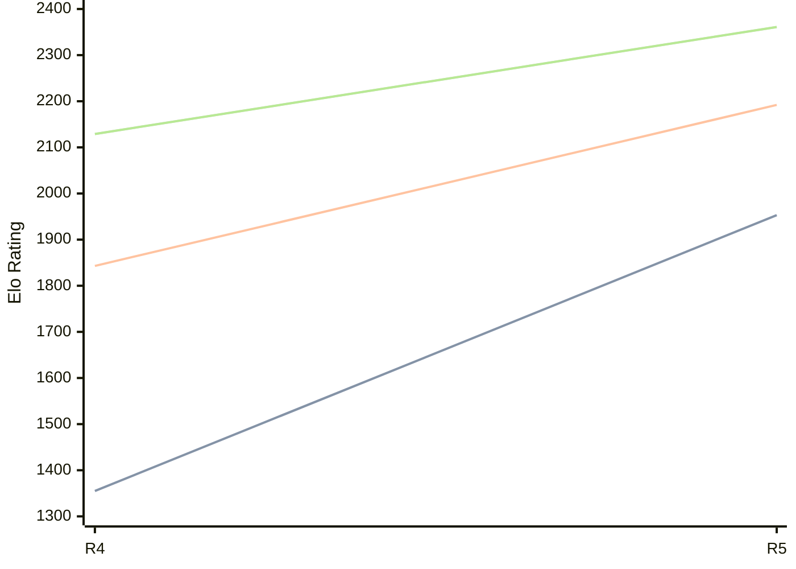

# Engine: Viking

Author: Dario Pendic

Home: https://github.com/nbqofficial/viking

## Elo Ratings

| Version | Published | STC 8.0+0.08s  | LTC 60.0+0.60s | VLTC 2m24s+1.12s | Comment |
| --- | --- | --- | --- | --- | --- |
| R5 | 2026-04-27 | 1953(+598) | 2192(+349) | 2361(+232) |  |
| R4 | 2026-04-22 | 1355(+new) | 1843(+new) | 2129(+new) |  |
| R3 | 2026-04-22 |  |  |  |  |
| R2 | 2025-09-25 |  |  |  |  |
| R1 | 2025-09-24 |  |  |  |  |
 | | | cElo (∆ prev) | cElo (∆ prev) | cElo (∆ prev) | 

<a href="https://github.com/computer-chess-index/cci/issues/new?template=submit-version.yml&title=[VERSION]+Viking+<version>&body=###%20Engine%20name%0AViking%0A%0A###%20Version%0AR5" target="_blank">Submit new version</a>

 Test Conditions:

GUI/CLI: <a href=https://github.com/cutechess/cutechess target="_blank">Cute-Chess</a> 
Elo Calculation: <a href=https://www.remi-coulom.fr/Bayesian-Elo/ target="_blank">Bayesian-Elo</a> 
CPU: Intel(R) Core(TM) i5-7500T 2.70GHz 
Opening book: 8_moves_v3 
\* STC: 8.0+0.08s, LTC: 60.0+0.60s, VLTC: 2m24s+1.12s

 Lists:
Ratings: <a href=https://github.com/computer-chess-index/cci/blob/main/lists/CCIRatings.csv target="_blank">Complete list</a>

Generated: 2026-05-19 06:30:16

## Ratings Verlauf

⬛ STC (8.0+0.08s) &nbsp;&nbsp; 🟧 LTC (60.0+0.60s) &nbsp;&nbsp; 🟩 VLTC (2m24s+1.12s)

dark mode: 🟩STC (8.0+0.08s) 🟧LTC (60.0+0.60s) ⬜VLTC (2m24s+1.12s)

## Detailed Evaluation Results

| Version | Time Control | Elo  | Range +/- | Matches | Score | Average Opponent Elo | Draws |
| --- | --- | --- | --- | --- | --- | --- | --- |
| R5 | VLTC (2m24s+1.12s) | 2361 | 30 | 342 | 50% | 2361 | 35% |
| R5 | LTC (60.0+0.60s) | 2192 | 31 | 348 | 52% | 2165 | 29% |
| R5 | STC (8.0+0.08s) | 1953 | 31 | 394 | 53% | 1922 | 22% |
| --- | --- | --- | --- | --- | --- | --- | --- |
| R4 | VLTC (2m24s+1.12s) | 2129 | 31 | 372 | 41% | 2240 | 28% |
| R4 | LTC (60.0+0.60s) | 1843 | 36 | 298 | 46% | 1912 | 23% |
| R4 | STC (8.0+0.08s) | 1355 | 38 | 288 | 47% | 1419 | 19% |
| --- | --- | --- | --- | --- | --- | --- | --- |