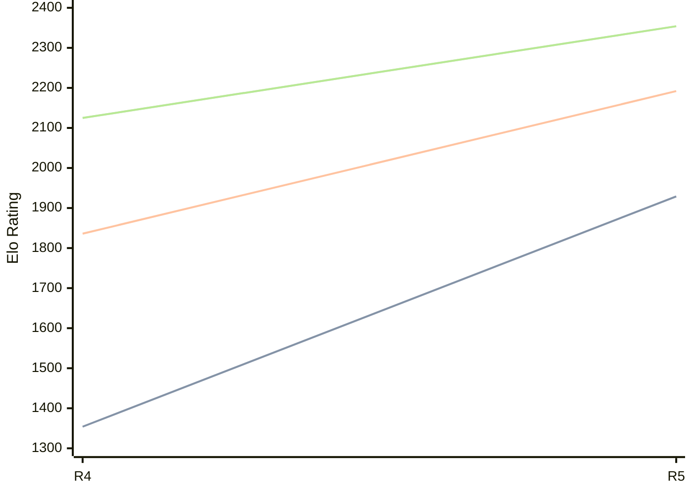

# Engine: Viking

Author: Dario Pendic

Home: https://github.com/nbqofficial/viking

## Elo Ratings E1

| Version | Published | STC 8.0+0.08s  | LTC 60.0+0.60s | VLTC 2m24s+1.12s | Comment |
| --- | --- | --- | --- | --- | --- |
| R5 | 2026-04-27 | 1797 | 2105 | 2149 |  |
 | | | cElo (∆ prev) | cElo (∆ prev) | cElo (∆ prev) | 

## Elo Ratings P1

| Version | Published | STC 8.0+0.08s  | LTC 60.0+0.60s | VLTC 2m24s+1.12s | Comment |
| --- | --- | --- | --- | --- | --- |
| R5 | 2026-04-27 | 1945 | 2346 | 2568 |  |
 | | | cElo (∆ prev) | cElo (∆ prev) | cElo (∆ prev) | 

## Elo Ratings T1

| Version | Published | STC 8.0+0.08s  | LTC 60.0+0.60s | VLTC 2m24s+1.12s | Comment |
| --- | --- | --- | --- | --- | --- |
| R5 | 2026-04-27 | 1929(+575) | 2192(+356) | 2354(+229) |  |
| R4 | 2026-04-22 | 1354 | 1836 | 2125 |  |
 | | | cElo (∆ prev) | cElo (∆ prev) | cElo (∆ prev) | 

<a href="https://github.com/computer-chess-index/cci/issues/new?template=submit-version.yml&title=[VERSION]+Viking+<version>&body=###%20Engine%20name%0AViking%0A%0A###%20Version%0AR5" target="_blank">Submit new version</a>

 Test Conditions:

GUI/CLI: <a href=https://github.com/cutechess/cutechess target="_blank">Cute-Chess</a> 
Elo Calculation: <a href=https://www.remi-coulom.fr/Bayesian-Elo/ target="_blank">Bayesian-Elo</a> 
CPU for P1: Intel(R) Core(TM) Ultra 7 265T (1.50 GHz) - P-Core 
CPU for E1: Intel(R) Core(TM) Ultra 7 265T (1.50 GHz) - E-Core 
CPU for T1: Intel(R) Core(TM) i5-7500T 2.70GHz 
Opening book: 8_moves_v3 
\* STC: 8.0+0.08s, LTC: 60.0+0.60s, VLTC: 2m24s+1.12s

 Lists:
Ratings: <a href=https://github.com/computer-chess-index/cci/blob/main/lists/CCIRatings.csv target="_blank">Complete list</a>

Generated: 2026-10-09 14:17:58

## Ratings Verlauf

```mermaid
%%{init: {"theme":"base","themeVariables":{"seriesColors:['#a3a3a3','#222221','#faa371']}}}%%
xychart-beta
  x-axis ["R4", "R5"]
  y-axis "Elo Rating" 1300 --> 2400
  line "" [1354, 1929]
  line "STC (8.0+0.08s)" [1354, 1929]
  line "LTC (60.0+0.60s)" [1836, 2192]
  line "" [2125, 2354]
  line "VLTC (2m24s+1.12s)" [2125, 2354]
```

## Detailed Evaluation Results

| Version | Time Control | Elo  | Range +/- | Matches | Score | Average Opponent Elo | Draws |
| --- | --- | --- | --- | --- | --- | --- | --- |
| R5 | VLTC (2m24s+1.12s) | 2354 | 26 | 482 | 49% | 2367 | 33% |
| R5 | VLTC (2m24s+1.12s) | 2568 | 48 | 150 | 42% | 2658 | 29% |
| R5 | VLTC (2m24s+1.12s) | 2149 | 44 | 184 | 51% | 2152 | 27% |
| R5 | LTC (60.0+0.60s) | 2192 | 28 | 450 | 51% | 2174 | 29% |
| R5 | LTC (60.0+0.60s) | 2346 | 53 | 124 | 50% | 2357 | 27% |
| R5 | LTC (60.0+0.60s) | 2105 | 41 | 212 | 47% | 2164 | 28% |
| R5 | STC (8.0+0.08s) | 1929 | 26 | 542 | 50% | 1935 | 20% |
| --- | --- | --- | --- | --- | --- | --- | --- |
| R5 | STC (8.0+0.08s) | 1945 | 47 | 154 | 47% | 1967 | 23% |
| --- | --- | --- | --- | --- | --- | --- | --- |
| R5 | STC (8.0+0.08s) | 1797 | 41 | 206 | 47% | 1862 | 31% |
| --- | --- | --- | --- | --- | --- | --- | --- |
| R4 | VLTC (2m24s+1.12s) | 2125 | 31 | 372 | 41% | 2236 | 28% |
| R4 | LTC (60.0+0.60s) | 1836 | 36 | 298 | 46% | 1906 | 23% |
| R4 | STC (8.0+0.08s) | 1354 | 38 | 288 | 47% | 1418 | 19% |
| --- | --- | --- | --- | --- | --- | --- | --- |