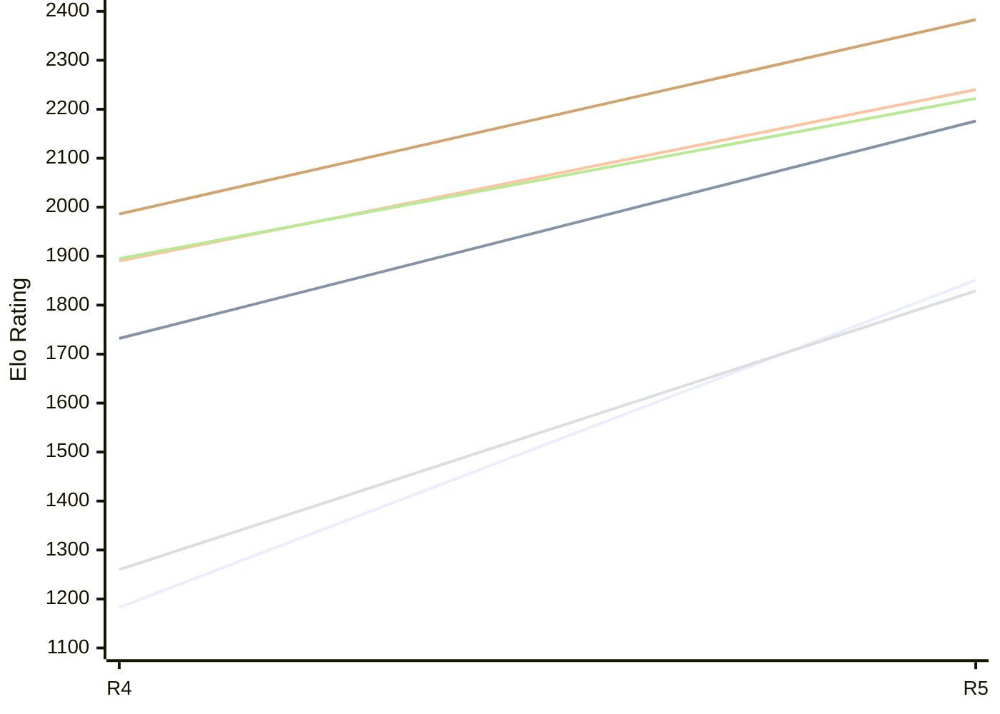
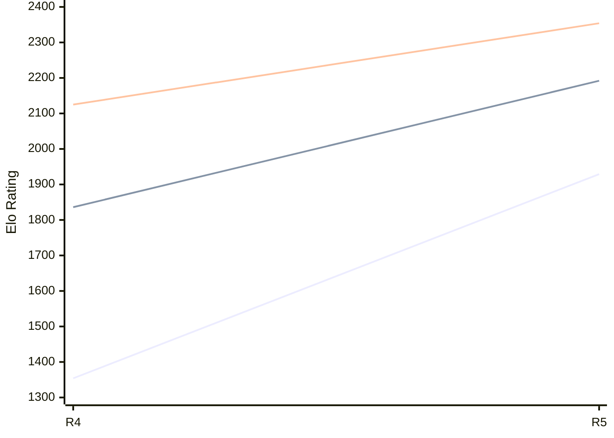

# Engine: Viking

Author: Dario Pendic

Home: https://github.com/nbqofficial/viking

## Elo Ratings E1 (Ultra 7 265T (1.50 GHz) - E-Core)

| Version | Published | STC 8.0+0.08s  | LTC 60.0+0.60s | VLTC 2m24s+1.12s | Comment |
| --- | --- | --- | --- | --- | --- |
| R5 | 2026-04-27 | 1851(+668) | 2176(+444) | 2240(+350) |  |
| R4 | 2026-04-22 | 1183 | 1732 | 1890 |  |
 | | | cElo (∆ prev) | cElo (∆ prev) | cElo (∆ prev) | 

## Elo Ratings P1 (Ultra 7 265T (1.50 GHz) - P-Core)

| Version | Published | STC 8.0+0.08s  | LTC 60.0+0.60s | VLTC 2m24s+1.12s | Comment |
| --- | --- | --- | --- | --- | --- |
| R5 | 2026-04-27 | 1829(+569) | 2222(+327) | 2383(+397) |  |
| R4 | 2026-04-22 | 1260 | 1895 | 1986 |  |
 | | | cElo (∆ prev) | cElo (∆ prev) | cElo (∆ prev) | 

## Elo Ratings T1 (i5-7500T 2.70GHz)

| Version | Published | STC 8.0+0.08s  | LTC 60.0+0.60s | VLTC 2m24s+1.12s | Comment |
| --- | --- | --- | --- | --- | --- |
| R5 | 2026-04-27 | 1929(+575) | 2192(+356) | 2354(+229) |  |
| R4 | 2026-04-22 | 1354 | 1836 | 2125 |  |
 | | | cElo (∆ prev) | cElo (∆ prev) | cElo (∆ prev) | 

<a href="https://github.com/computer-chess-index/cci/issues/new?template=submit-version.yml&title=[VERSION]+Viking+<version>&body=###%20Engine%20name%0AViking%0A%0A###%20Version%0AR5" target="_blank">Submit new version</a>

 Test Conditions:

GUI/CLI: <a href=https://github.com/cutechess/cutechess target="_blank">Cute-Chess</a> 
Elo Calculation: <a href=https://www.remi-coulom.fr/Bayesian-Elo/ target="_blank">Bayesian-Elo</a> 
CPU for P1: Intel(R) Core(TM) Ultra 7 265T (1.50 GHz) - P-Core 
CPU for E1: Intel(R) Core(TM) Ultra 7 265T (1.50 GHz) - E-Core 
CPU for T1: Intel(R) Core(TM) i5-7500T 2.70GHz 
Opening book: 8_moves_v3 
\* STC: 8.0+0.08s, LTC: 60.0+0.60s, VLTC: 2m24s+1.12s

 Lists:
Ratings: <a href=https://github.com/computer-chess-index/cci/blob/main/lists/CCIRatings.csv target="_blank">Complete list</a>

Generated: 2026-11-27 05:44:48

## Ratings Verlauf E1 / P1

```mermaid
%%{init: {"theme":"base","themeVariables":{"seriesColors:['#a3a3a3','#222221','#faa371']}}}%%
xychart-beta
  x-axis ["R4", "R5"]
  y-axis "Elo Rating" 1100 --> 2400
  line "E1: STC (8.0+0.08s)" [1183, 1851]
  line "E1: LTC (60.0+0.60s)" [1732, 2176]
  line "E1: VLTC (2m24s+1.12s)" [1890, 2240]
  line "P1: STC (8.0+0.08s)" [1260, 1829]
  line "P1: LTC (60.0+0.60s)" [1895, 2222]
  line "P1: VLTC (2m24s+1.12s)" [1986, 2383]
```

## Ratings Verlauf T1

```mermaid
%%{init: {"theme":"base","themeVariables":{"seriesColors:['#a3a3a3','#222221','#faa371']}}}%%
xychart-beta
  x-axis ["R4", "R5"]
  y-axis "Elo Rating" 1300 --> 2400
  line "T1: STC (8.0+0.08s)" [1354, 1929]
  line "T1: LTC (60.0+0.60s)" [1836, 2192]
  line "T1: VLTC (2m24s+1.12s)" [2125, 2354]
```

## Detailed Evaluation Results

| Version | Time Control | Variant | Elo  | Range +/- | Matches | Score | Average Opponent Elo | Draws |
| --- | --- |--- | --- | --- | --- | --- | --- | --- |
| R5 | VLTC (2m24s+1.12s) | P1 | 2383 | 34 | 290 | 43% | 2458 | 30% |
|  |  | E1 | 2240 | 33 | 334 | 51% | 2241 | 27% |
|  |  | T1 | 2354 | 26 | 482 | 49% | 2367 | 33% |
|  | LTC (60.0+0.60s) | P1 | 2222 | 39 | 224 | 47% | 2275 | 32% |
|  |  | E1 | 2176 | 32 | 350 | 48% | 2214 | 29% |
|  |  | T1 | 2192 | 28 | 450 | 51% | 2174 | 29% |
|  | STC (8.0+0.08s) | P1 | 1829 | 39 | 230 | 48% | 1850 | 24% |
|  |  | E1 | 1851 | 29 | 410 | 46% | 1906 | 29% |
|  |  | T1 | 1929 | 26 | 542 | 50% | 1935 | 20% |
| --- | --- |--- | --- | --- | --- | --- | --- | --- |
| R4 | VLTC (2m24s+1.12s) | T1 | 2125 | 31 | 372 | 41% | 2236 | 28% |
|  |  | P1 | 1986 | 59 | 108 | 48% | 2017 | 30% |
|  |  | E1 | 1890 | 50 | 150 | 38% | 2066 | 25% |
|  | LTC (60.0+0.60s) | T1 | 1836 | 36 | 298 | 46% | 1906 | 23% |
|  |  | P1 | 1895 | 55 | 116 | 42% | 1983 | 25% |
|  |  | E1 | 1732 | 50 | 160 | 36% | 1912 | 19% |
|  | STC (8.0+0.08s) | T1 | 1354 | 38 | 288 | 47% | 1418 | 19% |
|  |  | P1 | 1260 | 61 | 126 | 36% | 1520 | 13% |
|  |  | E1 | 1183 | 46 | 176 | 45% | 1241 | 16% |