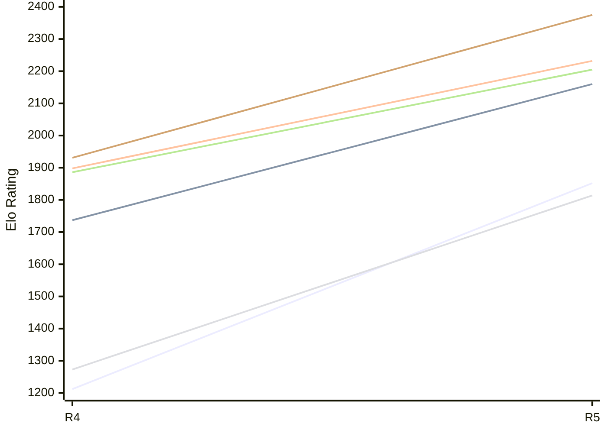
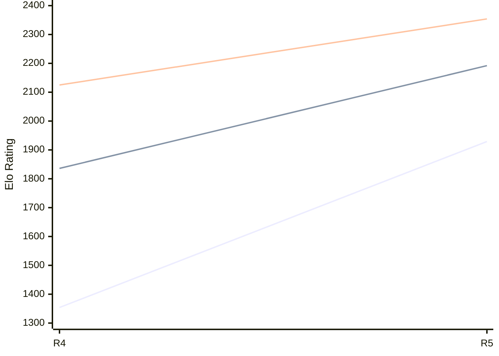

# Engine: Viking

Author: Dario Pendic

Home: https://github.com/nbqofficial/viking

## Elo Ratings E1 (Ultra 7 265T (1.50 GHz) - E-Core)

| Version | Published | STC 8.0+0.08s  | LTC 60.0+0.60s | VLTC 2m24s+1.12s | Comment |
| --- | --- | --- | --- | --- | --- |
| R5 | 2026-04-27 | 1852(+640) | 2160(+423) | 2232(+334) |  |
| R4 | 2026-04-22 | 1212 | 1737 | 1898 |  |
 | | | cElo (∆ prev) | cElo (∆ prev) | cElo (∆ prev) | 

## Elo Ratings P1 (Ultra 7 265T (1.50 GHz) - P-Core)

| Version | Published | STC 8.0+0.08s  | LTC 60.0+0.60s | VLTC 2m24s+1.12s | Comment |
| --- | --- | --- | --- | --- | --- |
| R5 | 2026-04-27 | 1814(+541) | 2205(+319) | 2375(+444) |  |
| R4 | 2026-04-22 | 1273 | 1886 | 1931 |  |
 | | | cElo (∆ prev) | cElo (∆ prev) | cElo (∆ prev) | 

## Elo Ratings T1 (i5-7500T 2.70GHz)

| Version | Published | STC 8.0+0.08s  | LTC 60.0+0.60s | VLTC 2m24s+1.12s | Comment |
| --- | --- | --- | --- | --- | --- |
| R5 | 2026-04-27 | 1929(+575) | 2192(+356) | 2354(+229) |  |
| R4 | 2026-04-22 | 1354 | 1836 | 2125 |  |
 | | | cElo (∆ prev) | cElo (∆ prev) | cElo (∆ prev) | 

<a href="https://github.com/computer-chess-index/cci/issues/new?template=submit-version.yml&title=[VERSION]+Viking+<version>&body=###%20Engine%20name%0AViking%0A%0A###%20Version%0AR5" target="_blank">Submit new version</a>

 Test Conditions:

GUI/CLI: <a href=https://github.com/cutechess/cutechess target="_blank">Cute-Chess</a> 
Elo Calculation: <a href=https://www.remi-coulom.fr/Bayesian-Elo/ target="_blank">Bayesian-Elo</a> 
CPU for P1: Intel(R) Core(TM) Ultra 7 265T (1.50 GHz) - P-Core 
CPU for E1: Intel(R) Core(TM) Ultra 7 265T (1.50 GHz) - E-Core 
CPU for T1: Intel(R) Core(TM) i5-7500T 2.70GHz 
Opening book: 8_moves_v3 
\* STC: 8.0+0.08s, LTC: 60.0+0.60s, VLTC: 2m24s+1.12s

 Lists:
Ratings: <a href=https://github.com/computer-chess-index/cci/blob/main/lists/CCIRatings.csv target="_blank">Complete list</a>

Generated: 2026-11-18 05:44:46

## Ratings Verlauf E1 / P1

```mermaid
%%{init: {"theme":"base","themeVariables":{"seriesColors:['#a3a3a3','#222221','#faa371']}}}%%
xychart-beta
  x-axis ["R4", "R5"]
  y-axis "Elo Rating" 1200 --> 2400
  line "E1: STC (8.0+0.08s)" [1212, 1852]
  line "E1: LTC (60.0+0.60s)" [1737, 2160]
  line "E1: VLTC (2m24s+1.12s)" [1898, 2232]
  line "P1: STC (8.0+0.08s)" [1273, 1814]
  line "P1: LTC (60.0+0.60s)" [1886, 2205]
  line "P1: VLTC (2m24s+1.12s)" [1931, 2375]
```

## Ratings Verlauf T1

```mermaid
%%{init: {"theme":"base","themeVariables":{"seriesColors:['#a3a3a3','#222221','#faa371']}}}%%
xychart-beta
  x-axis ["R4", "R5"]
  y-axis "Elo Rating" 1300 --> 2400
  line "T1: STC (8.0+0.08s)" [1354, 1929]
  line "T1: LTC (60.0+0.60s)" [1836, 2192]
  line "T1: VLTC (2m24s+1.12s)" [2125, 2354]
```

## Detailed Evaluation Results

| Version | Time Control | Variant | Elo  | Range +/- | Matches | Score | Average Opponent Elo | Draws |
| --- | --- |--- | --- | --- | --- | --- | --- | --- |
| R5 | VLTC (2m24s+1.12s) | E1 | 2232 | 34 | 322 | 51% | 2237 | 27% |
|  |  | T1 | 2354 | 26 | 482 | 49% | 2367 | 33% |
|  |  | P1 | 2375 | 35 | 274 | 44% | 2441 | 31% |
|  | LTC (60.0+0.60s) | E1 | 2160 | 33 | 314 | 47% | 2214 | 30% |
|  |  | T1 | 2192 | 28 | 450 | 51% | 2174 | 29% |
|  |  | P1 | 2205 | 40 | 212 | 47% | 2256 | 32% |
|  | STC (8.0+0.08s) | E1 | 1852 | 30 | 388 | 47% | 1905 | 30% |
|  |  | T1 | 1929 | 26 | 542 | 50% | 1935 | 20% |
|  |  | P1 | 1814 | 40 | 218 | 48% | 1835 | 24% |
| --- | --- |--- | --- | --- | --- | --- | --- | --- |
| R4 | VLTC (2m24s+1.12s) | T1 | 2125 | 31 | 372 | 41% | 2236 | 28% |
|  |  | P1 | 1931 | 67 | 86 | 43% | 2024 | 30% |
|  |  | E1 | 1898 | 59 | 114 | 35% | 2115 | 23% |
|  | LTC (60.0+0.60s) | T1 | 1836 | 36 | 298 | 46% | 1906 | 23% |
|  |  | P1 | 1886 | 67 | 84 | 39% | 1999 | 19% |
|  |  | E1 | 1737 | 54 | 136 | 35% | 1936 | 20% |
|  | STC (8.0+0.08s) | T1 | 1354 | 38 | 288 | 47% | 1418 | 19% |
|  |  | P1 | 1273 | 71 | 94 | 30% | 1621 | 16% |
|  |  | E1 | 1212 | 52 | 138 | 47% | 1254 | 14% |