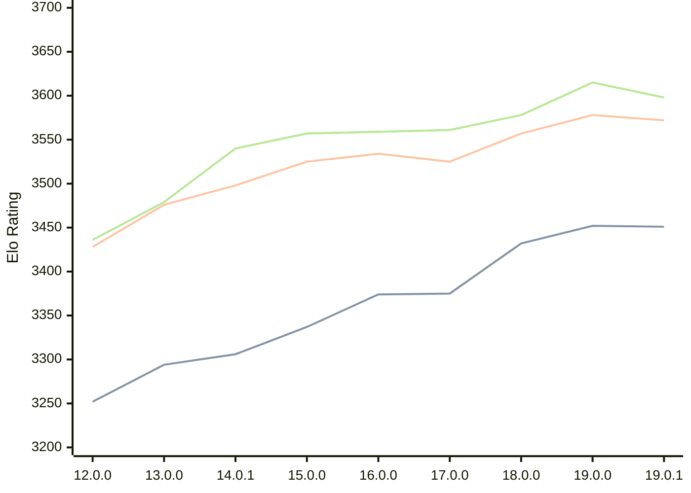

# Engine: Viridithas

Author: Cosmo Bobak

Home: https://github.com/cosmobobak/viridithas

## Elo Ratings

| Version | Published | STC 8.0+0.08s  | LTC 60.0+0.60s | VLTC 2m24s+1.12s | Comment |
| --- | --- | --- | --- | --- | --- |
| 19.0.1 | 2026-01-06 | 3451(-1) | 3572(-6) | 3598(-17) |  |
| 19.0.0 | 2026-01-04 | 3452(+20) | 3578(+21) | 3615(+37) |  |
| 18.0.0 | 2025-08-25 | 3432(+57) | 3557(+32) | 3578(+17) |  |
| 17.0.0 | 2025-04-10 | 3375(+1) | 3525(-9) | 3561(+2) |  |
| 16.0.0 | 2025-01-27 | 3374(+37) | 3534(+9) | 3559(+2) |  |
| 15.0.0 | 2024-10-13 | 3337(+31) | 3525(+27) | 3557(+17) |  |
| 14.0.1 | 2024-08-15 | 3306(+new) | 3498(+new) | 3540(+new) |  |
| 14.0.0 | 2024-08-11 |  |  |  | skipped for 14.0.1 |
| 13.0.0 | 2024-06-26 | 3294(+42) | 3476(+48) | 3479(+43) |  |
| 12.0.0 | 2024-03-01 | 3252(+new) | 3428(+new) | 3436(+new) |  |
| 11.0.0 | 2023-09-24 |  |  |  |  |
| 10.0.0 | 2023-06-19 |  |  |  |  |
| 9.1.0 | 2023-05-29 |  |  |  |  |
| 9.0.0 | 2023-05-08 |  |  |  |  |
| 8.1.0 | 2023-03-28 |  |  |  |  |
| 8.0.0 | 2023-03-27 |  |  |  |  |
| 7.0.0 | 2023-01-28 |  |  |  |  |
| 6.0.0 | 2022-12-27 |  |  |  |  |
| 5.1.0 | 2022-11-28 |  |  |  |  |
| 5.0.0 | 2022-11-27 |  |  |  |  |
| 4.0.0 | 2022-11-06 |  |  |  |  |
| 3.0.0 | 2022-10-18 |  |  |  |  |
| 2.7.0 | 2022-09-10 |  |  |  |  |
| 2.6.0 | 2022-08-30 |  |  |  |  |
| 2.5.0 | 2022-08-22 |  |  |  |  |
| 2.4.3 | 2022-08-15 |  |  |  |  |
| 2.4.2 | 2022-08-09 |  |  |  |  |
| 2.4.1 | 2022-08-09 |  |  |  |  |
| 2.4.0 | 2022-08-05 |  |  |  |  |
| 2.3.0 | 2022-08-02 |  |  |  |  |
| 2.2.0 | 2022-07-24 |  |  |  |  |
| 2.1.0 | 2022-07-04 |  |  |  |  |
| 2.0.0 | 2022-05-13 |  |  |  |  |
 | | | cElo (∆ prev) | cElo (∆ prev) | cElo (∆ prev) | 

<a href="https://github.com/computer-chess-index/cci/issues/new?template=submit-version.yml&title=[VERSION]+Viridithas+<version>&body=###%20Engine%20name%0AViridithas%0A%0A###%20Version%0A19.0.1" target="_blank">Submit new version</a>

 Test Conditions:

GUI/CLI: <a href=https://github.com/cutechess/cutechess target="_blank">Cute-Chess</a> 
Elo Calculation: <a href=https://www.remi-coulom.fr/Bayesian-Elo/ target="_blank">Bayesian-Elo</a> 
CPU: Intel(R) Core(TM) i5-7500T 2.70GHz 
Opening book: 8_moves_v3 
\* STC: 8.0+0.08s, LTC: 60.0+0.60s, VLTC: 2m24s+1.12s

 Lists:
Ratings: <a href=https://github.com/computer-chess-index/cci/blob/main/lists/CCIRatings.csv target="_blank">Complete list</a>

Generated: 2026-05-03 07:47:20

## Ratings Verlauf

⬛ STC (8.0+0.08s) &nbsp;&nbsp; 🟧 LTC (60.0+0.60s) &nbsp;&nbsp; 🟩 VLTC (2m24s+1.12s)

dark mode: 🟩STC (8.0+0.08s) 🟧LTC (60.0+0.60s) ⬜VLTC (2m24s+1.12s)

## Detailed Evaluation Results

| Version | Time Control | Elo  | Range +/- | Matches | Score | Average Opponent Elo | Draws |
| --- | --- | --- | --- | --- | --- | --- | --- |
| 19.0.1 | VLTC (2m24s+1.12s) | 3598 | 25 | 360 | 51% | 3594 | 88% |
| 19.0.1 | D1 | 1076 | 32 | 320 | 47% | 1107 | 31% |
| 19.0.1 | D10 | 2971 | 26 | 458 | 49% | 2981 | 43% |
| 19.0.1 | D11 | 3096 | 26 | 428 | 49% | 3102 | 51% |
| 19.0.1 | D12 | 3194 | 22 | 566 | 48% | 3205 | 55% |
| 19.0.1 | D13 | 3281 | 25 | 460 | 50% | 3285 | 55% |
| 19.0.1 | D14 | 3341 | 26 | 380 | 50% | 3341 | 71% |
| 19.0.1 | D15 | 3380 | 23 | 484 | 49% | 3389 | 69% |
| 19.0.1 | D16 | 3436 | 22 | 496 | 50% | 3433 | 75% |
| 19.0.1 | D17 | 3480 | 22 | 492 | 50% | 3482 | 76% |
| 19.0.1 | D18 | 3494 | 22 | 484 | 51% | 3490 | 80% |
| 19.0.1 | D19 | 3519 | 22 | 480 | 51% | 3513 | 84% |
| 19.0.1 | D2 | 1246 | 34 | 288 | 49% | 1249 | 29% |
| 19.0.1 | D20 | 3553 | 21 | 498 | 50% | 3552 | 87% |
| 19.0.1 | D21 | 3555 | 21 | 512 | 50% | 3552 | 84% |
| 19.0.1 | D3 | 1574 | 32 | 312 | 50% | 1573 | 34% |
| 19.0.1 | D4 | 1769 | 30 | 376 | 48% | 1789 | 29% |
| 19.0.1 | D5 | 2017 | 29 | 402 | 51% | 2009 | 25% |
| 19.0.1 | D6 | 2215 | 28 | 422 | 48% | 2229 | 26% |
| 19.0.1 | D7 | 2442 | 28 | 426 | 49% | 2450 | 30% |
| 19.0.1 | D8 | 2637 | 28 | 388 | 51% | 2623 | 38% |
| 19.0.1 | D9 | 2797 | 28 | 414 | 49% | 2808 | 36% |
| 19.0.1 | S10 | 3453 | 26 | 368 | 49% | 3459 | 77% |
| 19.0.1 | S40 | 3551 | 27 | 328 | 50% | 3549 | 85% |
| 19.0.1 | LTC (60.0+0.60s) | 3572 | 26 | 338 | 49% | 3578 | 86% |
| 19.0.1 | STC (8.0+0.08s) | 3451 | 23 | 470 | 50% | 3449 | 73% |
| --- | --- | --- | --- | --- | --- | --- | --- |
| 19.0.0 | VLTC (2m24s+1.12s) | 3615 | 47 | 102 | 50% | 3613 | 93% |
| 19.0.0 | D1 | 1008 | 49 | 140 | 49% | 1022 | 29% |
| 19.0.0 | D10 | 2979 | 46 | 146 | 48% | 2993 | 39% |
| 19.0.0 | D11 | 3073 | 40 | 176 | 47% | 3094 | 53% |
| 19.0.0 | D12 | 3210 | 40 | 160 | 50% | 3209 | 64% |
| 19.0.0 | D13 | 3239 | 41 | 156 | 48% | 3252 | 60% |
| 19.0.0 | D14 | 3363 | 43 | 132 | 51% | 3353 | 73% |
| 19.0.0 | D15 | 3413 | 38 | 168 | 49% | 3418 | 78% |
| 19.0.0 | D16 | 3425 | 38 | 168 | 51% | 3418 | 80% |
| 19.0.0 | D17 | 3476 | 42 | 132 | 50% | 3478 | 80% |
| 19.0.0 | D18 | 3506 | 39 | 164 | 50% | 3509 | 75% |
| 19.0.0 | D19 | 3517 | 34 | 196 | 51% | 3507 | 86% |
| 19.0.0 | D2 | 1277 | 51 | 132 | 48% | 1292 | 27% |
| 19.0.0 | D20 | 3561 | 42 | 128 | 50% | 3560 | 90% |
| 19.0.0 | D21 | 3556 | 35 | 190 | 53% | 3537 | 82% |
| 19.0.0 | D3 | 1542 | 48 | 140 | 49% | 1553 | 34% |
| 19.0.0 | D4 | 1748 | 52 | 120 | 51% | 1735 | 31% |
| 19.0.0 | D5 | 2018 | 46 | 160 | 48% | 2043 | 28% |
| 19.0.0 | D6 | 2219 | 46 | 164 | 49% | 2230 | 24% |
| 19.0.0 | D7 | 2406 | 37 | 248 | 53% | 2381 | 25% |
| 19.0.0 | D8 | 2666 | 47 | 144 | 50% | 2662 | 33% |
| 19.0.0 | D9 | 2835 | 40 | 196 | 48% | 2853 | 38% |
| 19.0.0 | S10 | 3464 | 35 | 192 | 51% | 3455 | 80% |
| 19.0.0 | S40 | 3552 | 42 | 132 | 52% | 3542 | 80% |
| 19.0.0 | LTC (60.0+0.60s) | 3578 | 35 | 184 | 51% | 3572 | 85% |
| 19.0.0 | STC (8.0+0.08s) | 3452 | 43 | 132 | 50% | 3452 | 74% |
| --- | --- | --- | --- | --- | --- | --- | --- |
| 18.0.0 | VLTC (2m24s+1.12s) | 3578 | 25 | 372 | 50% | 3576 | 88% |
| 18.0.0 | D1 | 1044 | 32 | 348 | 51% | 1031 | 22% |
| 18.0.0 | D10 | 3121 | 27 | 396 | 51% | 3117 | 54% |
| 18.0.0 | D11 | 3208 | 24 | 442 | 49% | 3209 | 64% |
| 18.0.0 | D12 | 3262 | 26 | 400 | 51% | 3256 | 60% |
| 18.0.0 | D13 | 3329 | 26 | 370 | 51% | 3324 | 70% |
| 18.0.0 | D14 | 3352 | 26 | 374 | 50% | 3352 | 71% |
| 18.0.0 | D15 | 3422 | 25 | 412 | 51% | 3413 | 71% |
| 18.0.0 | D16 | 3452 | 23 | 460 | 49% | 3460 | 78% |
| 18.0.0 | D17 | 3486 | 25 | 402 | 50% | 3490 | 75% |
| 18.0.0 | D18 | 3498 | 24 | 412 | 50% | 3498 | 80% |
| 18.0.0 | D19 | 3519 | 23 | 428 | 49% | 3525 | 82% |
| 18.0.0 | D2 | 1435 | 33 | 336 | 51% | 1427 | 17% |
| 18.0.0 | D20 | 3542 | 24 | 404 | 50% | 3540 | 84% |
| 18.0.0 | D21 | 3549 | 24 | 404 | 51% | 3544 | 85% |
| 18.0.0 | D3 | 1700 | 31 | 368 | 51% | 1697 | 21% |
| 18.0.0 | D4 | 1902 | 31 | 380 | 51% | 1899 | 21% |
| 18.0.0 | D5 | 2126 | 29 | 402 | 51% | 2118 | 25% |
| 18.0.0 | D6 | 2454 | 29 | 408 | 50% | 2465 | 25% |
| 18.0.0 | D7 | 2687 | 29 | 380 | 50% | 2688 | 36% |
| 18.0.0 | D8 | 2874 | 26 | 424 | 50% | 2876 | 48% |
| 18.0.0 | D9 | 3015 | 28 | 372 | 50% | 3009 | 47% |
| 18.0.0 | S10 | 3453 | 24 | 444 | 51% | 3448 | 74% |
| 18.0.0 | S40 | 3530 | 24 | 408 | 51% | 3519 | 82% |
| 18.0.0 | LTC (60.0+0.60s) | 3557 | 25 | 364 | 51% | 3552 | 88% |
| 18.0.0 | STC (8.0+0.08s) | 3432 | 24 | 416 | 49% | 3437 | 75% |
| --- | --- | --- | --- | --- | --- | --- | --- |
| 17.0.0 | VLTC (2m24s+1.12s) | 3561 | 23 | 420 | 50% | 3560 | 86% |
| 17.0.0 | D1 | 1054 | 30 | 384 | 50% | 1050 | 25% |
| 17.0.0 | D10 | 2871 | 27 | 400 | 49% | 2882 | 47% |
| 17.0.0 | D11 | 2989 | 26 | 404 | 50% | 2992 | 54% |
| 17.0.0 | D12 | 3093 | 26 | 404 | 49% | 3098 | 59% |
| 17.0.0 | D13 | 3204 | 26 | 400 | 50% | 3202 | 59% |
| 17.0.0 | D14 | 3271 | 26 | 384 | 50% | 3270 | 65% |
| 17.0.0 | D15 | 3330 | 25 | 408 | 49% | 3337 | 68% |
| 17.0.0 | D16 | 3395 | 24 | 436 | 49% | 3402 | 75% |
| 17.0.0 | D17 | 3421 | 24 | 424 | 50% | 3421 | 75% |
| 17.0.0 | D18 | 3448 | 23 | 440 | 49% | 3455 | 79% |
| 17.0.0 | D19 | 3476 | 24 | 416 | 50% | 3475 | 79% |
| 17.0.0 | D2 | 1423 | 31 | 388 | 51% | 1413 | 18% |
| 17.0.0 | D20 | 3488 | 25 | 402 | 50% | 3486 | 78% |
| 17.0.0 | D21 | 3524 | 25 | 392 | 50% | 3525 | 82% |
| 17.0.0 | D3 | 1643 | 30 | 428 | 51% | 1634 | 20% |
| 17.0.0 | D4 | 1918 | 32 | 368 | 50% | 1917 | 19% |
| 17.0.0 | D5 | 2076 | 30 | 380 | 49% | 2083 | 24% |
| 17.0.0 | D6 | 2244 | 31 | 356 | 50% | 2241 | 27% |
| 17.0.0 | D7 | 2369 | 31 | 356 | 50% | 2369 | 27% |
| 17.0.0 | D8 | 2514 | 29 | 376 | 51% | 2502 | 35% |
| 17.0.0 | D9 | 2726 | 28 | 384 | 50% | 2724 | 40% |
| 17.0.0 | S10 | 3391 | 24 | 404 | 50% | 3394 | 78% |
| 17.0.0 | S40 | 3525 | 24 | 404 | 50% | 3526 | 81% |
| 17.0.0 | LTC (60.0+0.60s) | 3525 | 25 | 388 | 50% | 3528 | 83% |
| 17.0.0 | STC (8.0+0.08s) | 3375 | 25 | 392 | 50% | 3378 | 70% |
| --- | --- | --- | --- | --- | --- | --- | --- |
| 16.0.0 | VLTC (2m24s+1.12s) | 3559 | 19 | 632 | 50% | 3556 | 83% |
| 16.0.0 | D1 | 1139 | 24 | 600 | 49% | 1149 | 22% |
| 16.0.0 | D10 | 2954 | 22 | 596 | 51% | 2943 | 50% |
| 16.0.0 | D11 | 3087 | 21 | 604 | 51% | 3081 | 55% |
| 16.0.0 | D12 | 3191 | 21 | 596 | 51% | 3187 | 62% |
| 16.0.0 | D13 | 3274 | 19 | 716 | 49% | 3278 | 64% |
| 16.0.0 | D14 | 3344 | 20 | 616 | 50% | 3344 | 68% |
| 16.0.0 | D15 | 3402 | 20 | 600 | 50% | 3402 | 74% |
| 16.0.0 | D16 | 3422 | 20 | 612 | 50% | 3421 | 74% |
| 16.0.0 | D17 | 3464 | 19 | 652 | 51% | 3457 | 74% |
| 16.0.0 | D18 | 3490 | 20 | 608 | 51% | 3483 | 79% |
| 16.0.0 | D19 | 3507 | 20 | 572 | 51% | 3503 | 81% |
| 16.0.0 | D2 | 1492 | 25 | 596 | 52% | 1470 | 18% |
| 16.0.0 | D20 | 3529 | 20 | 576 | 50% | 3528 | 81% |
| 16.0.0 | D21 | 3556 | 34 | 204 | 50% | 3557 | 85% |
| 16.0.0 | D3 | 1717 | 24 | 644 | 50% | 1710 | 19% |
| 16.0.0 | D4 | 1937 | 25 | 576 | 49% | 1948 | 23% |
| 16.0.0 | D5 | 2129 | 25 | 564 | 52% | 2110 | 28% |
| 16.0.0 | D6 | 2286 | 24 | 584 | 50% | 2283 | 26% |
| 16.0.0 | D7 | 2469 | 24 | 580 | 49% | 2475 | 28% |
| 16.0.0 | D8 | 2606 | 22 | 632 | 49% | 2610 | 36% |
| 16.0.0 | D9 | 2790 | 23 | 588 | 50% | 2790 | 41% |
| 16.0.0 | S10 | 3387 | 20 | 616 | 50% | 3387 | 69% |
| 16.0.0 | S40 | 3499 | 20 | 616 | 50% | 3498 | 82% |
| 16.0.0 | LTC (60.0+0.60s) | 3534 | 19 | 652 | 49% | 3540 | 85% |
| 16.0.0 | STC (8.0+0.08s) | 3374 | 20 | 616 | 49% | 3380 | 71% |
| --- | --- | --- | --- | --- | --- | --- | --- |
| 15.0.0 | VLTC (2m24s+1.12s) | 3557 | 16 | 880 | 50% | 3556 | 85% |
| 15.0.0 | D1 | 1122 | 20 | 892 | 46% | 1164 | 22% |
| 15.0.0 | D10 | 2863 | 20 | 720 | 49% | 2870 | 48% |
| 15.0.0 | D11 | 2982 | 21 | 680 | 51% | 2978 | 51% |
| 15.0.0 | D12 | 3125 | 18 | 892 | 46% | 3159 | 57% |
| 15.0.0 | D13 | 3170 | 19 | 756 | 50% | 3170 | 62% |
| 15.0.0 | D14 | 3258 | 18 | 760 | 50% | 3255 | 66% |
| 15.0.0 | D15 | 3310 | 18 | 796 | 51% | 3306 | 69% |
| 15.0.0 | D16 | 3375 | 18 | 780 | 49% | 3382 | 74% |
| 15.0.0 | D17 | 3398 | 17 | 808 | 50% | 3399 | 75% |
| 15.0.0 | D18 | 3441 | 17 | 816 | 49% | 3449 | 77% |
| 15.0.0 | D19 | 3479 | 17 | 816 | 50% | 3479 | 78% |
| 15.0.0 | D2 | 1515 | 24 | 696 | 51% | 1509 | 15% |
| 15.0.0 | D20 | 3486 | 18 | 772 | 50% | 3484 | 80% |
| 15.0.0 | D3 | 1721 | 23 | 720 | 49% | 1735 | 21% |
| 15.0.0 | D4 | 1982 | 22 | 696 | 49% | 1993 | 27% |
| 15.0.0 | D5 | 2138 | 22 | 716 | 50% | 2141 | 23% |
| 15.0.0 | D6 | 2307 | 22 | 676 | 49% | 2317 | 30% |
| 15.0.0 | D7 | 2411 | 22 | 694 | 49% | 2421 | 33% |
| 15.0.0 | D8 | 2539 | 21 | 720 | 50% | 2537 | 33% |
| 15.0.0 | D9 | 2666 | 21 | 692 | 49% | 2673 | 43% |
| 15.0.0 | S10 | 3367 | 17 | 888 | 50% | 3368 | 70% |
| 15.0.0 | S40 | 3498 | 16 | 888 | 49% | 3502 | 81% |
| 15.0.0 | LTC (60.0+0.60s) | 3525 | 17 | 840 | 50% | 3525 | 82% |
| 15.0.0 | STC (8.0+0.08s) | 3337 | 17 | 848 | 50% | 3337 | 68% |
| --- | --- | --- | --- | --- | --- | --- | --- |
| 14.0.1 | VLTC (2m24s+1.12s) | 3540 | 31 | 240 | 52% | 3525 | 81% |
| 14.0.1 | D1 | 1035 | 19 | 1060 | 50% | 1038 | 18% |
| 14.0.1 | D10 | 2822 | 17 | 1036 | 52% | 2804 | 45% |
| 14.0.1 | D11 | 2930 | 18 | 896 | 50% | 2925 | 51% |
| 14.0.1 | D12 | 3060 | 14 | 1326 | 50% | 3060 | 57% |
| 14.0.1 | D13 | 3156 | 16 | 1062 | 51% | 3151 | 60% |
| 14.0.1 | D14 | 3225 | 16 | 968 | 49% | 3229 | 64% |
| 14.0.1 | D15 | 3281 | 17 | 936 | 52% | 3248 | 65% |
| 14.0.1 | D16 | 3328 | 15 | 1088 | 51% | 3320 | 73% |
| 14.0.1 | D17 | 3395 | 16 | 952 | 52% | 3379 | 70% |
| 14.0.1 | D18 | 3411 | 16 | 940 | 50% | 3410 | 75% |
| 14.0.1 | D19 | 3436 | 17 | 823 | 50% | 3433 | 76% |
| 14.0.1 | D2 | 1324 | 22 | 760 | 50% | 1330 | 15% |
| 14.0.1 | D20 | 3472 | 17 | 811 | 51% | 3465 | 82% |
| 14.0.1 | D21 | 3478 | 27 | 340 | 53% | 3453 | 74% |
| 14.0.1 | D3 | 1683 | 18 | 1092 | 52% | 1665 | 19% |
| 14.0.1 | D4 | 1894 | 20 | 932 | 51% | 1882 | 21% |
| 14.0.1 | D5 | 2075 | 18 | 1012 | 51% | 2068 | 26% |
| 14.0.1 | D6 | 2269 | 18 | 1056 | 49% | 2298 | 25% |
| 14.0.1 | D7 | 2396 | 17 | 1150 | 50% | 2398 | 29% |
| 14.0.1 | D8 | 2498 | 17 | 1212 | 49% | 2504 | 31% |
| 14.0.1 | D9 | 2676 | 18 | 936 | 52% | 2660 | 41% |
| 14.0.1 | S10 | 3329 | 33 | 236 | 48% | 3343 | 70% |
| 14.0.1 | S40 | 3482 | 38 | 156 | 50% | 3480 | 87% |
| 14.0.1 | LTC (60.0+0.60s) | 3498 | 31 | 236 | 49% | 3506 | 84% |
| 14.0.1 | STC (8.0+0.08s) | 3306 | 28 | 352 | 54% | 3274 | 62% |
| --- | --- | --- | --- | --- | --- | --- | --- |
| 14.0.0 |  |  |  |  |  |  |  |
| 13.0.0 | VLTC (2m24s+1.12s) | 3479 | 31 | 248 | 50% | 3482 | 77% |
| 13.0.0 | D1 | 1030 | 21 | 828 | 49% | 1042 | 17% |
| 13.0.0 | D10 | 2746 | 19 | 796 | 52% | 2730 | 49% |
| 13.0.0 | D11 | 2882 | 20 | 692 | 48% | 2898 | 52% |
| 13.0.0 | D12 | 2984 | 18 | 818 | 48% | 3002 | 55% |
| 13.0.0 | D13 | 3086 | 20 | 692 | 49% | 3092 | 60% |
| 13.0.0 | D14 | 3171 | 20 | 632 | 49% | 3177 | 65% |
| 13.0.0 | D15 | 3233 | 20 | 656 | 49% | 3243 | 68% |
| 13.0.0 | D16 | 3285 | 19 | 748 | 50% | 3283 | 65% |
| 13.0.0 | D17 | 3332 | 19 | 704 | 48% | 3348 | 75% |
| 13.0.0 | D18 | 3379 | 21 | 532 | 50% | 3380 | 77% |
| 13.0.0 | D19 | 3405 | 21 | 568 | 50% | 3402 | 77% |
| 13.0.0 | D2 | 1311 | 21 | 880 | 52% | 1293 | 16% |
| 13.0.0 | D20 | 3432 | 18 | 713 | 50% | 3433 | 79% |
| 13.0.0 | D21 | 3438 | 18 | 730 | 52% | 3428 | 79% |
| 13.0.0 | D3 | 1607 | 19 | 956 | 51% | 1601 | 20% |
| 13.0.0 | D4 | 1832 | 21 | 839 | 50% | 1827 | 23% |
| 13.0.0 | D5 | 2029 | 19 | 968 | 54% | 1994 | 27% |
| 13.0.0 | D6 | 2219 | 19 | 912 | 53% | 2188 | 25% |
| 13.0.0 | D7 | 2336 | 22 | 672 | 49% | 2341 | 32% |
| 13.0.0 | D8 | 2433 | 22 | 668 | 51% | 2421 | 34% |
| 13.0.0 | D9 | 2627 | 20 | 764 | 50% | 2627 | 40% |
| 13.0.0 | S10 | 3297 | 35 | 204 | 49% | 3303 | 72% |
| 13.0.0 | S40 | 3444 | 35 | 196 | 49% | 3452 | 79% |
| 13.0.0 | LTC (60.0+0.60s) | 3476 | 36 | 192 | 51% | 3474 | 76% |
| 13.0.0 | STC (8.0+0.08s) | 3294 | 33 | 232 | 50% | 3294 | 65% |
| --- | --- | --- | --- | --- | --- | --- | --- |
| 12.0.0 | VLTC (2m24s+1.12s) | 3436 | 37 | 186 | 48% | 3449 | 70% |
| 12.0.0 | D1 | 973 | 52 | 136 | 50% | 977 | 18% |
| 12.0.0 | D10 | 2724 | 50 | 124 | 51% | 2715 | 40% |
| 12.0.0 | D11 | 2865 | 44 | 164 | 53% | 2838 | 38% |
| 12.0.0 | D12 | 2934 | 41 | 172 | 48% | 2947 | 48% |
| 12.0.0 | D13 | 3078 | 40 | 176 | 52% | 3059 | 52% |
| 12.0.0 | D14 | 3156 | 42 | 152 | 49% | 3164 | 60% |
| 12.0.0 | D15 | 3213 | 38 | 184 | 48% | 3224 | 61% |
| 12.0.0 | D16 | 3291 | 42 | 140 | 49% | 3297 | 71% |
| 12.0.0 | D17 | 3337 | 47 | 116 | 49% | 3343 | 67% |
| 12.0.0 | D18 | 3341 | 39 | 176 | 52% | 3325 | 63% |
| 12.0.0 | D19 | 3368 | 42 | 138 | 50% | 3366 | 72% |
| 12.0.0 | D2 | 1322 | 58 | 104 | 48% | 1342 | 21% |
| 12.0.0 | D20 | 3395 | 38 | 176 | 50% | 3395 | 70% |
| 12.0.0 | D21 | 3425 | 36 | 192 | 47% | 3448 | 74% |
| 12.0.0 | D3 | 1602 | 55 | 116 | 51% | 1594 | 19% |
| 12.0.0 | D4 | 1854 | 51 | 128 | 49% | 1867 | 26% |
| 12.0.0 | D5 | 1975 | 50 | 140 | 53% | 1944 | 23% |
| 12.0.0 | D6 | 2153 | 44 | 176 | 49% | 2168 | 26% |
| 12.0.0 | D7 | 2264 | 45 | 168 | 49% | 2271 | 25% |
| 12.0.0 | D8 | 2415 | 44 | 180 | 51% | 2403 | 24% |
| 12.0.0 | D9 | 2592 | 46 | 152 | 53% | 2565 | 32% |
| 12.0.0 | S10 | 3299 | 38 | 176 | 47% | 3320 | 67% |
| 12.0.0 | S40 | 3440 | 44 | 126 | 51% | 3433 | 72% |
| 12.0.0 | LTC (60.0+0.60s) | 3428 | 35 | 200 | 51% | 3418 | 74% |
| 12.0.0 | STC (8.0+0.08s) | 3252 | 39 | 172 | 49% | 3262 | 60% |
| --- | --- | --- | --- | --- | --- | --- | --- |
| 11.0.0 |  |  |  |  |  |  |  |
| 10.0.0 |  |  |  |  |  |  |  |
| 9.1.0 |  |  |  |  |  |  |  |
| 9.0.0 |  |  |  |  |  |  |  |
| 8.1.0 |  |  |  |  |  |  |  |
| 8.0.0 |  |  |  |  |  |  |  |
| 7.0.0 |  |  |  |  |  |  |  |
| 6.0.0 |  |  |  |  |  |  |  |
| 5.1.0 |  |  |  |  |  |  |  |
| 5.0.0 |  |  |  |  |  |  |  |
| 4.0.0 |  |  |  |  |  |  |  |
| 3.0.0 |  |  |  |  |  |  |  |
| 2.7.0 |  |  |  |  |  |  |  |
| 2.6.0 |  |  |  |  |  |  |  |
| 2.5.0 |  |  |  |  |  |  |  |
| 2.4.3 |  |  |  |  |  |  |  |
| 2.4.2 |  |  |  |  |  |  |  |
| 2.4.1 |  |  |  |  |  |  |  |
| 2.4.0 |  |  |  |  |  |  |  |
| 2.3.0 |  |  |  |  |  |  |  |
| 2.2.0 |  |  |  |  |  |  |  |
| 2.1.0 |  |  |  |  |  |  |  |
| 2.0.0 |  |  |  |  |  |  |  |